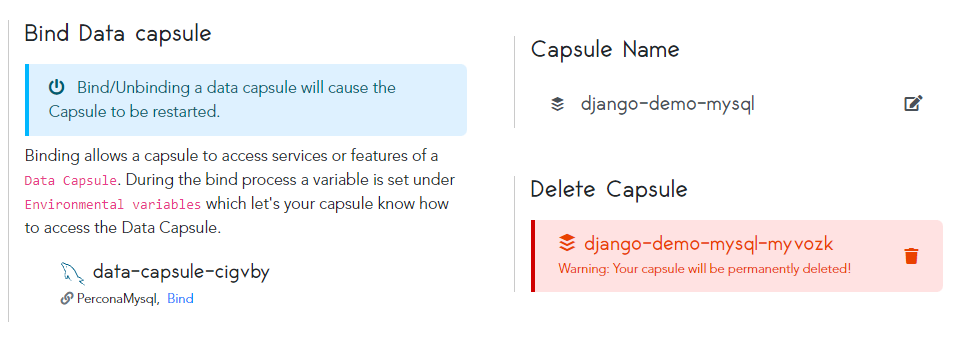

# How to Deploy a Django MySQL Application to Production on Code Capsules

Deploy a Django application that uses MySQL for data storage and learn how to host backend code and a database on Code Capsules.

## Getting Started

This guide will walk you through the process of deploying a Django MySQL application using a data capsule and a backend capsule. The application will accept a name as input and display a list of names that were previously submitted.  

We will use an example application that has been provided by Code Capsules on their GitHub account. Fork [this repository]() to your own GitHub account and link it to your Code Capsules account.

## Linking to GitHub

The next step is to link the forked repository to your Code Capsules account. You can do this by clicking your profile image at the top right of your screen in Code Capsules. 

Once on the "Profile" tab click the "GitHub" button to start the process of linking to the repo. 

You now need to authorise Code Capsules to connect to the Django MySQL application by:

1. Clicking your GitHub username.
2. Selecting "Only Select Repositories".
3. Choosing the GitHub repository we forked.
4. Pressing "Install & Authorize".

Code Capsules will link to the GitHub repository containing the Django MySQL application after actioning the above steps. 

## Add Repo to Team

We now need to add the linked repository to our "Personal Team". Doing so gives all capsules in that team access to the repository's data. 

Navigate to the "Team Settings" tab on the top navigation bar and click on the "Modify" button under the _Team Repos_ section once you get there. This should trigger the "Edit Team Repos" screen to slide in from the right. On this screen, select "Add" next to the repo you want to add to your Personal Team and then confirm.

## Setting up the Capsules

Create a Space to house the Backend Capsule and Data Capsule we'll need.

Next create the Data Capsule:

Followed by the Backend Capsule:  

Select the repository you forked earlier and leave the "Run Command" field blank. Click the "Create Capsule" button to start the build.

## Binding the Capsules

After the two capsules have been successfully built, the next step is to bind them together. To do this, navigate to the "Configure" tab of your Backend Capsule. Scroll down to the "Bind Data Capsule" section and click on the "Bind" option in the bottom left. This provides the capsule with information on how to connect to the MySQL database. 

## View Application

You can now view the application after the two capsules have been binded together. To see how it looks, click on the "Live Website" link at the top of your Backend Capsule page.

## View Application Logs

Code Capsules also produces logs for your application. To view them, navigate to the "Logs" tab on your Backend Capsule page.

