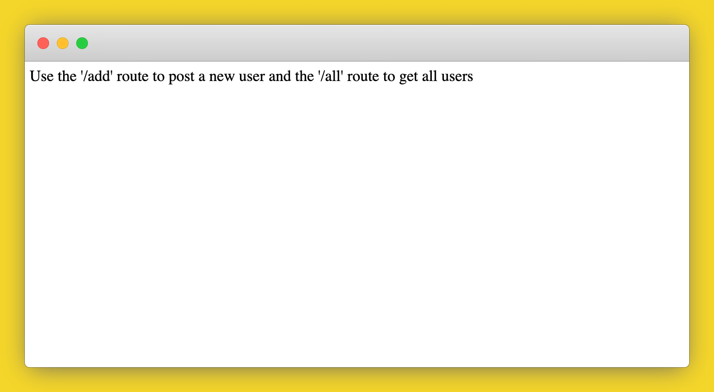

# How to Deploy a Java MySQL Application to Production on Code Capsules 

Deploy a Java MySQL application and learn how to host backend code on Code Capsules.

## Set up

Code Capsules connects to GitHub repositories to deploy applications. To follow this guide, you’ll need a [Code Capsules](https://codecapsules.io/) account and a [GitHub](https://github.com/) account.

To demonstrate how to deploy a Java MySQL application with Code Capsules, we’ve provided an example application which you can find on the [Code Capsules GitHub repository](https://github.com/codecapsules-io/demo-java-mysql).

Sign in to GitHub, and fork the example application by clicking “Fork” at the top-right of your screen and selecting your GitHub account as the destination.

## Create an Account with Code Capsules

If you don’t already have an account, navigate to the [Code Capsules](https://codecapsules.io/) site and click the “Sign Up” button in the top right corner of the screen. Enter your details to create an account, or log in to an existing one.

If you’ve just signed up for an account, you’ll be directed to a welcome page on your first login. Click on the “Go To Personal Team” button.

Alternatively, if you’re signing in again, click on “Spaces” in the top right corner of your screen.

Code Capsules gives every account a Personal Team by default. A Team is an environment for you to manage your Spaces and Capsules. For a better understanding of Teams, Spaces, and Capsules, take a look at [our explanation](https://codecapsules.io/docs/FAQ/teams-spaces-capsules/).

## Create a Space for your Apps

[Spaces](https://codecapsules.io/docs/FAQ/what-is-a-space/) are an organisational tool for your applications. You can select the Personal Space that you find in your default Personal Team to host this application, or you can create a new Space. In the Spaces Tab, click the "Create A New Space For Your Apps" button. 

Follow the prompts, choosing your region and giving your Space a name, then click “Create Space”.

## Link to GitHub

To link to GitHub, click your profile image at the top right of the Code Capsules screen and find the “GitHub” button under “GitHub Details”.

Click the “GitHub” button, select your GitHub username, and do the following in the dialog box that appears:

1. Select "Only Select Repositories".
2. Choose the GitHub repository we forked.
3. Press "Install & Authorize".

## Add Repository to Team

Select "Team Settings" in the top navigation bar to switch to the Team Settings tab.

Click on the "Modify" button under the Team Repos section, and an “Edit Team Repos” screen will slide in from the right. Click “Add” next to the demo repo, and then “Confirm”. All the Spaces in your Team will now have access to this repo.

## Create the Capsules

A [Capsule](https://codecapsules.io/docs/FAQ/what-is-a-capsule/) provides the server for hosting an application on Code Capsules.

Navigate to the “Spaces” tab and open the Space you’ll be using.

Click the “Create a New Capsule for Your Space” button, and follow the instructions below to create a Data Capsule:

1. Choose “Data Capsule”.
2. Under “Data Type”, select “Mysql Database Cluster”.  
3. Under “Product”, select “Standard”.
4. Click “Create Capsule”.

Navigate to the "Space" containing your recently created Data Capsule and click the "New Capsule" button. Follow the instructions below to create a Backend Capsule:

1. Choose “Backend Capsule”.
2. Under “Product”, select “Sandbox”.
3. Choose the GitHub repository you forked.
4. Press “Next”.
5. Leave “Run Command” blank.
6. Click “Create Capsule”.

Code Capsules will automatically build your application when you’ve finished creating the Capsule. While the build is in progress, you can view the log by clicking “View Build Progress” next to the “Building Capsule” message.

Once your application is live, you can view the build log by selecting the “Deploy” tab and clicking the “View build log” link in the “Builds” section.

## Binding the Capsules

After the two capsules have been successfully built, the next step is to bind them together. To do this, navigate to the "Configure" tab of your Backend Capsule. Scroll down to the "Bind Data Capsule" section and click on the "Bind" option in the bottom left. This provides the capsule with information on how to connect to the MySQL database. 

## View Application

After restarting the capsule, the application will now be ready to be viewed. Click the “Live Website” link at the top of the capsule tab and you should see your deployed application.

If you’d like to deploy another application in a different language or framework, take a look at our other [deployment guides](/docs/deployment/).