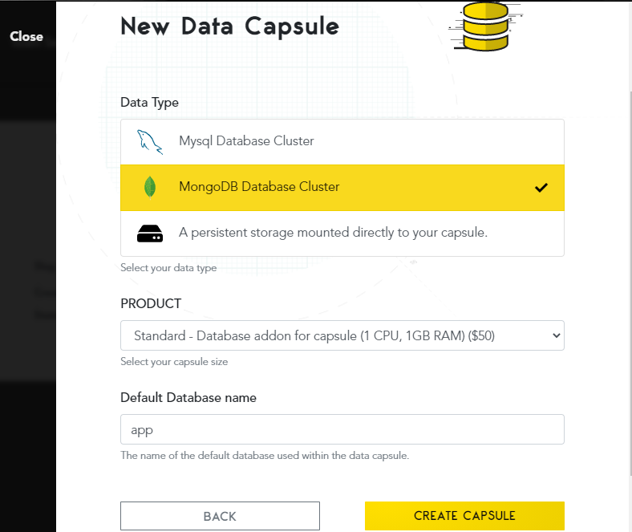
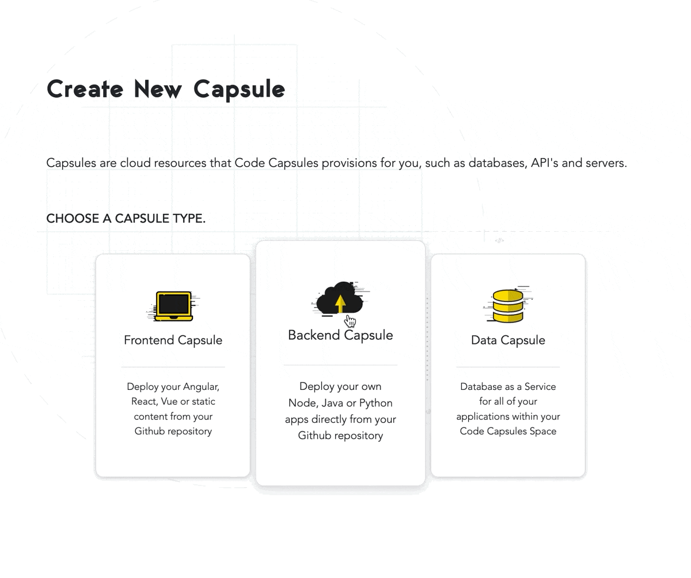
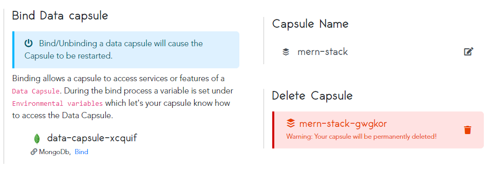
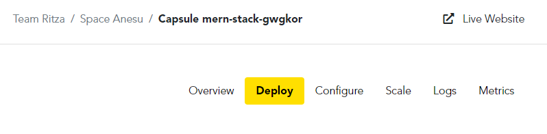
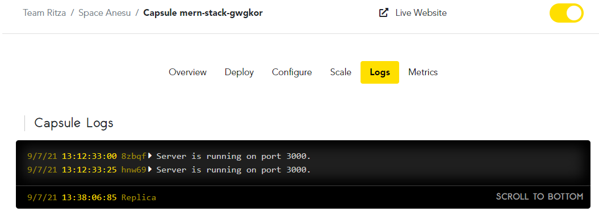

# How to Deploy a MERN Stack Application to Production on Code Capsules

Deploy a MERN (MongoDB, Express, React, Node) Stack application using a Backend Capsule and a Data Capsule for a full stack application without the need for a Frontend Capsule.

## Getting Started

In this guide, we'll show you how to deploy a MERN Stack application that accepts a name as input and displays a personalized message for the user. The example application we will use can be found on [Code Capsules's GitHub](https://github.com/codecapsules-io/mern-stack) account.

Fork the project above to your own GitHub account and link the repository to your Code Capsules account. You can do this by clicking your username at the top right of your screen in Code Capsules, and choosing "Edit Profile". Now you can click the "GitHub" button to link to the repo. 

## Setting up the Capsules

Create a Space to house the Backend Capsule and Data Capsule we'll need. Now we'll create the capsules.

First create the Data Capsule:

Then create the Backend Capsule:  

Select the repository you forked earlier. In the "Run Command" field, enter `node index.js` to let the capsule know how to run your application.

## Binding the Capsules

Now we need to bind the two capsules together. Navigate to the Backend Capsule you've just created and open the "Configure" tab. Scroll to the "Bind Data Capsule" section and click on the "Bind" option in the bottom left to allow the capsule to use the MongoDB database in the Data Capsule. 

## View Application

The application will be ready for use after binding the two capsules together. To view it, click on the "Live Website" link at the top of your Backend Capsule page.

## View Application Logs

You can also view your application's logs by navigating to the "Logs" tab on your Backend Capsule page.

