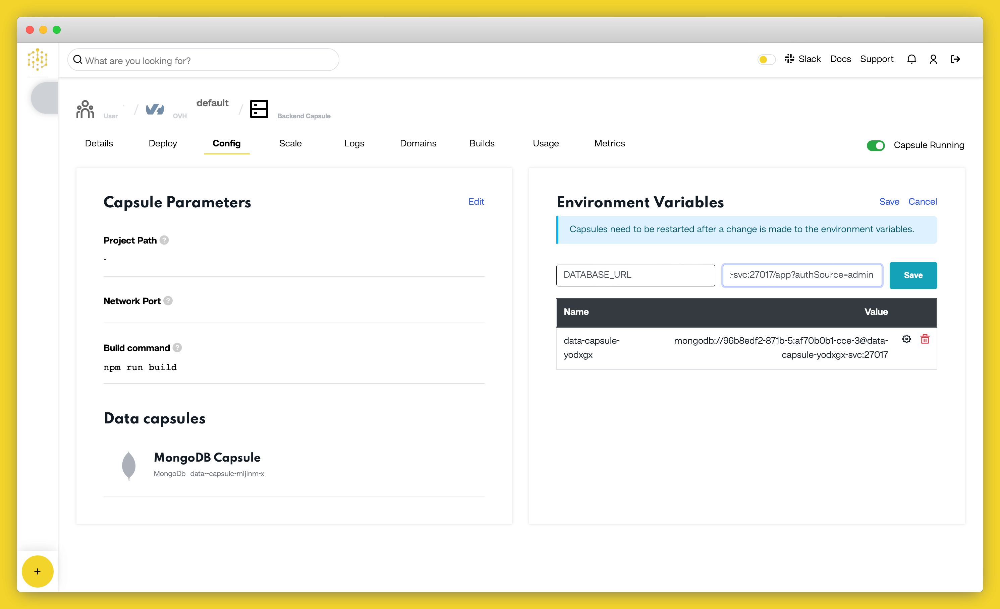

# How to Deploy a MERN Stack Application to Production on Code Capsules

Deploy a MERN (MongoDB, Express, React, Node.js) stack application using a Backend Capsule and a Data Capsule for a full stack application without the need for a Frontend Capsule.

## Getting Started

In this guide, we'll show you how to deploy a MERN stack application that accepts a name as input and displays a personalized message for the user. The example application we'll use can be found on [Code Capsules's GitHub](https://github.com/codecapsules-io/mern-stack) account.

Fork the example application project to your own GitHub account and link the repository to your Code Capsules account. You can do this by clicking your username at the top right of your screen in Code Capsules, and choosing "Edit Profile". Now you can click the "GitHub" button to link to the repo. 

## Setting up the Capsules

Create a Space to house the Backend Capsule and Data Capsule we'll need.

Next create the Data Capsule:

Then create the Backend Capsule:  

Select the repository you forked earlier and leave the "Run Command" field blank. Click the "Create Capsule" button to start the build. You can view the [logs](#view-application-logs) while the capsule is building your application to track its progress, as it might take a while. 

## Binding the Capsules

Now we need to bind the two capsules together. Navigate to the Backend Capsule you've just created and open the "Configure" tab. Scroll to the "Bind Data Capsule" section and click on the "Bind" option in the bottom left. This enables the capsule to use the MongoDB database in the Data Capsule. 

## Edit `DATABASE_URL` Environment Variable

Next, we have to append `/app?authSource=admin` to the `DATABASE_URL` value under the "Capsule parameters" section on the "Configure" tab. 

Confirm your changes by clicking on "Update Capsule" then restart your capsule by toggling the radio button in the top right off and on again.

## View Application

The application will be ready for use after binding the two capsules together. To view it, click on the "Live Website" link at the top of your Backend Capsule page.

## View Application Logs

You can also view your application's logs by navigating to the "Logs" tab on your Backend Capsule page.

