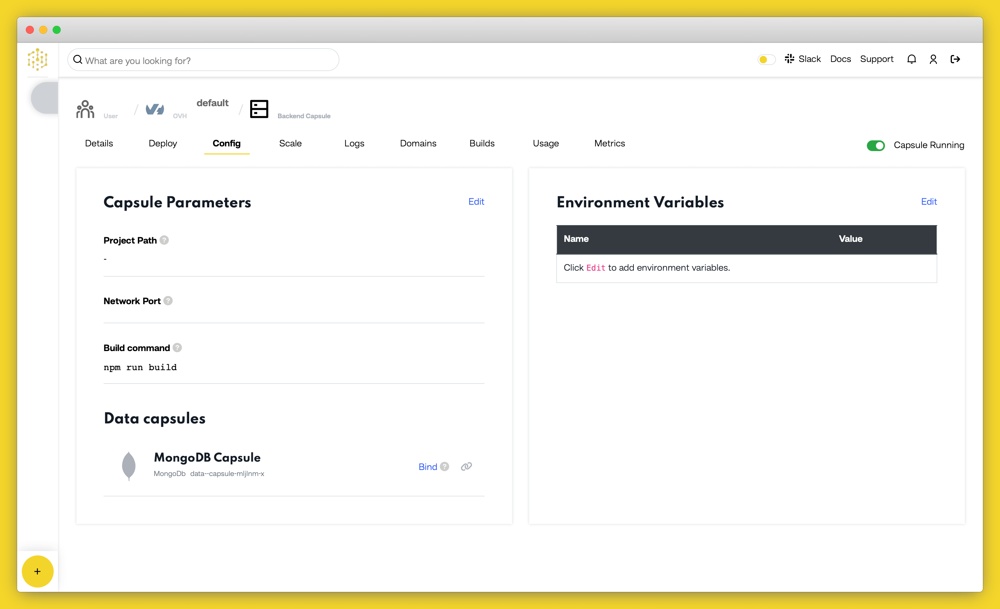
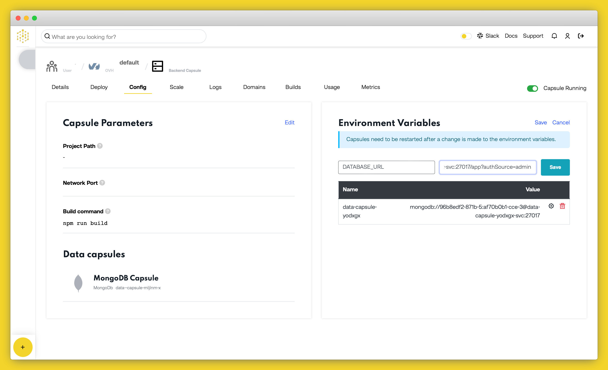

# How to Deploy a Next.js, Express.js and Mongo Application to Production on Code Capsules

Deploy a Next.js, Express.js and Mongo application and learn how to host backend code on Code Capsules.

## Set up

Code Capsules connects to GitHub repositories to deploy applications. To follow this guide, you’ll need a [Code Capsules](https://codecapsules.io/) account and a [GitHub](https://github.com/) account.

To demonstrate how to deploy a Next.js, Express.js and Mongo application with Code Capsules, we’ve provided an example application which you can find on the [Code Capsules GitHub repository](https://github.com/codecapsules-io/demo-next-express-mongo).

Sign in to GitHub, and fork the example application by clicking "Fork" at the top-right of your screen and selecting your GitHub account as the destination.

## Create the Capsule

A [Capsule](https://codecapsules.io/docs/FAQ/what-is-a-capsule/) provides the server for hosting an application on Code Capsules.

Click the yellow`+` button, and follow the instructions below to create a Data Capsule:

1. Choose "Data Capsule".
2. Under "Data Type", select "MongoDB".  
3. Click "Create Capsule".

To create a new Capsule for your space follow the instructions below:

1. Choose "Backend Capsule", your Team and Space.
2. Choose your payment plan.
3. Click the GitHub button and give access to the repository you forked at the start of the tutorial.
4. Choose the GitHub repository you forked.
5. Press "Next".
6. Leave "Run Command" blank.
7. Click "Create Capsule".

Code Capsules will automatically build your application when you’ve finished creating the Capsule. 

Once your application is live, you can view the build log by selecting the "Deploy" tab and clicking the "View build log" link in the "Builds" section.

## Binding the Capsules

Now you need to bind the two capsules together. Navigate to the "Configure" tab of the Backend Capsule you've just created. Scroll to the "Bind Data Capsule" section and click on the "Bind" option in the bottom left. This enables the capsule to use the MongoDB database in the Data Capsule. 

## Edit `DATABASE_URL` Environment Variable

Once the binding is complete, you have to append `/app?authSource=admin` to the `DATABASE_URL` value under the "Capsule parameters" section on the "Configure" tab. 

Confirm your changes by clicking on "Update Capsule" then restart your capsule by toggling the radio button in the top right off and on again.

## View Application

After restarting the capsule, the application will now be ready to be viewed. Once the build is complete, a URL link will appear in the URL section in the "Details" tab. Click the link and you should see your deployed application.

If you’d like to deploy another application in a different language or framework, take a look at our other [deployment guides](/docs/deployment/).
