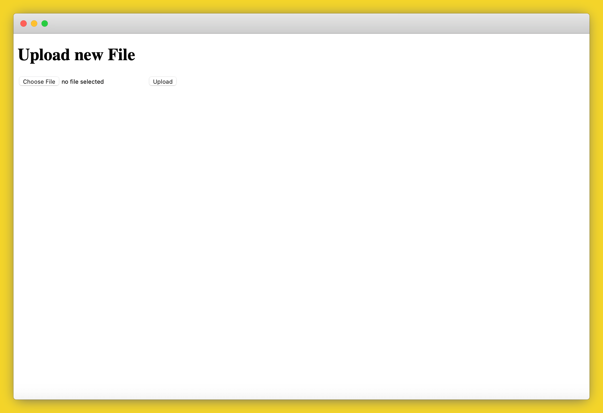

# How to Deploy a Static File Share with Flask and Caddy

This guide will show you how to deploy a basic file sharing site on Code Capsules. You'll use a Flask application to upload files and a Caddy file server to serve and download the uploaded files.

We'll use three capsules: a Data Capsule to store the files, a Backend Capsule for the Flask upload server and a Docker Capsule for the Caddy file server.

After following the guide, you'll be able to upload files in the Flask application and see a file listing and get public links to your uploaded files in the Caddy application, as shown below.

## Set up

Code Capsules connects to GitHub repositories to deploy applications. To follow this guide, you’ll need a [Code Capsules](https://codecapsules.io/) account and a [GitHub](https://github.com/) account.

The code you need for this guide is in the following GitHub projects.

* **[Flask file uploads](https://github.com/codecapsules-io/flask-file-uploads)**
* **[Caddy file server](https://github.com/codecapsules-io/caddy-file-server)**

Sign in to GitHub, and fork both example applications by clicking "Fork" at the top right of your screen and selecting your GitHub account as the destination.

## Create a Space for your Apps

In the Spaces Tab, click the "Create A New Space For Your Apps" button.

Follow the prompts, choosing your region and giving your Space a name, then click "Create Space".

## Link to GitHub

To link to GitHub, click your profile image at the top right of the Code Capsules screen and find the "GitHub" button under "GitHub Details".

Click the "GitHub" button, select your GitHub username, and do the following in the dialog box that appears:

1. Select "Only Select Repositories".
2. Choose both the GitHub repositories you forked.
3. Press "Install & Authorize".

{ width="75%" }

## Add Repository to Team

Select "Team Settings" in the top navigation bar to switch to the Team Settings tab.

Click on the "Modify" button under the Team Repos section, and an "Edit Team Repos" screen will slide in from the right. Click "Add" next to the demo repo, and then "Confirm". All the Spaces in your Team will now have access to this repo.

## Create the Capsules

A [Capsule](https://codecapsules.io/docs/FAQ/what-is-a-capsule/) provides the server for hosting an application on Code Capsules.

Navigate to the "Spaces" tab and open the Space you’ll be using.

### Data Capsule

Click the "New capsule" button.

1. Choose "Data Capsule".
2. Under "Data type", select "persistent storage".
3. Click "Create Capsule".

### Backend Capsule

Click the "New capsule" button again.

1. Choose Backend Capsule
2. Select the flask-file-uploads repository
3. Press "Next"
4. Press "Create capsule"

### Docker Capsule

Click the "New capsule" button again.

1. Choose Docker Capsule
2. Select the caddy-file-server repository
3. Click "Next"
4. Enter `Dockerfile` for the Dockefile location
5. Press "Create Capsule"

## Binding the Capsules

Now navigate to each of the Backend Capsule and Docker Capsule and bind them to the Data Capsule. This gives them access to a shared file store so that the Flask application can upload files and the Caddy server can serve them to users.

