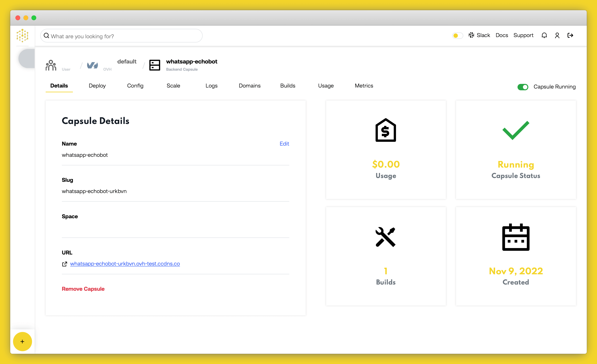

# How to Deploy a WhatsApp Bot to Production on Code Capsules

Deploy a WhatsApp Bot and learn how to host backend code on Code Capsules.

## Set up

Code Capsules connects to GitHub repositories to deploy applications. To follow this guide, you’ll need a [Code Capsules](https://codecapsules.io/) account, a [GitHub](https://github.com/) account and a [Twilio](https://www.twilio.com/try-twilio) account.

To demonstrate how to deploy a WhatsApp Bot with Code Capsules, we’ve provided an example bot which you can find on the [Code Capsules GitHub repository](https://github.com/codecapsules-io/whatsapp-echobot).

Sign in to GitHub, and fork the example bot repository by clicking “Fork” at the top-right of your screen and selecting your GitHub account as the destination.

## Create a Space for your Bot

Log in to your Code Capsules account and navigate to the “Spaces” tab. Once there, click the “Create A New Space For Your Apps” button. 

Follow the prompts, choosing your region and giving your Space a name, then click “Create Space”.

## Link to GitHub

To link to GitHub, click your profile image at the top right of the Code Capsules screen and find the “GitHub” button under “GitHub Details”.

Click the “GitHub” button, select your GitHub username, and do the following in the dialog box that appears:

1. Select “Only Select Repositories”.
2. Choose the GitHub repository we forked.
3. Press “Install & Authorize”.

## Add Repository to Team

Select “Team Settings” in the top navigation bar to switch to the Team Settings tab.

Click on the “Modify” button under the “Team Repos” section. An “Edit Team Repos” screen will slide in from the right. Click “Add” next to the bot repo, and then “Confirm”. All the Spaces in your Team will now have access to this repo.

## Create the Capsule

A [Capsule](https://codecapsules.io/docs/FAQ/what-is-a-capsule/) provides the server for hosting an application on Code Capsules.

Navigate to the “Spaces” tab and open the Space you’ll be using.

Click the “Create a New Capsule for Your Space” button, and follow the instructions below:

1. Choose “Backend Capsule”.
2. Under “Product”, select “Sandbox”.
3. Choose the GitHub repository you forked.
4. Press “Next”.
5. Leave “Run Command” blank.
6. Click “Create Capsule”.

Code Capsules will automatically build your application when you’ve finished creating the Capsule. While the build is in progress, you can view the log by clicking “View Build Progress” next to the “Building Capsule” message.

Once your application is live, you can view the build log by selecting the “Deploy” tab and clicking the “View build log” link in the “Builds” section.

## Create a Twilio Sandbox

The Twilio Sandbox provides a development environment to access the WhatsApp API. Sign up for a [Twilio account](https://www.twilio.com/try-twilio) to use a sandbox that allows you to test your bot in realtime. After you've logged into your Twilio account, navigate to the [console](https://www.twilio.com/console/sms/whatsapp/sandbox) page to configure your WhatsApp sandbox settings. 

1. Go to your capsule's "Overview" tab and copy your bot's domain under the "Domains" section.

2. Head back to your Twilio console and paste the domain in the "When a Message Comes In" field and append `/bot` to the end of it. Make sure the method is set to *HTTP Post*.

3. Scroll down to the bottom of the page and click "Save".
4. Under the "Sandbox Participants" section you will find the WhatsApp number for your sandbox and a code to join it that starts with **join**. Send this code to the displayed WhatsApp number to add your personal number as a sandbox participant. 

## Chat with the Bot

The bot will now be able to respond to your messages after sending the join code. Try it and the bot should echo any message you send it. 

If you’d like to deploy another application in a different language or framework, take a look at our other [deployment guides](/docs/deployment/).