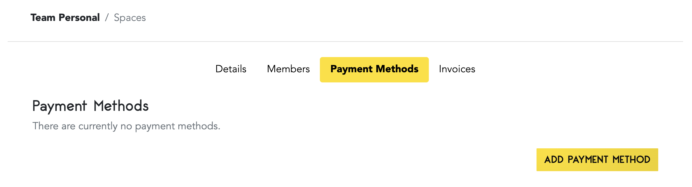

# Capsule Billing

Code Capsules uses a per-hour billing model, which ensures you only pay for what you use.

## Capsule Pricing

Pricing for capsules starts at $5 per month and can go up to $50 per month for Backend Capsules, depending on the size of the resources you need for your application. Frontend Capsules are fixed at $5 per month per capsule, regardless of the size of your static site.

## Adding a Payment Method

Code Capsules accepts Visa and Mastercard as payment methods. To add a card to your account, click on the "Billing" tab on the top navigation bar, then click "Add".

You will see a screen asking you to enter your card details. When you're done, click on "Confirm Payment Method". 

