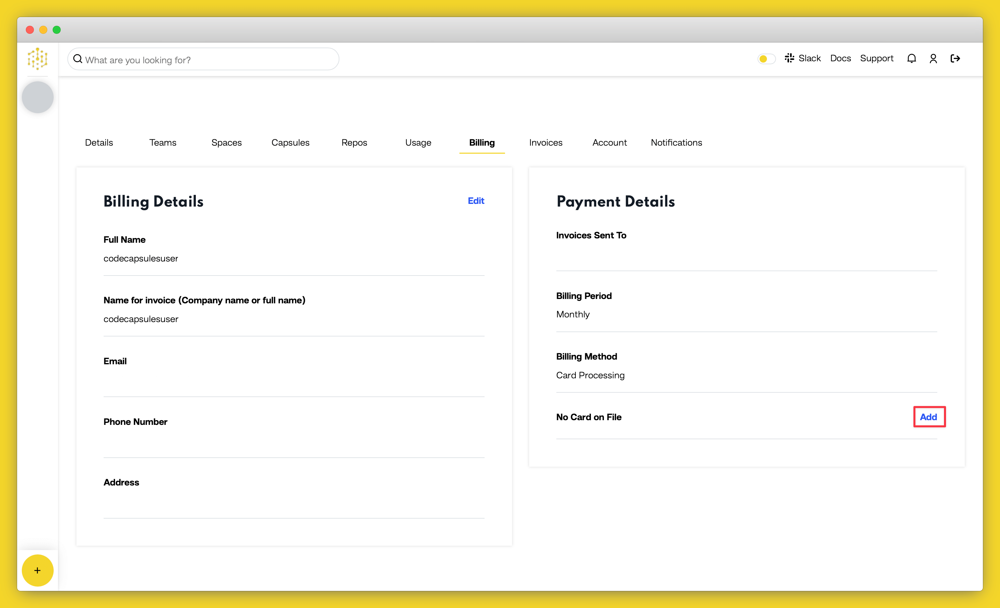

# Capsule Billing

Code Capsules provides one free frontend capsule per account so you have to provide a payment method if you wish to host other types of capsules or a second frontend capsule.

## Capsule Pricing

Pricing for capsules starts at $5 per month and can go up to $50 per month for backend capsules depending on the size of the resources you need for your application. In comparison, frontend capsules are fixed at $5 per month per capsule regardless of how big your static site may be.

## Adding a Payment Method

Code Capsules accepts Visa and Mastercard as payment methods. To add one for your account, click on "Team Settings" on the top navigation bar while logged into your Code Capsules account. When you get to the "Team Settings" page, navigate to the "Payment Methods" tab where you should see a button for adding a payment method.

Click on the "Add Payment Method" button and a screen should slide in from the right asking you to enter your card details. Do so, and when you're done click on "Confirm Payment Method". 

