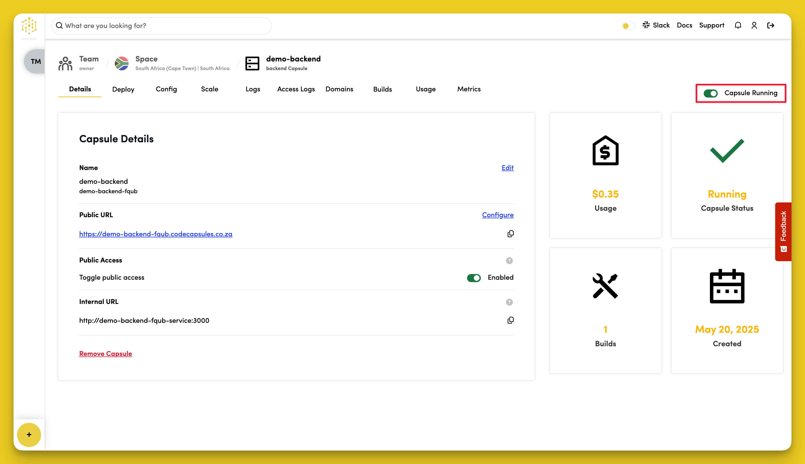
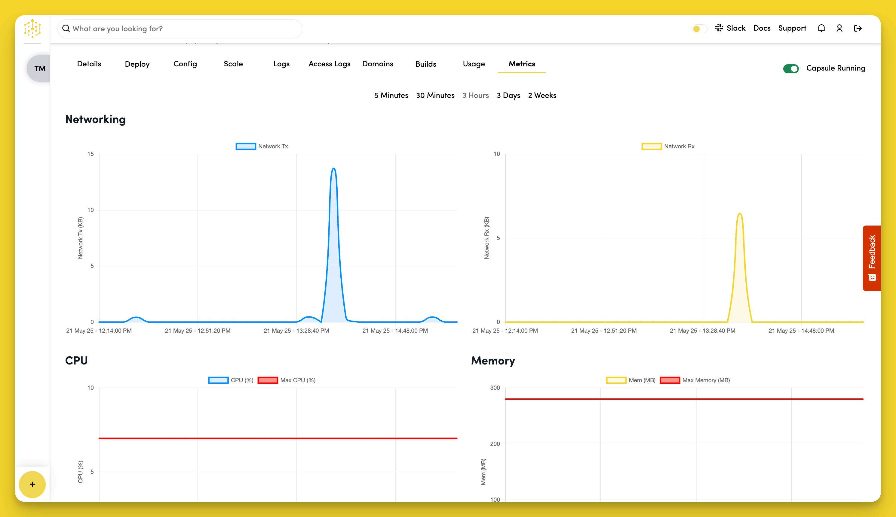

# Capsules Management

A [Capsule](../../FAQ/what-is-a-capsule/) provides the server for hosting an application on Code Capsules. In this reference guide, we'll take a look at the different options you have for managing your capsule while it's deployed.

## Turning Off a Capsule

You can turn off your capsule by toggling off the radio button in the top right section of the Capsule's page on Code Capsules. 

The most common reason for turning off a capsule is when you've changed or added an environment variable in which case you'll have to toggle the capsule back on after a few seconds for the new variable to be accessible. Depending on the purpose of your application you might also want to turn off your capsule during periods of inactivity to save on the cost of running your application on Code Capsules.

## Scale a Capsule

It is possible to allocate more resources to your capsule depending on how much traffic your application will be getting and it's computational needs. To view the different scaling options available for your capsule navigate to the "Scale" tab while on your Capsule's page.

You can choose any one of the packages in the image above by clicking on the item with the capsule resources which best suite your needs.

## Monitor Capsule Metrics

Each capsule tracks its usage data and you can view this information by opening the "Metrics" tab on your Capsule's page. 

## Delete a Capsule

When you no longer wish to host your application on Code Capsules you can find the option to delete your capsule by navigating to the "Configure" tab and scrolling to the bottom while on the Capsule page. 

Once there, click on the delete icon under the "Delete Capsule" section to the bottom right. After actioning this step, a screen should slide in from the right asking you whether you're sure about deleting the capsule since the action isn't reversible. If you're sure, enter the capsule's name to activate the delete button and click "Delete" to confirm your changes. 