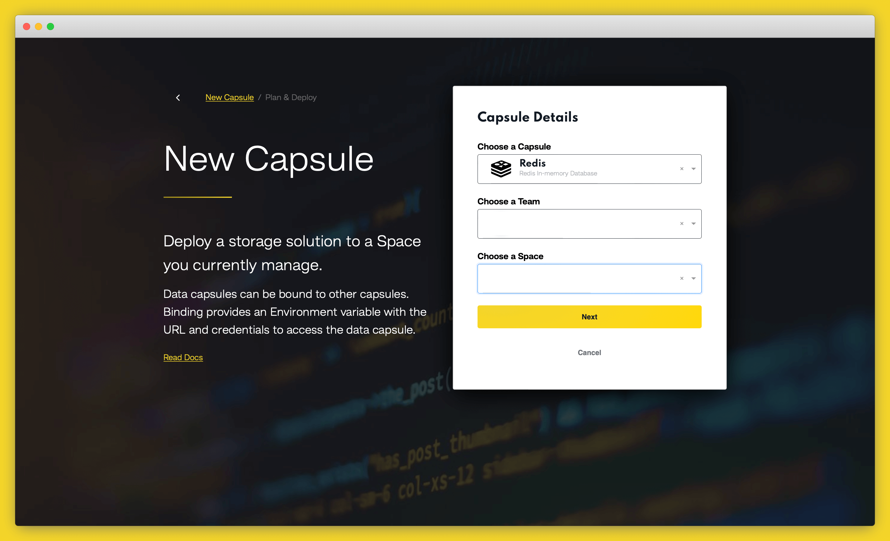
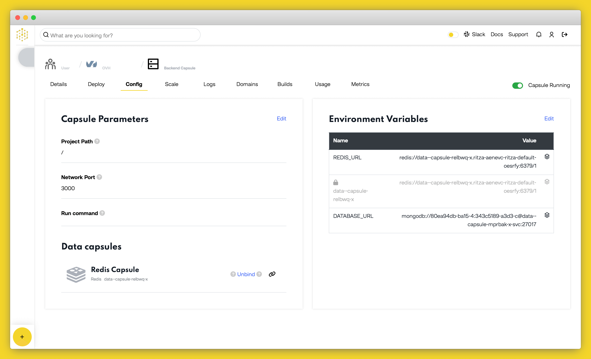

# How to Set Up a Redis Data Capsule

In this tutorial, we’ll create a Redis Data Capsule to provide low latency, in-memory data storage for your application hosted on Code Capsules.

## Create a Redis Data Capsule

Log in to your [Code Capsules account](https://codecapsules.io/) and navigate to the Space your Redis Capsule will be contained in. Click the yellow `+` button. In the Create New Capsule dialog, select "Redis".



Choose a payement option, and click "Create Capsule".

## Binding a Data Capsule to a Backend Capsule

Now we need to bind our Data Capsule to a Backend Capsule. Navigate to your Backend Capsule and click on the "Configure" tab. Scroll down to the "Bind Data Capsule" section and click "Bind".



During the "Bind" process, Code Capsules creates a `REDIS_URL` environment variable which will let your application connect to your Redis database. Once the capsules have been bound, you can find the variable under the "Config" tab, in the "Capsule parameters" section.

We'll use this environment variable in our app to connect to the Redis database.


## Connecting to a Redis Data Capsule from a Python application

If your Backend Capsule is a Python application, use the following code to connect to your Redis database:

```python
import os
import redis

redis_url = os.getenv('REDIS_URL')

connection = redis.from_url(redis_url)

# Do something here
```

## Connecting to a Redis Data Capsule from a Node.js application

If your Backend Capsule is a Node.js application, use the following code to connect to your Redis database:

```js
let redis = require('redis');
let redis_url = process.env.REDIS_URL

let connection = redis.createClient({
  url: redis_url
});

connection.connect();

// Do something here 

connection.quit();
```
