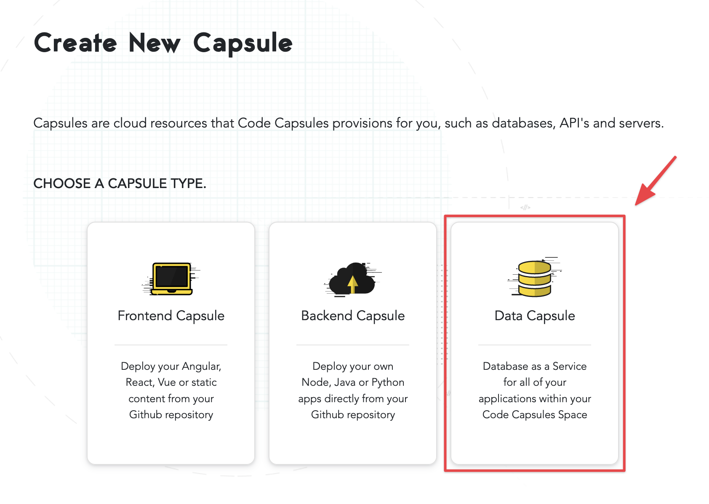

# How to Set Up a Persistent File Data Capsule

Plenty of times you need to make use of persistent storage to develop applications that solve real world problems. In this tutorial, we look at how to create a persistent file data capsule that you can use with your backend applications that are running on Code Capsules. 

## Create a File Data Capsule

Log in to your Code Capsules account and navigate to the Space where your file data capsule will be contained in. Click "New Capsule" and select the "Data Capsule" option from the Create New Capsule dialog that slides in from the right. 



In the New Data Capsule dialog, choose "A persistent storage mounted directly to your capsule." as your data type, then click the "Create Capsule" button. 


## Binding a Data Capsule to a Backend Capsule

To connect a data capsule to a backend capsule hosted on Code Capsules you need to bind the two together before you can connect to and use your data capsule.

Navigate to the backend capsule and click "Configure" to open the capsule's config tab. Scroll down to the "Bind Data capsule" section where your recently created data capsule will show.


Click "Bind" to bind your data and backend capsules. During the bind process, Code Capsules creates a `PERSISTENT_STORAGE_DIR` environmental variable to let your backend capsule know where your data capsule resides in order to access its features. Once the two capsules have been bound, you can scroll to the top of the Configure tab to find the value of this variable. 


The next step is to use this environment variable in code in order to read and write to our data capsule. Copy the value of the `PERSISTENT_STORAGE_DIR` variable or alternatively, reference it directly from code using `os.getenv` or `process.env` for Python and Node.js applications respectively. 

### Connecting to a File Data Capsule From a Python Application 

If your backend capsule is a Python application, use the following code to connect to your file data capsule:

```python
import os

db_directory = os.getenv('PERSISTENT_STORAGE_DIR')

### Do something with the db_directory variable here
file_to_write = os.path.join(db_directory, "test.txt")

file1 = open(file_to_write, "w")
file1.write("File writing test")
file1.close()

```

### Connecting to a File Data Capsule From a Node.js Application 

If your backend capsule is a Node.js application, use the following code to connect to your file data capsule:

```js

db_directory = process.env.PERSISTENT_STORAGE_DIR
const fs = require('fs')

const content = 'Some content!'

// Do something with the db_directory variable here

fs.writeFile(db_directory + '/test.txt', content, err => {
  if (err) {
    console.error(err)
    return
  }
  //file written successfully
})

``` 
