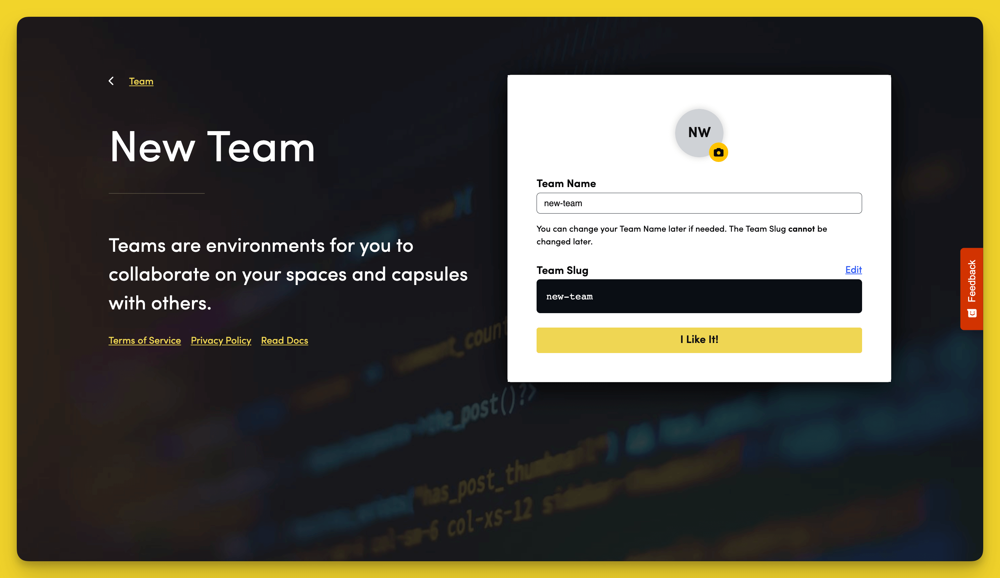

# Team Management

A [Team](../../FAQ/what-is-a-team/) is a group of developers who share access to the same [Spaces](../../FAQ/what-is-a-space/) and [Capsules](../../FAQ/what-is-a-capsule/) in order to make collaborative development easier. This guide explores the team management options you have on Code Capsules.

## Adding Team Members

Click on "Team Settings" in the top navigation bar and navigate to the "Members" tab once you get to the "Team Settings" page.

On the "Members" tab, press the "Invite Members" button and a screen should slide in from the right. Enter the email adrresses of the members you wish to add to your Team and confirm your changes by pressing the "Invite Team Members" button.

## Adding Team Repos

Code Capsules connects with GitHub to deploy applications on its platform. Before you can deploy an application, you need to give Code Capsules permission to read the repository you want to deploy from your GitHub account. 

### Link to GitHub

To link Code Capsules to your GitHub account, click your profile image at the top right of the Code Capsules screen and find the “GitHub” button under “GitHub Details”.

Click the “GitHub” button, select your GitHub username, and do the following in the dialog box that appears:

1. Select "Only Select Repositories".
2. Choose the GitHub repository we forked.
3. Press "Install & Authorize".

### Add Repository to Team

Select "Team Settings" in the top navigation bar to switch to the Team Settings tab.

Click on the "Modify" button under the Team Repos section, and an “Edit Team Repos” screen will slide in from the right. Click “Add” next to the repo you wish to deploy and then “Confirm”. All the Spaces in your Team will now have access to this repo.

## Creating Teams

You can create as many teams as you require depending on your project needs. The name of your current Team will be displayed in the top navigation bar to the right of the Code Capsules logo. To create a new Team, click on the down arrow besides your current Team name which should trigger a dropdown to appear. 

Click on the "Create New Team" option in the dropdown and fill in your Team name in the screen that slides in from the right. Confirm your changes by pressing the "I Like It" button.

### Edit Team Repos 

Depending on whether or not you had previously linked your Code Capsules account to GitHub you will either see a screen asking you to link the two if you hadn't or a screen asking you which repos to add to your Team if you had already done so. 

In the first case, click the "Install GitHub" button and follow the instructions in the [Link to GitHub](#link-to-github) section above.

In the second scenario, click "Add" next to the repos you wish to add to your Team and confirm your changes by pressing the "Confirm" button.

### Team Billing 

On the next screen, you will be asked to enter your Team billing information. You can do so now, or skip this step if you wish to do it later.

### Invite Team Members

The final step in creating a Team is to invite members to it. Enter your prospective team member's email address in the text field and press the "Invite Team Members" button to send your invitation.

The Team creation process will be complete after actioning this step. 