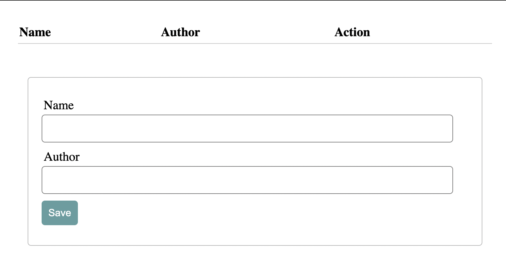

# Building a book recommendations app with PHP, SQLite, and Docker

PHP is one of the first technologies that made dynamic web applications possible and is still widely used today. In this tutorial, we’ll look at how to build a Docker container that contains a full-stack book recommendations app built with PHP and SQLite.

Here’s what the final app will look like:



## Requirements

You will need the following to complete the tutorial and host your application on Code Capsules:

- A [Code Capsules](https://codecapsules.io/) account.
- Git set up and installed, and a registered [GitHub](https://github.com/) account.
- IDE or text editor of your choice.
- PHP installed.

## Project setup

Let’s start by creating a project folder that will house all our files.

In a terminal, navigate to the directory you’ll be keeping the application files in. Run the commands below to create the project folder and navigate into it.

```
mkdir book-recommendations
cd book-recommendations
```

### Initializing an empty git repository

From the project’s root folder, enter the command `git init` to initialize a git repository. This will allow you to track changes to your app as you build it.

### Linking to GitHub

Create a new repository in [GitHub](https://github.com/). Then, in your project's root folder, run the command below from the terminal, replacing "username" and "repository_name" with your own values from GitHub.

```bash
git remote add origin git@github.com:username/repository_name.git
```

This will link your local repository to the one on GitHub.

## Building the frontend

Let’s begin by building our app’s index page. This page will use PHP and HTML as it will contain both static and dynamic content. Create a file named `index.php` in the project root folder and populate it with the code below:

```php
<?php
// Establish database connection
include "database/db_connect.php"; ?>
```
```html
<!DOCTYPE html>
<html lang="en">

<head>
	
	<meta charset="UTF-8">
	<meta name="viewport" content="width=device-width, initial-scale=1.0">
	<title>Book Recommendations</title>
	
	<link rel="stylesheet" href="https://fonts.xz.style/serve/inter.css">
	<link rel="stylesheet" href="https://cdn.jsdelivr.net/npm/@exampledev/new.css@1.1.2/new.min.css">

</head>

<body>
```
```php
	<?php
	// initialize variables
	$book_title = "";
	$author = "";
	$update = false;

	// Check for rest action
	if ($_POST) {

		// Check if Edit has been called
		if ($_POST["rest_action"] == "edit") {

			// Get book by ID
			$id = $_POST['book_id'];
			$update = true;

			// Get Book to edit (parameterized)
			$stmt = $db->prepare('SELECT * FROM books WHERE id=:id');
			$stmt->bindValue(':id',$id,SQLITE3_INTEGER);

			$result = $stmt->execute();
			$book = $result->fetchArray();
		}
	}
	?>

	<?php
	// Get all books from database
	$query = "SELECT * FROM books";
	$results = $db->query($query);
	?>
```
```html
	<!-- Page header -->
	<header>
		<h1>Book Recommendations CRUD demo</h1>
	</header>

	<!-- Section: List book recommendations -->
	<section>
		<table>
			<thead>
				<tr>
					<th>Book Title</th>
					<th>Author</th>
					<th colspan="2">Action</th>
				</tr>
			</thead>
```
```php
			<?php while ($row = $results->fetchArray()) : ?>
```
```html
				<tr>
					<td><?php echo $row['book_title']; ?></td>
					<td><?php echo $row['author']; ?></td>
					<td>

						<form method="POST">
							<input type="hidden" name="book_id" value="<?php echo $row['id'] ?>">
							<input type="hidden" name="rest_action" value="edit">
							<button>Edit</button>
						</form>

					</td>
					<td>

						<form action="app.php" method="POST">
							<input type="hidden" name="book_id" value="<?php echo $row['id'] ?>">
							<input type="hidden" name="rest_action" value="delete">
							<button>Delete</button>
						</form>

					</td>
				</tr>
```
```php
			<?php endwhile; ?>
```
```html
		</table>
	</section>

	<!-- Section: Form -->
	<section>
		<form method="post" action="app.php">

			<p>
				<label for="book_title">Book Title</label> <br>
				<input type="text" name="book_title" value="<?php echo $book["book_title"] ?? '' ?>">
			</p>

			<p>
				<label for="author">Author</label> <br>
				<input type="text" name="author" value="<?php echo $book["author"] ?? '' ?>">
			</p>

			<p>

				<?php if ($update == true) : ?>

					<input type="hidden" name="book_id" value="<?php echo $id; ?>">
					<input type="hidden" name="rest_action" value="update">
					<button type="submit" name="update">Update</button>

				<?php else : ?>

					<input type="hidden" name="rest_action" value="store">
					<button type="submit" name="save">Save</button>

				<?php endif ?>

			</p>

		</form>
	</section>

</body>

</html>
```

The first part, directly after the opening `<body>` tag, we initialize PHP variables and check to see if a POST request has been sent. If a POST request has been sent, we check for the edit instruction and retrieve the book entry to be edited.

~~~
NOTE: For security purposes, we have made use of parameterization (prepared statements). This guards against possible SQL injection attacks.
~~~

Next, there is PHP code for getting a list of all the books from the database. To do this, we first assign the raw SQL query to a variable called `$query` and then run that query against the database and store the results in a variable called `$results`. Below this code is an HTML table that dynamically renders rows of book data from the `$results` variable.

The last part of the index page is the input form that users will fill in to record their book recommendations. Depending on the value of the `$update` variable defined at the top of the file the form renders either a "Save" or an "Update" button. When a user submits the form, it posts the data to a script named `app.php` which will either save a new book entry or update an existing one. We’ll add the `app.php` script in the backend section.

### Adding styling

We have made use of new.css, which is a classless CSS framework to provide boilerplate CSS styling.

You may have noticed the following `<link>` tags inside the `<head>` tag:

```html
<link rel="stylesheet" href="https://fonts.xz.style/serve/inter.css">
<link rel="stylesheet" href="https://cdn.jsdelivr.net/npm/@exampledev/new.css@1.1.2/new.min.css">

```


## Building the backend

Next, we’ll build the backend for our app which will consist of the `dbconfig.php` and `app.php` files mentioned earlier.

### Configuring SQLite

Create a file named `dbconfig.php` and add the following code to it:

```php
<?php
    class MyDB extends SQLite3
    {
    function __construct()
    {
        $this->open($_ENV["PERSISTENT_STORAGE_DIR"] . '/combadd.sqlite');
    }
    }
    $dbh = new MyDB();
    if(!$dbh){
    echo $dbh->lastErrorMsg();
    } else {
        $query = "CREATE TABLE IF NOT EXISTS books (name STRING, author STRING)";
        $dbh->exec($query);
    }
?>
```

The code above connects to a SQLite database when the app is launched and creates a table called “books” if it doesn't already exist in the database.

### Adding app logic

Now add a file named `app.php` and populate it with the code below:

```php
<?php include('dbconfig.php');

	if (isset($_GET['del'])) {
		$id = $_GET['del'];
		$query = "DELETE FROM books WHERE rowid=$id";
		$dbh->exec($query);
		header('location: index.php');
	}

	if (isset($_POST['update'])) {
		$id = $_POST['id'];
		$name = $_POST['name'];
		$author = $_POST['author'];

		$query = "UPDATE books SET name='$name', author='$author' WHERE rowid=$id";
		$dbh->exec($query);
		header('location: index.php');
	}

	if (isset($_POST['save'])) {
		$name = $_POST['name'];
		$author = $_POST['author'];

    		// Makes query with post data
    		$query = "INSERT INTO books (name, author) VALUES ('$name', '$author')";
    		$dbh->exec($query);
    		header('location: index.php');
	}
?>
```

In the first line we include the `dbconfig.php` file so that we can access the database variable.

The first `if` statement executes if a delete request was sent from the frontend. In that case, the code block gets the unique `id` of the book to be deleted from the request and uses it in a `DELETE` SQL query to specify which book should be deleted.

In the event that a user is updating a book entry the second `if` statement executes. The book entry is updated by first getting the new values and `id` so the code knows which book is being updated. After this, the new values are injected in an `UPDATE` SQL query.

Finally, the last `if` statement checks to see if a save request was made and if so, the new book entry is saved. This is done by extracting the book name and author from the request and adding these variables to a raw SQL `INSERT` statement. Afterwards we redirect the app to the index page by setting the location header tag.

## Dockerizing the app

Our book recommendation app is now complete. We’re only left with containerizing it with Docker and then it’ll be ready to be shipped to Code Capsules. Let’s do this by adding a `Dockerfile` to the project root folder. A `Dockerfile` is a set of instructions on how to build an image of your application and run it inside a docker container. Populate the `Dockerfile` with the code below:

```dockerfile
FROM php:8.0-apache
WORKDIR /var/www/html

COPY . .
EXPOSE 80
```

In the first line we import the PHP 8 Apache image which is what our image will be based on. Then we set `/var/www/html` as the working directory for the image which will be built shortly.

The third line copies everything in the project root folder into the working directory of the image. Lastly we expose the app in the image on port 80.

### Naming the `Dockerfile`

The name `Dockerfile` should start with a capital letter ‘D’ and have no extension.

## Adding, commiting, and pushing git changes

The application is now ready for deployment. Let’s add and commit all the files we created to our local repository and then push them to the remote one. Do this by running the commands below in a terminal while in the project’s root folder:

```
git add -A
git commit -m "Added book recommendation app files"
git branch -M main
git push -u origin main
```

Your remote repository will now be up to date with your local one.

## Deploying to Code Capsules

The final step is to deploy our app. Log into your Code Capsules account and link your remote GitHub repository to Code Capsules. Create a Docker Capsule and deploy the app there. You can reference this [deployment guide](https://codecapsules.io/docs/deployment/how-to-deploy-flask-docker-application-to-production/#create-the-capsule) to see how to do so in greater detail.

Once the build is complete, navigate to the "Configure" tab and scroll down to the "Network Port" section. Enter "80" as the port number and click on "Update Capsule".


### Creating a data Capsule

Our book recommendations app needs a Data Capsule in order to persistently store book entries. Create a persistent storage Data Capsule in the same Space where you have your Docker Capsule and bind the two capsules together. You can reference this [guide](https://codecapsules.io/docs/reference/set-up-file-data-capsule/) to see how to do so in more detail.

### Viewing the App

That’s it! Your "Book Recommendations" app should be live and fully functional now. To visit the index route, click the "Live Website" link at the top right of your Docker Capsule.


