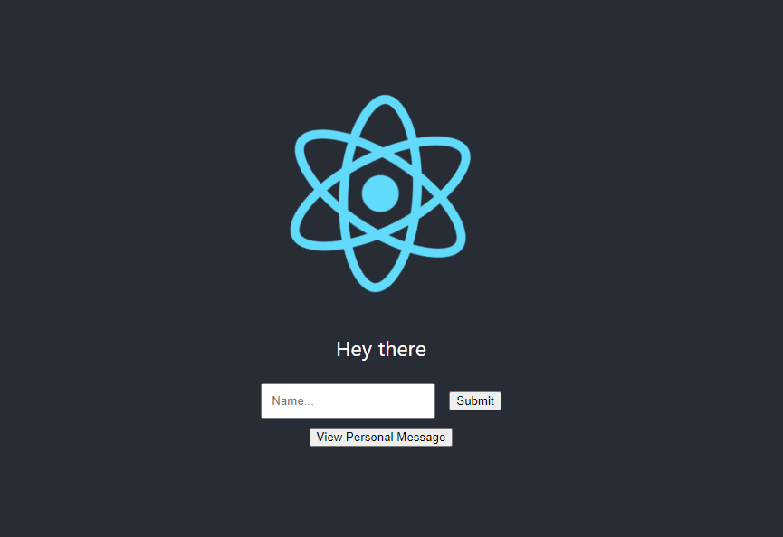
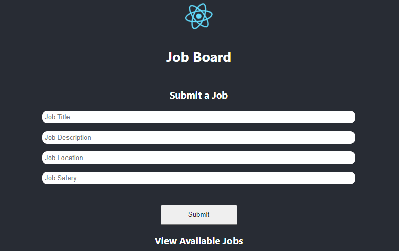

# Build a MERN job board

A MERN (MongoDB, Express, React, Node) stack like other full stack applications has the convenience of needing only one capsule to host both the front end and back end.

In this tutorial, which is part two of this [deployment guide](../deployment/how-to-deploy-mern-stack-application-to-production.md) we'll be extending the boilerplate MERN application we deployed in the first part in order to make a job board based on the same architecture. When complete, the job board will be a platform where users can view and submit available jobs.

To follow along, go over the [deployment guide](../deployment/how-to-deploy-mern-stack-application-to-production.md) first as the tutorial will be building on top of the steps detailed in that guide.

## Extending the Front End

We’ll start by extending the front end to show that it’s for a job board. Open the project’s root folder and navigate to the client directory. Inside this folder, you will find the `src` code for the react front end we want to extend. Open the command line and run `npm install` whilst in the client directory to install the project’s node_modules. 

When you’ve installed the node_modules you can now build the react side of the app to create an optimized production build of the front end by running `npm run build`. This command creates a build folder with an optimized version of our front-end source code. This code has all the extra spacing removed which is great for efficiency but impossible for humans to read or edit. An except is shown below.

```
a=document.createElement("script");a.charset="utf-8",a.timeout=120,i.nc&&a.setAttribute("nonce",i.nc),a.src=function(e){return i.p+"static/js/"+({}[e]||e)+"."+{3:"fe1e148c"}[e]+".chunk.js"}(e);var c=new Error;u=function(r){a.onerror=a.onload=null,clearTimeout(f);var t=o[e];if(0!==t){if(t){var n=r&&("load"===r.type?"missing":r.type),u=r&&r.target&&r.target.src;
```

This means that whenever we make changes to our application, we edit the files in the `src` directory, and then `npm run build` which creates the optimized code in the `build` directory, which is what is run in our web browser.


### Adding `build` to `gitignore`

We don't want to track the build folder in git so we'll have to add it to gitignore. Open the `.gitignore` file in the project's root folder and add the line below to ignore the build folder in our repository.

```
 /client/build
```

### View the Boilerplate Application

Before we can view how the application looks we need to install the `node_modules` for the backend and comment out some code that relies on environment variables that are only accessible on Code Capsules. 

Navigate to the project's root folder in a terminal window and run `npm install` there. Open `index.js` in the project's root folder and comment out the lines shown below.

```js
// db.mongoose
//   .connect(db.url, {
//     useNewUrlParser: true,
//     useUnifiedTopology: true
//   })
//   .then(() => {
//     console.log("Connected to the database!");
//   })
//   .catch(err => {
//     console.log("Cannot connect to the database!", err);
//     process.exit();
//   });
```

We can now safely see how the application looks by running `node index.js` in the terminal whilst in the project's root folder. This command will start the boilerplate MERN application and you can view it in your browser at `localhost:8080`. The app should should look like the screenshot below.



We need to change this front end to reflect the job board functionality.

### Adding the SubmitJob Component

Create a `client/src/components` folder to house the view and submit job components we’re going to build next. Inside the components folder, create a `submitJob.js` file with the following code in it to allow users to submit jobs.  

```js
import React, {useState} from 'react'
import axios from 'axios'

const SubmitJob = () => {

    const [jobTitle, setJobTitle] = useState("")
    const [jobDescription, setJobDescription] = useState("")
    const [jobLocation, setJobLocation] = useState("")
    const [jobSalary, setJobSalary] = useState(null)

    const postJob = (e) => {
        const data = { title: jobTitle, description: jobDescription, location: jobLocation,
                        salary: jobSalary }
        axios.post('/api/jobs/', data)
        .then(response => {
          console.log(response)
        })
    }

    return(
        <div className="submitJobContainer">
            <h3>Submit a Job</h3>
            <form className="formContainer" onSubmit={postJob}>
                <input type="text" name="title" placeholder="Job Title" 
                  onChange={e => setJobTitle(e.target.value)} />
                <input type="text" name="description" placeholder="Job Description"
                    onChange={e => setJobDescription(e.target.value)} />
                <input type="text" name="location" placeholder="Job Location"
                    onChange={e => setJobLocation(e.target.value)} />
                <input type="number" name="salary" placeholder="Job Salary"
                    onChange={e => setJobSalary(e.target.value)} />
                <button className="submitButton" type="submit">Submit</button>
            </form>
        </div>
    )
}

export default SubmitJob
```

The SubmitJob component uses state to keep track of the job field values as they are entered by a user. You can add more state variables if you wish to capture more job fields in your application. When the user clicks submit the postJob method posts the job field values to the endpoint specified in the `axios.post()` method. Notice that we use a relative url, `/api/jobs/` in the post request since the frontend will be hosted at the same url as the backend. 

### Adding the ViewJob Component

Create a `viewJobs.js` file in the components folder and put the below code in it. 

```js
import React, {useState, useEffect} from 'react'
import axios from 'axios'

const ViewJobs = () => {

    const [jobsStateArray, setJobsStateArray] = useState([])

    useEffect(() => {          
        axios.get('/api/jobs/')
        .then(response => {
            console.log(response)
            setJobsStateArray(response.data)
          })
    }, [])

    return(
        <div className="viewJobsContainer">
            <h3>View Available Jobs</h3>
            {jobsStateArray.map((item, index) => {
                return(
                    <div className="jobCard">
                        <p><strong>Job Title</strong>: {item.title}</p>
                        <p><strong>Location</strong>: {item.location}</p>
                        <p><strong>Description</strong>: {item.description}</p>
                        <p><strong>Salary</strong>: {item.salary}</p>
                    </div>
                )
            })}
        </div>
    )
}

export default ViewJobs
```

The ViewJobs component uses hooks to fetch available jobs as soon as the page loads. After fetching the jobs, they are stored in the jobsStateArray before being displayed using the `map` function.  

### View the Front End 

We need to add the two components we just created to `src/App.js` before we can see the changes we just made. Open `App.js` and replace its contents with the code below. 

```js
import logo from './logo.svg';
import './App.css';
import React, {useState} from 'react';
import axios from 'axios';
import SubmitJob from './components/submitJob';
import ViewJobs from './components/viewJobs';

function App() {
  return (
    <div className="App">
      <header className="App-header">
        
        <h3>Job Board</h3>
      </header>
      <SubmitJob />
      <ViewJobs />
    </div>
  );
}

export default App;
```

React displays the contents of `App.js` and the code we added imports the components we made so that they can be rendered. Run `npm run build` again whilst in the client directory in the terminal to build the job board front end. When the site has been built open your browser to see how the front end looks now. 

The page layout should’ve changed but the styling is a bit off. Add the contents of [this css file](https://github.com/ritza-co/mern-job-board/blob/main/client/src/App.css) to `src/App.css` in order to make our front end prettier. 

When you’ve added the above mentioned css build your application again which should now look like this. 



## Extending the Back End

We’re now ready to extend the back end.   

### Adding Job model

Next, let’s define our job model to declare which job fields we want to save. Open `app/models/index.js` and replace its contents with the code below.

```js
const dbConfig = require("../config/db-config.js");

const mongoose = require("mongoose");
mongoose.Promise = global.Promise;

const db = {};
db.mongoose = mongoose;
db.url = dbConfig.url;
db.jobs = require("./job.model.js")(mongoose);

module.exports = db;
```

In the code above we create and export a db variable that we will use to access the database. We will also be using the mongoose interface to handle all communication with our MongoDB. 

Create a file named `job.model.js` in the models folder to define the fields and field types of the job model. Populate it with the code below and if you added more fields to your front end SubmitJob component remember to add them here as well or they won’t be saved when a user submits a job.

```js
module.exports = mongoose => {
var schema = mongoose.Schema(
    {
    title: String,
    description: String,
    location: String,
    salary: Number
    },
    { timestamps: true }
);

schema.method("toJSON", function() {
    const { __v, _id, ...object } = this.toObject();
    object.id = _id;
    return object;
});

const Job = mongoose.model("job", schema);
return Job;
};
```

By default, mongoose names object id fields `_id` and the `schema.method()` function makes sure the name of the id field is just `id` which is the name our front end expects. Delete the `person.model.js` file that came with the boilerplate project as we won’t be needing it. 

### Adding Job controllers

After defining the job model the next step is to create controllers which decide whether the app will be reading or writing jobs to the database. Inside the `app/controllers/` folder create a file named `job.controller.js` with the following code in it. 

```js
const db = require("../models");
const Job = db.jobs;

// Create and Save a new Job
exports.create = (req, res) => {
  // Validate request
  if (!req.body.title) {
    res.status(400).send({ message: "Content can not be empty!" });
    return;
  }

  // Create a Job
  const job = new Job({
    title: req.body.title,
    description: req.body.description,
    location: req.body.location,
    salary: req.body.salary
  });

  // Save Job in the database
  job
    .save(job)
    .then(data => {
      res.send(data);
    })
    .catch(err => {
      res.status(500).send({
        message:
          err.message || "Some error occurred while creating the Job."
      });
    });
};

// Retrieve all Jobs from the database.
exports.findAll = (req, res) => {
    const title = req.query.title;
    var condition = title ? { title: { $regex: new RegExp(title), $options: "i" } } : {};
  
    Job.find(condition)
      .then(data => {
        res.send(data);
      })
      .catch(err => {
        res.status(500).send({
          message:
            err.message || "Some error occurred while retrieving Jobs."
        });
      });
};
```

The `create` export is responsible for creating a new job object using the job model and saving it to the database. The `findAll` export retrieves all jobs that were previously submitted. Delete the `person.controller.js` file that came with the boilerplate project as we won’t be needing it. 

### Adding Endpoints

The last step in extending the back end is to add endpoints where the front end will be making post and get requests to. Create a `job.routes.js` file in the `app/routes/` folder and add the below code to it. 

```js
module.exports = app => {
    const jobs = require("../controllers/job.controller.js");
  
    var router = require("express").Router();
  
    // Create a new Job
    router.post("/", jobs.create);
  
    // Retrieve all Jobs
    router.get("/", jobs.findAll);
  
    app.use('/api/jobs', router);
};
```

The routes use request methods and the controller exports we made earlier to decide what happens when each endpoint is hit by a get or post request. Delete the `person.routes.js` file that was in the routes folder and modify the line below in `index.js` in the root folder of the project.

From 

```js
require("./app/routes/person.routes")(app);
```

Change to 

```js
require("./app/routes/job.routes")(app);
```

The line above tells our back end to use the routes defined in `job.routes.js`.

It's now also time to uncomment the code we commented out earlier when we wanted to view the application's front end. Uncomment the code below in `index.js`.

```js
db.mongoose
  .connect(db.url, {
    useNewUrlParser: true,
    useUnifiedTopology: true
  })
  .then(() => {
    console.log("Connected to the database!");
  })
  .catch(err => {
    console.log("Cannot connect to the database!", err);
    process.exit();
  });
```

## Integrating the Front and Back End 

Our express backend uses the contents inside the `client/build` folder to render the frontend of the mern application. The lines below in index.js in the root folder handle that responsibility.

```js
const path = __dirname + '/client/build/';
const app = express();
app.use(express.static(path));
```

## Using Version Control

We need to use version control to keep track of the new files we added when we were extending our application. 

### Git Add

To add all the new files we created, run the command below in the root folder of the project.

```
git add -A
```

### Git Commit

Next, we need to commit the files we just added to our repository. To do this, run the command specified below.

```
git commit -m "Added job board files"
```

### Git Push

The final step is to push our committed changes to the remote repository which Code Capsules is linked to. Run the command below to push the changes we just made.

```
git push origin main
```

Code Capsules automatically deploys the new version of your application as soon as you push to the deploy branch which is `main` in this case. 

That’s it, your job board should be fully functional now.
