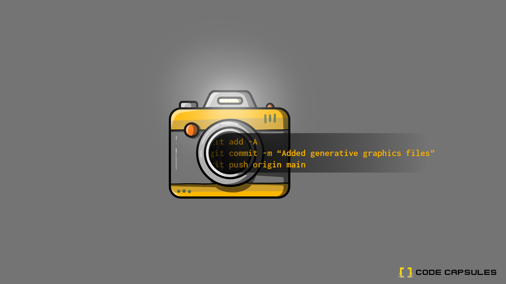

# Build a Generative Graphics Application with Pillow, Flask and HTMx



Image processing is an increasingly popular functionality among today’s apps as more and more pictures get digitized by the day. Python provides support for image manipulation through a package called `Pillow` and in this tutorial we’ll look at how to leverage it to create random graphic images.

We’ll build a web app that creates images with rectangle graphics of different colours and sizes and makes them available for download when requested by a user.

An example of a graphic image that can be created by the app we'll build is shown below.


You can also add text to the generated images to create image covers and different marketing posts.

## Overview and Requirements

You will need the following to complete the tutorial and host your application on Code Capsules:

- A [Code Capsules](https://codecapsules.io/) account
- Git set up and installed, and a registered GitHub account
- An IDE or text editor of your choice
- Python3 installed

## Project Set Up

After ensuring that you have all the requirements in place, we can go ahead with the project set up. We’ll start by creating a project folder which will house all files relevant to the application we’ll be building.

### Create Project Folder

Open a terminal and from there, navigate to a directory where you desire to keep the application files. Run the commands below to create the project folder and navigate into it.

```
mkdir generate-graphics
cd generate-graphics
```

### Create Virtual Environment

A virtual environment allows us to isolate the packages we need to run our application from the computer system. Run the command below from a terminal in the project root folder to create a virtual environment called `env`.

```
python -m venv env
```

To activate the virtual environment, run either of the following commands depending on your OS.

**MacOS**

```
source env/bin/activate
```

**Windows**

```
.\env\Scripts\activate
```

When you’ve activated the virtual environment the name `env` will appear on the leftmost part of the terminal in your current line. This will be the confirmation that the activation was successful.

### Install Dependencies

With the virtual environment now active, we can add the dependencies our app needs to the environment. Run the command below from a terminal in the project root folder to install the packages we’ll need.

```
pip install flask pillow gunicorn
```

### Initialize Git Repository

We’ll make use of version control throughout the course of this tutorial to keep track of our changes. Run the command `git init` to create a new empty repository in the project root folder.

### Link to GitHub

The next step after creating a local `git` repository is to link it to a remote one that we can deploy from. The remote repository can be thought of as a mirror image of the local one that we update after adding new logic that works as expected.

Head over to [GitHub](https://github.com/) and create a new repository. After successfully creating one, you’ll be presented with instructions of how to link your new remote repository to a local one. Go back to your terminal in the project root folder and run the command below, taking care to replace the `username` and `repository_name` with your own values.

```
git remote add origin git@github.com:username/repository_name.git
```

## Build the Frontend

We can now start building our generative graphics app and we’ll start with the frontend using `flask` templates. Create an `app/templates` folder inside the project root folder and add a file named `home.html` to it. This file will contain the code for the landing page of our app. Populate it with the code below:

```html
<!DOCTYPE html>
<html lang="en">
  <head>
    <title>Flask HTMX ALPINE App</title>
    <link
      href="https://cdn.jsdelivr.net/npm/bootstrap@5.0.0-beta1/dist/css/bootstrap.min.css"
      rel="stylesheet"
      integrity="sha384-giJF6kkoqNQ00vy+HMDP7azOuL0xtbfIcaT9wjKHr8RbDVddVHyTfAAsrekwKmP1"
      crossorigin="anonymous"
    />
    <!-- HTMX -->
    <script src="https://unpkg.com/htmx.org@1.5.0"></script>
    <style>
      body {
        padding: 20px;
        text-align: center;
      }
      img {
        max-height: 75vh;
      }
      .image-frame {
        border: 10px solid #213e49;
        border-radius: 5px;
        width: 80vh;
        margin: auto;
        margin-top: 20px;
      }
      .button-row {
        display: flex;
        flex-direction: row;
        justify-content: space-around;
        width: 60%;
        margin: auto;
        margin-top: 25px;
      }
    </style>
  </head>
</html>
```

The `<link>` tag in the `<head>` section links to `Bootstrap` to simplify styling for common `html` elements like `forms` and `buttons` while the `<style>` tag adds any extra unique styling we might need.

We’ll be using `htmx` to send requests to generate a new graphic image and we include it in the project by adding the `<script>` tag below the `<link>` tag. `HTMx` makes it possible to add interactivity to traditional multipage html sites without any extra complexity that’s introduced by popular single page frameworks.

Next, we need to add the code for the body of the home page. Copy and paste the snippet below underneath the closing `</head>` tag in `home.html`

```html
<body>
  <h1>Generate Cool Graphics</h1>
  
  <div class="image-frame">
    
  </div>
  

  <div class="button-row">
    
    <form action="/download" method="post" enctype="multipart/form-data">
      <input
        type="text"
        name="image"
        value="{{image}}"
        style="display: none;"
      />
      <button type="submit" class="btn btn-primary">Download</button>
    </form>
    
    <button
      class="btn btn-primary"
      hx-target="#new-image"
      hx-get="/generate-another"
      hx-swap="outerHTML"
    >
      I hate this art, make me another
    </button>
  </div>
</body>
```

Our app has two main features which are to generate new graphic images and download them. To do this, the “I hate this art, make me another” button sends a request to the `/generate-another` route which handles the creation of a new graphic image. When the app generates an image a user likes, the user can download that image by pressing the “Download” button. This sends a request to the `/download` route which is responsible for starting the image download.

The `` tag below the page header takes in a `byte 64` string as input and renders the corresponding graphic image to the screen. We’ve assigned an `id` value of “new-image” to the tag to allow us to use `HTMx` to update the image when a user clicks the “I hate this art, make me another” button. You’ll notice three `HTMx` attributes in the `src` code for this button which is located at the bottom of the page. Let’s go over them and see what each one is responsible for:

- **hx-target** - This attribute accepts an `id` value prefixed by a “#”. It lets `HTMx` know which element to swap upon a successful request.
- **hx-get** - The `hx-get` attribute sends a `GET` request to the specified url. If we wanted to send a `POST` request we’d have used the `hx-post` attribute instead.
- **hx-swap** - This attribute tells `HTMx` how to swap out the old and new elements after a successful request. In our case we’ve used the value of “outerHTML” to specify that the entire `` element be replaced by the response. Other accepted values include but are not limited to innerHTML, beforeend and afterend.

You can view other `HTMx` attributes and their functionalities [here](https://htmx.org/reference/).

## Build the Backend

With the frontend complete, we can now focus on the backend which contains the interesting bits of our app’s logic. Here, we will see the logic for the two routes that are called in the frontend.

Create a file named `run.py` in the project root folder and populate it with the code below:

```py
from app import app

if __name__ == "__main__":
    app.run()
```

The code above is responsible for starting our application by calling flask’s `run` method.

### Initialize `app` Module

Let’s go ahead and initialize the `app` module we imported in the previous code snippet. Create an `__init__.py` file inside the `/app` folder and populate it with the code below:

```py
from flask import Flask

app = Flask(__name__)

from app import views
```

In the code above, we create a Flask `app` object and import the app views we’ll add later on.

### Add Graphic Image Generation Logic

The next step is to add logic for the graphic image generation. Create a file named `pallets.json` in the project root folder and populate it with the code in this [file](https://github.com/codecapsules-io/generative-art/blob/main/pallets.json). This is a list of 2D arrays containing random numbers that represent different colour pallets which our app will pick randomly each time a user chooses to generate a new image.

Next, let’s create the file that’ll make use of the pallets we just defined. Inside the `/app` folder add a file named `make_squares.py` and populate it with the code below:

```py
from PIL import Image, ImageDraw, ImageFont
import base64
import random
import json
import io

pallets = []
with open("pallets.json") as f:
    ps = json.load(f)
    for p in ps:
        pallet = [tuple(x) for x in p]
        pallets.append(pallet)

BLACK = (0, 0, 0, 255)

def create():
    img = Image.new("RGBA", (1000, 1000), (255, 255, 255, 255))
    d = ImageDraw.Draw(img)


    num_recs = random.randrange(20, 40)
    min_size = random.randrange(20,50)
    max_size = min_size + random.randrange(20,100)
    colors = random.choice(pallets)
    stroke_width = random.randrange(1,5)
    xoffset = 0
    yoffset = 0
    for row in range(num_recs):
        for rec in range(num_recs):
            topleftx = random.randrange(0, 50) + xoffset
            toplefty = random.randrange(0, 50) + yoffset
            bottomrightx = topleftx + random.randrange(min_size,max_size)
            bottomrighty = toplefty + random.randrange(min_size,max_size)
            color = random.choice(colors)
            xoffset += 50
            r = d.rectangle([topleftx, toplefty, bottomrightx, bottomrighty], fill=color, outline=BLACK, width=stroke_width)
        yoffset += 50
        xoffset = 0
    image = io.BytesIO()
    img.save(image, "PNG")
    image.seek(0)
    img_b64 = base64.b64encode(image.getvalue()).decode()
    return img_b64
```

The module defined in the code snippet above leverages the “Pillow” package to create new random images using the pallets we defined in the `pallets.json` file. In line 8-12 we open the `pallets.json` file and add its contents to a local array named “pallets” that we’ll use in the `create()` method.

The `create()` method is responsible for generating base 64 image strings for new random images. It does so by first creating a blank canvas and adding a random number of rectangles of different sizes and colours. After the image has been created it’s returned as a base 64 image string which is more efficient to transfer between our app modules.

### Add App Views

The last step in building our backend is to add the application views. To do this, create a file named `views.py` inside the `/app` folder and populate it with the code below:

```py
from app import app
from flask import render_template, send_file, request
from app.make_squares import create
import io, base64
from PIL import Image
import os

db_directory = os.getenv('PERSISTENT_STORAGE_DIR')

@app.route("/", methods=["GET"])
def index():
    graphic_image = create()
    img = Image.open(io.BytesIO(base64.decodebytes(bytes(graphic_image, "utf-8"))))
    img.save(os.path.join(db_directory, "imgnew.png"))
    return render_template('home.html', image=graphic_image)

@app.route("/generate-another", methods=["GET"])
def generate_another():
    graphic_image = create()
    img = Image.open(io.BytesIO(base64.decodebytes(bytes(graphic_image, "utf-8"))))
    img.save(os.path.join(db_directory, "imgnew.png"))
    response = f"""
    
    """
    return response

@app.route("/download", methods=["GET", "POST"])
def download():
    return send_file(os.path.join(db_directory, "imgnew.png"), mimetype='image/png', as_attachment=True, download_name="graphic.png")
```

You will notice at the top of the file we import the `create` method from the `make_squares` module since our views need to return the base 64 image string when responding. Our app will make use of the persistent file storage provided by Code Capsules so we import `os` to allow us to read the `PERSISTENT_STORAGE_DIR` environment variable. Reading and writing to this file storage is the same as reading and writing to your local file system but with the benefit of online access and persistence in this case. We store the value of the `PERSISTENT_STORAGE_DIR` environment variable in the `db_directory` variable in an effort to follow clean code principles.

The index route is called when the app is first started and it calls the `create()` method to generate a base 64 image string and returns it in the `home.html` template. The `/generate-another` route is called when a user clicks on the “I hate this art, make me another” button. It saves the new graphic image to the persistent file storage before returning it as part of an `HTML` response since the request is triggered by `HTMx`. Doing so, allows our app to only refresh the image element and not the whole page like in the case of rendering templates.

The last view we have is for the download feature. When a user clicks on the “Download” button, the `/download` route is called and it gets the most recently generated graphic image from the file storage before returning a response with the file added as an attachment.

## Preparing for Deployment

Our “Generate Graphics” app is now complete and we are only left with adding files necessary for deployment before we can publish it.

### Add Procfile and `requirements.txt`

We’ll start by creating a Procfile which tells Code Capsules how to run our app. Create a file named `Procfile` in the project root folder and add the following code to it:

```
web: gunicorn run:app
```

We use the `gunicorn` package to run our app in production since the built in flask server is less secure and only suitable for the development environment.

After creating a `Procfile` we have to generate a `requirements.txt` file to tell Code Capsules which packages need to be installed first before our app can start. Run the command, `pip freeze –local > requirements.txt` from a terminal while in the project’s root folder. This should create a `requirements.txt` file.

### Add Virtual Environment to `.gitignore`

Before we push our local changes to the remote repository we need to stop tracking our virtual environment folder. To do this, create a file named `.gitignore` in the project root folder and add the code below to it:

```
/env
```

### Add, Commit and Push Git Changes

Up next, we have to add and commit all the files we created to our local repository and then push them to the remote one. Do this by running the commands listed below in a terminal while in the project’s root folder:

```
git add -A
git commit -m “Added generative graphics files”
git push origin main
```

After actioning the above steps your remote repository will now be up to date with your local one.

## Deploy to Code Capsules

The final step is to deploy our app and for that you need to link your remote GitHub repository to Code Capsules. Log into your Code Capsules account and do so. After linking your GitHub repo, create a backend capsule and deploy the app there. Additionally, you will also need a file data capsule to persist your storage. When your app has been successfully built on the backend capsule you need to bind it to the file data capsule in order to connect the two. You can reference [these docs](https://codecapsules.io/docs/reference/set-up-file-data-capsule/) to see how to do so in greater detail.

That’s it! Your “Generate Graphics” app should be live and fully functional now.
