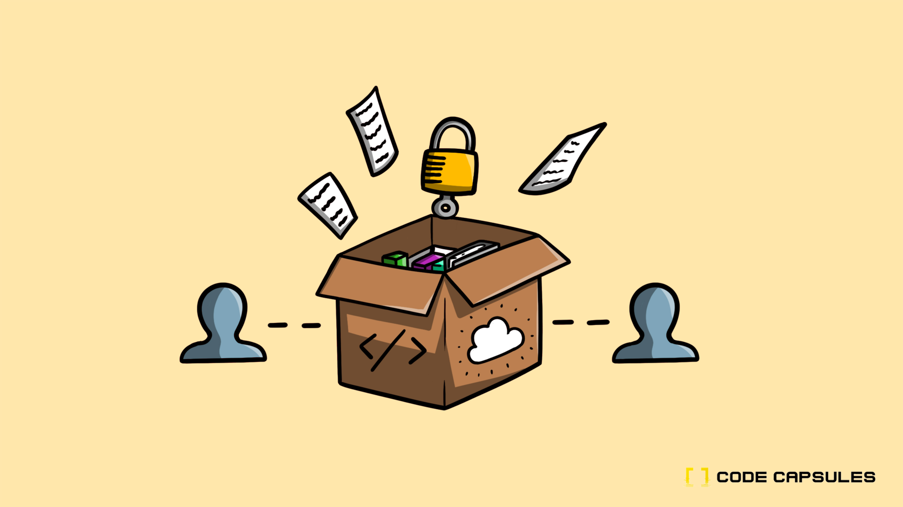

# Tutorial Guides

If you're looking to build cool applications that you can host on Code Capsules, you can find tutorials for:

<figure>
  <a href="./build-slackbot-with-node.html">
  
  <figcaption>Building a Slackbot</figcaption>
  </a>
</figure>

<figure>
    <a href="./creating-and-hosting-a-flask-api.html">
  
  <figcaption>Creating a Flask API</figcaption>
  </a>
</figure>

<figure>
    <a href="./customising-domain.html">
  
  <figcaption>Customising Domain</figcaption>
  </a>
</figure>

<figure>
    <a href="./create-and-host-telegram-bot.html">
  
  <figcaption>Creating a Telegram Bot</figcaption>
  </a>
</figure>

<figure>
    <a href="./host-a-frontend.html">
  
  <figcaption>Building a Frontend Portfolio</figcaption>
  </a>
</figure>

<figure>
    <a href="./develop-persistent-sleep-tracker-part-1.html">
  
  <figcaption>Developing a Persistent Sleep Tracker</figcaption>
  </a>
</figure>

<figure>
    <a href="./stripe-checkout-and-email-with-flask.html">
  
  <figcaption>Stripe Checkout and Email Subscription</figcaption>
  </a>
</figure>

<figure>
    <a href="./build-a-web-file-store.html">
  
  <figcaption>Building a Web File Store</figcaption>
  </a>
</figure>

