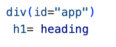
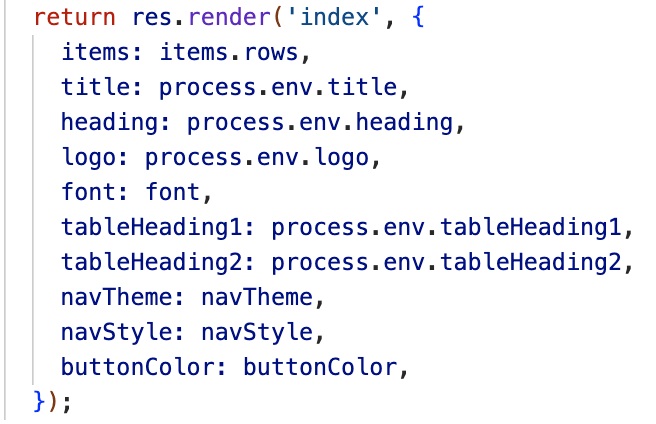
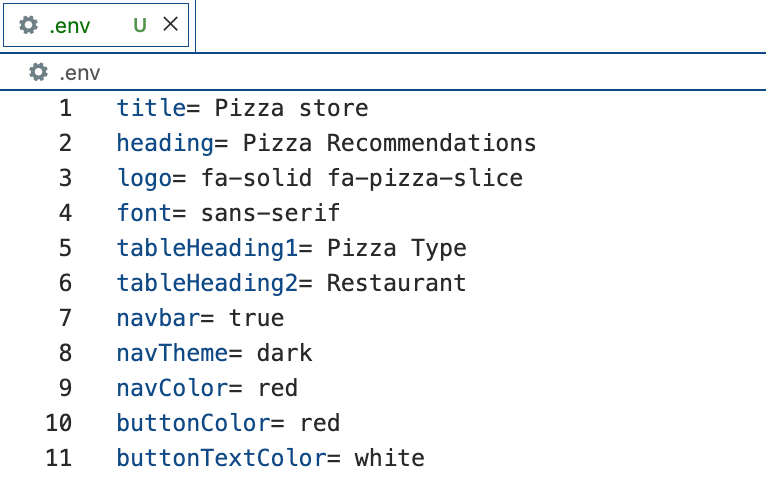
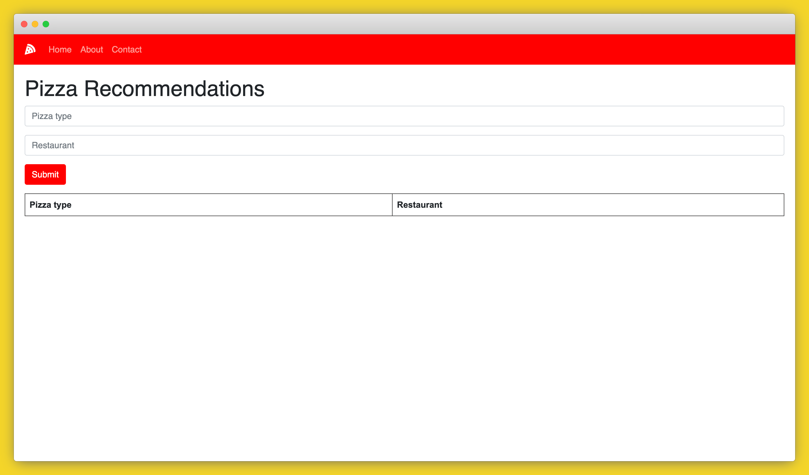

# White label your app with Code Capsules


A white label app is a prebuilt solution that offers customers the freedom to customize their applications without the hassle of developing the core functionality.

These kinds of apps were developed out of a need for short waiting times and lower costs in app development. Generic app bases like this only need to be created once and then can be sold to multiple customers. The pros for developers is that the software only has to be created once, meaning more money can be made for less work. The pros for companies is a minimal wait time and lower development costs to implement their app.

Do the benefits of a white label app seem appealing to you? (Who wouldn’t want to save money and time!) Then let’s take a look at the two options available.

## Single tenant vs multi tenant

When choosing to create your white label app, you need to consider the level of customization your clients will need. There are two types of white label applications: single-tenant and multi-tenant. While one allows for greater customization, the other offers a more cost effective and speedy solution. Let’s take a look at what each type has to offer.

### Single-tenant

A single tenant application has its own independent database and server, that is solely dedicated to a single customer's version of the application. This means that changes made to the app will not affect any other versions, allowing customers to have complete control over any updates made to the app, both stylistic and architectural. 

This option offers a template that speeds up the lengthy development process, while still maintaining the freedom to tailor the application to your heart’s content. This template is the perfect foundation for customers who want to save money on building the basics but are willing to put in the resources to maximize on customization and user experience.

### Multi-tenant

For customers who are looking for a cost-effective way to get their application out quickly, the multi-tenant option is the most suitable choice. Multi-tenant applications share a server and database across all versions. Customers can focus solely on the UI of their application to suit their brand, while enjoying the benefits of a well designed base architecture.

Multi-tenant applications provide a one-size fits all app architecture that cannot be changed on a per customer basis. Customers can change stylistic elements of their own version of the app, but any changes to the UX or backend will update all versions.

This solution is cost-effective because it requires very little setup or developer resources to get going. One downside to this model is that a shared database and server ultimately implies a shared impact when it comes to issues or breaches.

## Which solution is best for you?

The choice boils down to what the client needs. On the one hand a single tenant app gives a highly customizable experience, for a higher budget, while still offering quick development time and lower costs than a completely custom app. A multi-tenant app lets you take on more clients, as less technical setup is required. On the other hand, a multi-tenant white label app is a quick affordable solution to serve many small to medium-sized companies who want to get an MVP up and running.

Once you have decided which type is most appropriate, you can begin to design your app. You will need to consider the core functionality of the app while keeping future customization in mind.

In the next section we will walk through:

- Setting up a single-tenant white label application on GitHub.
- Hosting two different versions of the app on CodeCapsules. 
- Exploring the customization options you might consider when creating your own white label app.

## How to deploy a single-tenant white label apps on Code Capsules

This next section will demonstrate how Code Capsules can be used to host a white label application and allow for customization through the editing of environment variables within our intuitive UI. If you would like to read the code or follow along you can fork the [GitHub repository](https://github.com/ritza-co/demo-htmx-express-white-label) we will be working with. This code is a white labeled version of our [HTMX Express tutorial code](https://codecapsules.io/docs/tutorials/build-express-htmx/).

The app in the repo works as a store for data in a database using an HTMX frontend. The rest of the UI is determined by values that can be specified through environment variables.

Here are the elements that can be customized in this app:

1. Page title
2. Page heading
3. Headings for the table’s column 1 and 2
4. Page font
5. Company Logo
6. Optional navigation bar
7. Navigation bar theme and color
8. The color of the button and its text

All of these elements can be customized through the setting of environment variables. In this example the font can be changed by simply entering a font name of your choice into the `font` environment variable. Where some of the configuration isn’t completely intuitive, like the navbar theme variable that needs to be set to either light or dark, documentation should be provided to your customer giving them the help they need to understand the setup.

Setting up the environment variables was a simple process of creating variables in the HTML of the app.



Then setting those variables in the Javascript by accessing them from the environment variables with `process.env.variable-name`.



Here we can access the `heading` environment variable through `process.env.heading` and pass the value in our context dictionary which we can then access from the rendered HTML.

During development these environment variables are set and tested through a `.env` file which might look something like this:



## Deploying on Code Capsules

Now that our application is ready to be customized and deployed, we can use Code Capsules to make this process easy and intuitive. The workflow you could expect from delivering a white label app is as follows:

1. Providing your client with the white label application code
2. A Code Capsules account is set up for the client.
3. The repository is connected to the clients account.
4. The appropriate Capsules are created for your app.
5. The environment variables are set within the Capsule.
6. The app is deployed with all the customizations.

Let’s try this out. First I will create an account with Code Capsules. Then next I link my GitHub to my account and give access to the repo that is storing my white label code.

Now I create a database Capsule and a backend Capsule, storing my white label code and I bind them within the backend Capsule’s UI.

Now in my backend Capsule I navigate to the “Config” tab, where I can create and edit environment variables for my app.

Let’s say my first customer is a Pizza shop that needs a data store and UI for their pizza recommendations. In this case I will set the environment variables to the following:

```
title= Pizza store
heading= Pizza Recommendations
logo= fa-solid fa-pizza-slice
font= sans-serif
tableHeading1= Pizza Type
tableHeading2= Restaurant
navbar= true
navTheme= dark
navColor= red
buttonColor= red
buttonTextColor= white
```

After saving these new variables the Capsule will restart with all the new values and you will be able to see the app by clicking the URL in the “Details” tab of the backend Capsule’s UI.



Here the pizza shop has a red theme, a modern sans-serif font,custom headings, and their own logo.

Say another company comes along and wants to buy my white label application, this time its a movie company. I would simply repeat the steps of creating Capsules above but with new environment variables to the customer’s choosing.

```
title= Movie store
heading= Movie Recommendations
logo= fa-solid fa-film
font= serif
tableHeading1= Title
tableHeading2= Directors
navbar= true
navTheme= dark
navColor= darkblue
buttonColor= darkblue
buttonTextColor= white
```

The result is a brand new UI customized to the client’s use case.


I have included the option to turn off the navbar here as well, which can be done by setting the `navbar` environment variable to `false`. This would be the result:


So stylistic changes can be made by changing colors, font types, text, and logos, but pretty large changes can also be made to the UI by hiding and revealing its parts through variable choices. It’s all up to the designer of the application to decide how far they want to go in providing this kind of customization to their client.

## Takeaway

In this tutorial two very different looking applications were deployed from the same code base simply by changing a couple of variables in the Code Capsules UI. This is a really powerful way to get your app solution to more people, more quickly, and for less money.

Getting some new app ideas after reading this? (I know I am!) Test your application out, or deploy to production by signing up with Code Capsules.
