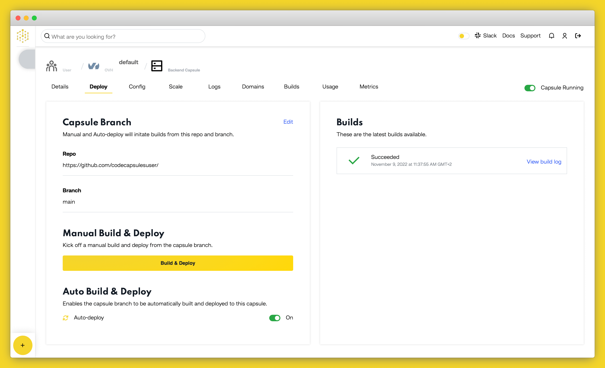

# White label your app with Code Capsules


A white label app is a prebuilt solution that offers customers the freedom to customize their applications without the hassle of developing the core functionality.

These kinds of apps were developed out of a need for short waiting times and lower costs in app development. Generic app bases like this only need to be created once and then can be sold to multiple customers. The pros for developers is that the software only has to be created once, meaning more money can be made for less work. The pros for companies is a minimal wait time and lower development costs to implement their app.

Do the benefits of a white label app seem appealing to you? (Who wouldn’t want to save money and time!) Then let’s take a look at the two options available.

# Single tenant vs multi tenant

When choosing to create your white label app, you need to consider the level of customization your clients will need. There are two types of white label applications: single-tenant and multi-tenant. While one allows for greater customization, the other offers a more cost effective and speedy solution. Let’s take a look at what each type has to offer.

## Single Tenant

A single tenant application has its own independent database and server, that is solely dedicated to a single customer's version of the application. This means that changes made to the app will not affect any other versions, allowing customers to have complete control over any updates made to the app, both stylistic and architectural.

This option offers a template that speeds up the lengthy development process, while still maintaining the freedom to tailor the application to your heart’s content. This template is the perfect foundation for customers who want to save money on building the basics but are willing to put in the resources to maximize on customization and user experience.

## Multi tenant

For customers who are looking for a cost-effective way to get their application out quickly, the multi-tenant option is the most suitable choice. Multi-tenant applications share a server and database across all versions. Customers can focus solely on the UI of their application to suit their brand, while enjoying the benefits of a well designed base architecture.

Multi-tenant applications provide a one-size fits all app architecture that cannot be changed on a per customer basis. Customers can change stylistic elements of their own version of the app, but any changes to the UX or backend will update all versions.

This solution is cost-effective because it requires very little setup or developer resources to get going. One downside to this model is that a shared database and server ultimately implies a shared impact when it comes to issues or breaches.

# Which solution is best for you?

The choice boils down to what the client needs. On the one hand a single tenant app gives a highly customizable experience, for a higher budget, while still offering quick development time and lower costs than a completely custom app. A multi-tenant app lets you take on more clients, as less technical setup is required. On the other hand, a multi-tenant white label app is a quick affordable solution to serve many small to medium-sized companies who want to get an MVP up and running.

Once you have decided which type is most appropriate, you can begin to design your app. You will need to consider the core functionality of the app while keeping future customization in mind.

In the next section we will walk through:

- Setting up a single-tenant white label application on GitHub.
- Hosting two different versions of the app on CodeCapsules
- Exploring the customization options you might consider when creating your own white label app.

# How to deploy a single-tenant white label app on Code Capsules

This next section will demonstrate how you can create a single-tenant application and host multiple versions of that application on Code Capsules. We will set up two versions of a white-label app, representing two different company that have bought the app. Each version will be customized through the editing of environment variables to meet the branding requirements of each company.

## Overview and Requirements

We will be editing, configuring and deploying both versions of our application. You will therefore need the following to complete the tutorial:

- Git set up and installed, and a registered GitHub account
- A [Code Capsules](https://codecapsules.io/) account
- An IDE or text editor of your choice

## Getting started

To get started, initialize a local git repository, and clone the [starter code](https://github.com/jamesdanielwhitford/demo-express-htmx), onto your local machine from your terminal with the following command:

```
git init

git clone https://github.com/jamesdanielwhitford/demo-express-htmx.git
```

This repo hosts an HTMX and Express app that works as a UI for a data store. To see the application run the following commands from your terminal:

```
npm i express pug sequelize sqlite3
npm run start
```

Then go to `[http://localhost:3005/](http://localhost:3005/)` to see the app.


Right now the application is set up for a singular purpose, to store book recommendations. The app at the moment has limited scope, it is branded as a data store for book recommendations only. The core functionality, a data store with an intuitive UI, could be a great tool for a number of companies, but right now the app is branded for only one purpose.

## Turning the app into a white-label app

To be a white label app this app needs to be customizable to match the requirements of different companies. We can add the ability to customize the app by removing hard coded values from our code and replacing them with environment variables that can be changed easily.

Create a new file in the root directory of the project called `.env` and enter the following inside it:

```
heading= Pizza Recommendations
```

This defines an environment variable that we can now access from our Javascript code and pass into our `index.pug` through a context dictionary. In the root directory of the project open the `index.js` file and in the `app.get('/',` function replace the `return` function with the following:

```js
return res.render('index', {
  items: items.rows,
  heading: process.env.heading,
});
```

Here we get the environment variable we set in the `.env` file with `process.env.heading` and pass it into the context dictionary that we can now access from our app’s view.

For example, open up the `index.pug` file in the `views` folder and change the `h1` on the page from this:

```html
h1 Book Recommendations
```

To this:

```
h1= heading
```

Here we have changed the hard coded title of the page to the environment variable accessed through the context dictionary. If you run the app now you will see that the page has a new heading.


You can get pretty creative with setting these environment variables. To demonstrate some of the possibilities, define these variables within the `.env` file:

```
title= Pizza store
heading= Pizza Recommendations
logo= fa-solid fa-pizza-slice
font= sans-serif
tableHeading1= Pizza Type
tableHeading2= Restaurant
navbar= true
navTheme= dark
navColor= red
buttonColor= red
buttonTextColor= white
```

And replace all the code within the `index.pug` file with the following:

```pug
doctype html
html(lang='en')
head
  title= title
  link(rel='stylesheet', href='https://cdn.jsdelivr.net/npm/bootstrap@5.0.0-beta1/dist/css/bootstrap.min.css')
  script(src='https://unpkg.com/htmx.org@1.5.0')
  script(src="https://kit.fontawesome.com/1857d670c9.js" crossorigin="anonymous")
  style.
    #app {padding: 20px}
    i {padding-left: 20px}
    table {font-family: arial, sans-serif;border-collapse: collapse;width: 100%;}
    tr.htmx-swapping td {opacity: 0;transition: opacity 0.5s ease-out;}
    td, th {border: 1px solid #383737;text-align: left;padding: 8px;}
    tr:nth-child(even) {background-color: #dddddd;}
body(style=font)
  nav(class=navTheme style= navStyle)
   a.navbar-brand(href='#')
     i(class= logo)
   button.navbar-toggler(type='button' data-toggle='collapse' data-target='#navbarNav' aria-controls='navbarNav' aria-expanded='false' aria-label='Toggle navigation')
    span.navbar-toggler-icon
   #navbarNav.collapse.navbar-collapse
    ul.navbar-nav
     li.nav-item.active
      a.nav-link(href='#') Home
     li.nav-item
      a.nav-link(href='#') About
     li.nav-item
      a.nav-link(href='#') Contact
  div(id="app")
   h1= heading
   form(hx-post="/submit" hx-swap="beforeend" hx-target="#new-item" class="mb-3")
     input(type="text" placeholder= tableHeading1 name="tableHead1" class="form-control mb-3")
     input(type="text" placeholder= tableHeading2 name="tableHead2" class="form-control mb-3")
     button(type="submit" class="btn btn-md" style= buttonColor) Submit
   table
     thead
       tr
         th= tableHeading1
         th= tableHeading2
     tbody(id="new-item" hx-target="closest tr" hx-swap="outerHTML swap:0.5s")
       each item in items
         tr
           td #{item.tableHead1}
           td #{item.tableHead2}
           td
             button(class="btn btn-primary" hx-get=`/get-edit-form/${item.id}`) Edit
           td
             button(hx-delete=`/delete/${item.id}` class="btn btn-primary") Delete
```

Here multiple environment variables have been added. This code allows us to customize the following elements of our application:

1. Page title
2. Page heading
3. Headings for the table’s column 1 and 2
4. Page font
5. Company Logo
6. Optional navigation bar
7. Navigation bar theme and color
8. The color of the button and its text

Finally we just need to access the environment variables from the `index.js` file and pass them into the context dictionary. Some of the variables set in the environment need to be altered before they can be passed into our context dictionary.

Replace the `app.get('/',` function with the following:

```js
app.get('/', async (req, res) => {
  const items = await Item.findAndCountAll();
  var display = '';
  if (process.env.navbar == 'true') {
    display = '';
  } else {
    display = 'none';
  }
  var font = `font-family: ${process.env.font}`;
  var navTheme = `navbar navbar-expand-lg navbar-${process.env.navTheme}`;
  var navStyle = `background-color: ${process.env.navColor}; display: ${display}`;
  var buttonColor = `background-color: ${process.env.buttonColor}; color: ${process.env.buttonTextColor}`;
  return res.render('index', {
    items: items.rows,
    title: process.env.title,
    heading: process.env.heading,
    logo: process.env.logo,
    font: font,
    tableHeading1: process.env.tableHeading1,
    tableHeading2: process.env.tableHeading2,
    navTheme: navTheme,
    navStyle: navStyle,
    buttonColor: buttonColor,
  });
});
```

Here we either pass the environment variable directly into the context dictionary, like so:

```js
title: process.env.title,
```

Or we edit the environment variable where necessary. The code below checks if the user wants a navigation bar, if not it will define a string to set the display property of the navbar’s styling to `none`.

```js
var display = '';
if (process.env.navbar == 'true') {
  display = '';
} else {
  display = 'none';
}
var navStyle = `background-color: ${process.env.navColor}; display: ${display}`;
```

If you run the code now you will see the app has a branded look:


We won’t need the `.env ` file in our deployment so you can go ahead and delete that file.

Now that our application is easily customizable we can deploy different versions of the application for different companies.

## Deploying on Code Capsules

Now that our application is ready to be customized and deployed, we can use Code Capsules to make this process easy and intuitive.

To get started create a repository on GitHub and push your app’s code to this new repository. Then create an account on or login on [Code Capsules](https://codecapsules.io/). During your account setup, link your GitHub repository to your account and provide access to the repository that stores your code.

Once your setup is complete you can begin deploying your apps. Let’s pretend two companies have bought your white-label app and wish to deploy their own customized version of the app. One company is a Pizza company that wants to give restaurant and pizza suggestions using your data store and UI, the other company is a movie club that wants to store movie suggestions.

You can deploy two different versions of the app with Code Capsules by following these steps for each application.

## Create the Capsules

A Capsule provides the server for hosting an application on Code Capsules.

Navigate to the "Capsules" tab. Once there, click the yellow + icon on the top right of the screen to add a new Capsule.

To create a new Data Capsule for your Space follow the instructions below:

1. Choose "Persistent Storage", your Team and Space.
2. Choose your payment plan.
3. Click "Create Capsule".

Navigate to the "Space" containing your recently created Data Capsule and click the yellow + icon on the top right of the screen. Follow the instructions below to create a Backend Capsule:

1. Choose "Backend Capsule", your Team and Space.
2. Choose your payment plan.
3. Click the GitHub button and give access to the repository you forked at the start of the tutorial.
4. Choose the GitHub repository you forked.
5. Press "Next".
6. Leave "Run Command" blank.
7. Click "Create Capsule".

Code Capsules will automatically build your application when you’ve finished creating the Capsule. While the build is in progress, you can view the log by clicking "View Build Progress" next to the "Building Capsule" message.

Once your application is live, you can view the build log by selecting the "Deploy" tab and clicking the "View build log" link in the "Builds" section.



### Binding the Capsules

Next you need to bind Backend Capsule to their own Database. Navigate to the "Config" tab of the Backend Capsule you've just created. Scroll to the "Bind Data Capsule" section and click on the "Bind" option on the appropriate Data Capsule. This enables the Capsule to use the Persistent Storage in the Data Capsule.


### Configure Environment Variables

In the Backend Capsule navigate to the “Config” tab and under the “Environment Variables” section click the “Edit” button. Next define the name of your environment variable and its value in the UI, and click “Save”. Repeat this for all your environment variables.


For the first app, the pizza company, set the environment variables to the following:

```
title= Pizza store
heading= Pizza Recommendations
logo= fa-solid fa-pizza-slice
font= sans-serif
tableHeading1= Pizza Type
tableHeading2= Restaurant
navbar= true
navTheme= dark
navColor= red
buttonColor= red
buttonTextColor= white
```

For the second app, the movie company, set the environment variables to the following:

```
title= Movie store
heading= Movie Recommendations
logo= fa-solid fa-film
font= serif
tableHeading1= Title
tableHeading2= Directors
navbar= true
navTheme= dark
navColor= darkblue
buttonColor= darkblue
buttonTextColor= white
```

### View Application

After saving these new variables the Capsule will restart, and the application will now be ready to be viewed. Click the "URL" link in the "Config" tab and you should see your deployed application.

The pizza company’s application has a red theme, a modern sans-serif font,custom headings, and their own logo.


The movie company has a dark blue theme, a traditional serif font, custom headings, and their own logo.


The app also has the option to turn off the navbar, which can be done by setting the `navbar` environment variable to `false`. This would be the result:


So stylistic changes can be made by changing colors, font types, text, and logos, but pretty large changes can also be made to the UI by hiding and revealing its parts through variable choices. It’s all up to the designer of the application to decide how far they want to go in providing this kind of customization to their client.

## Takeaway

In this tutorial two very different looking applications were deployed from the same code base simply by changing a couple of variables in the Code Capsules UI. This is a really powerful way to get your app solution to more people, more quickly, and for less money.

Getting some new app ideas after reading this? Test your application out, or deploy to production by signing up with Code Capsules.
