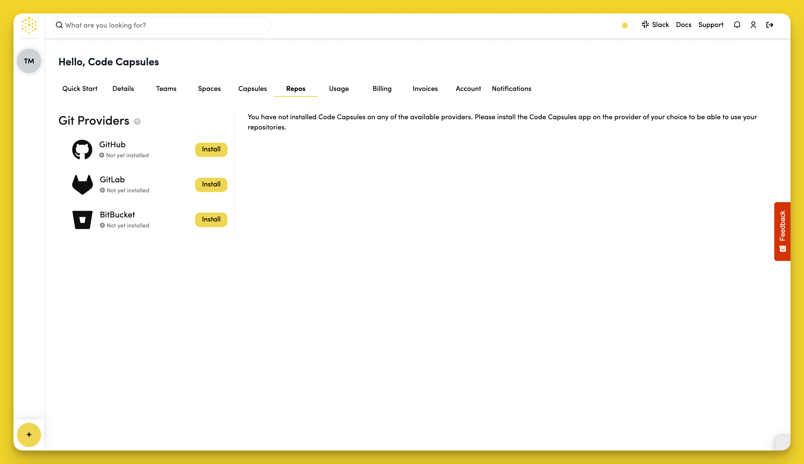
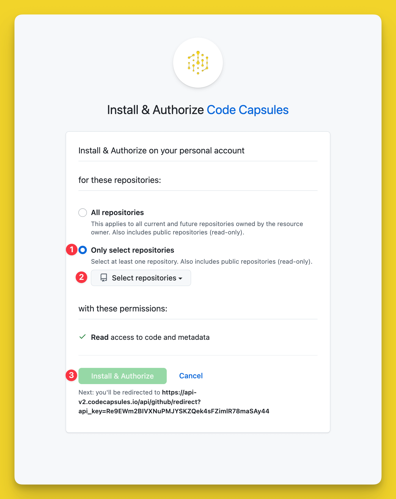

# How Do I Connect to a Version Control Provider?

Code Capsules connects to your version control provider to deploy applications on its platform. Before you can deploy an application, you need to give Code Capsules permission to read the repository you want to deploy from.

If you haven't yet linked to your version control provider to your Code Capsules account, you can do so by navigating to the "Repos" in your Code Capsules dashboard.

Click "Install" next to your preferred provider.

Then follow the prompts to connect your repos to Conde Capsules. For example, when choosing GitHub, you will select your GitHub username and do the following in the dialog box that appears:

1. Select "Only Select Repositories".
2. Choose the GitHub repository you want to deploy from.
3. Press "Install & Authorize".

Now that your version control provider is connected, you can [share repos with your Teams](../teams/share-a-repo-with-a-team.md).
