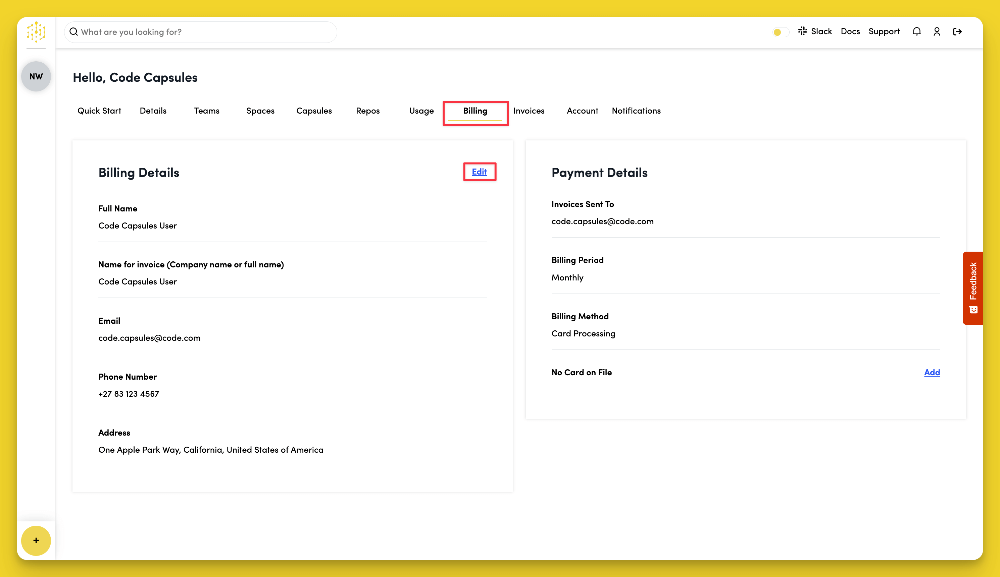

# How Do I Change My Billing Details?

To change your billing details, navigate to the "Billing" tab in your Code Capsules dashboard. In the "Billing Details" section, click "Edit", change any details you wish, then click "Save".

