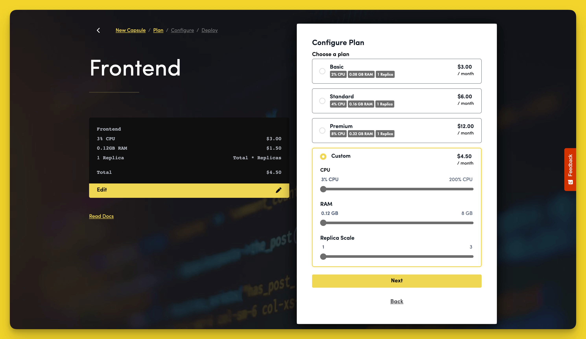

# How Does the Pricing Work?

Code Capsules uses a per-hour billing model, which ensures you only pay for what you use.

## Capsule Pricing

Pricing for Capsules start at $3 per month on the Basic plan and scales as you increase CPU, RAM, or replica scale. Customise your Capsule's resources by choosing "Custom plan" when [creating a Capsule](../capsules/how-do-i-add-remove-stop-capsules.md).

