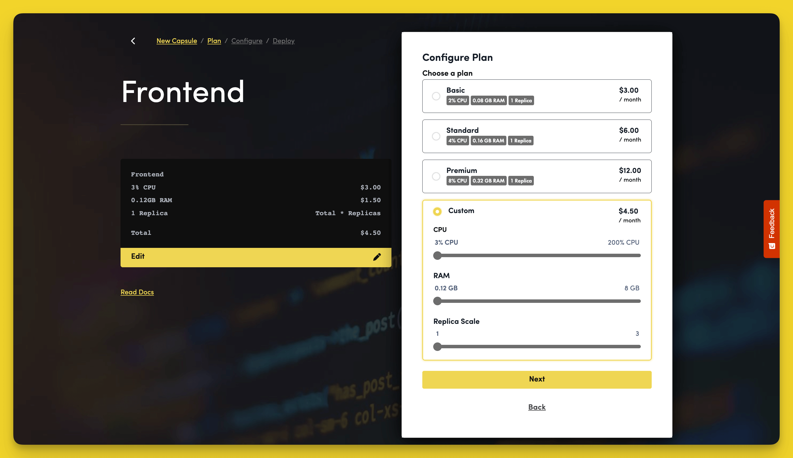

# How Do I Add, Remove, and Turn Off a Capsule?

## Creating Capsules

To create a new Capsule, click on the yellow `+` button on the bottom left of the screen.

Click on the "New Capsule" option, then choose a Capsule type, a Team, and a Space. Confirm your changes by clicking "Next".

### Configure a Plan

Configure your Capsule's resources by choosing a plan, or customise your Capsule resources to your needs by selecting "Custom" and move the sliders to increase or decrease CPU, RAM, and Replica Scale. When you are happy with your plan, click "Next".

### Connect to a Repo

Code Capsules connects to your version control provider to deploy applications on its platform. Before you can deploy an application, you need to give Code Capsules permission to read the repository you want to deploy from. 

To set up a connection to your repository you must:

1. Choose a repository from the dropdown to link your Capsule to that repository. If you've have not linked your Code Capsules account to a version control provider, you can do so now. Click "Configure Git for Code Capsules" then follow the instructions to connect to your version control account.
2. Select the branch that you would like to connect this Capsule to.
3. Select the folder that you would like the Capsule to build from. Leave this blank to build from the root of the branch.

### Configure Capsule Specific Settings

Depending on the type of Capsule you create, the next step is to configure the settings needed to run that Capsule properly. For example, if you set up a Frontend Capsule, the next step would be to specify a build command, a path to the project's static files, and to giev the Capsule a name.

Once you are happy with your Capsule configuration click "Create Capsule".

## Removing Capsules

When you no longer wish to host your application on Code Capsules, delete your Capsule by navigating to the "Details" tab of the Capsule page and scrolling to the bottom. 

Click on the "Delete Capsule" button. A dialog will pop up asking you whether you're sure about deleting the Capsule since this action isn't reversible. If you're sure, enter the Capsule's name to activate the delete button and click "Delete" to confirm your changes. 

## Turning off Capsules

You can turn off your Capsule by toggling the radio button at the top right of the Capsule's page. 

The most common reason for turning a Capsule off is if you've changed or added an environment variable, in which case you'll need to toggle the Capsule back on after a few seconds for the new variable to be accessible. Depending on the purpose of your application, you might also want to turn your Capsule off during periods of inactivity to save on the cost of running your application on Code Capsules.