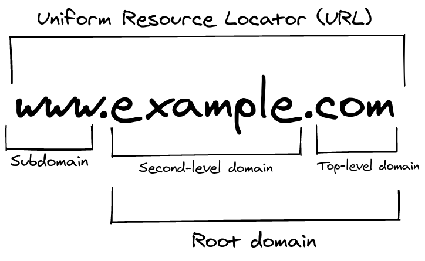

# Add and Remove Custom Domains and Subdomains

Each application deployed on Code Capsules is assigned a default domain in the format `capsulename.xxxx.codecapsules.co.za`.

At no additional cost, you can configure Code Capsules to use a custom domain you own (like `example.com`) instead of the default domain.

## Steps to Add a Custom Domain

The **Domains** tab contains all information about a Capsule's domain, including the option to add a custom domain.


**Before adding a custom domain:**

Each Capsule can route to **only one** root domain. You won't be able to add multiple root domains.


To add a new custom domain, click the yellow **+** button in the top-right corner of the dashboard.

Copy and save the **Static IP address**.

Click the **Add Custom Domain** link and enter your custom domain in the **Domain Name** field.


Ensure you enter only a **root domain**. Do not include a subdomain. A root domain contains only a domain name and top-level domain, for example, `example.com`. See the [notes on understanding URL structure](#understanding-url-structure) below.


Click **Create Domain**.

### Create an A Record

Next, you need to create an **A record** with your domain registrar for the custom domain you've purchased. 

Log in to your domain registrar's dashboard and locate the DNS settings for your custom domain.

Retrieve the static IP address you [previously copied and saved](#steps-to-add-a-custom-domain) and add an A record pointing to it. Your A record entry may look something like this:

|Record Type|Name|IPv4 Address|   
|-----------|----|------------|
|A Record   |  @ |`provided-IP-Address`|

Where:

- `@` refers to your root domain (for example, `example.com`).
- `provided-IP-Address` is the static IP address from Code Capsules.

Consult your domain registrar's documentation for specific instructions on adding A records to your domain. 


Changes to DNS records can take several hours to propagate.


## Steps to Add a Subdomain

Before adding a subdomain, make sure your custom domain has an [A record](#create-an-a-record) pointing to your application on Code Capsules.


**Note:**

- Each application on Code Capsules supports a **maximum of five subdomains**.
- **Wildcard subdomains are not supported.** You need to [create a separate CNAME record](#create-a-cname-record) for each subdomain you add.


To add a new subdomain, click the yellow **+** button in the top-right corner of the dashboard.

Click the **Add Custom Domain** link and enter the subdomain to create in the **Domain Name** field.

Click **Create Domain**.

### Create a CNAME Record

Next, you need to create a CNAME record with your domain registrar for the subdomain you added.

Log in to your registrar's dashboard and navigate to the DNS settings for your domain. Add a CNAME record for the subdomain. Your CNAME record entry may look something like this:

|Record Type|Name|Host/Target |   
|-----------|----|------------|
|CNAME      | `subdomain` |`your-root-domain`|

Where: 

- `subdomain` is the subdomain you're adding, for example, `app` or `www`.
- `your-root-domain` is your root domain that contains an A record routing to your application on Code Capsules.

Consult your domain registrar's documentation for specific instructions on adding CNAME records to your domain. 


Changes to DNS records can take several hours to propagate.


## Remove Domains and Subdomains

To remove a domain or subdomain from a Capsule, go to the Capsule's **Domains** tab. 

All associated domains and subdomains are listed in the right-hand panel. To remove one, click the **trash can icon** next to the domain or subdomain.


Removing a custom domain or subdomain does not update or delete its DNS records.

- If you remove a root domain, update the A record with your domain registrar to remove or change the IP address.
- If you remove a subdomain, delete the corresponding CNAME record from your DNS settings.


## Understanding URL Structure

- **Uniform Resource Locator (URL):** A web address used to locate a resource on the internet. URLs typically include a subdomain, a second-level domain, and a top-level domain.

- **Subdomain:** The portion of a URL before the main domain name, most commonly `www`. Subdomains are often used to organize different services or sections of a website (for example, `hr.myapplication.com` might route users to your company’s human resources portal).

- **Second-level domain (SLD):** The core name of the domain, located between the subdomain and the TLD. In `www.example.com`, `example` is the SLD.

- **Top-level domain (TLD):** The final part of the domain name, such as `.com`, `.org`, or `.co.za`. TLDs often indicate the purpose or location of a website, for example, `.de` typically signals a website based in Germany, while `.org` is commonly used by non-profit organizations.

- **Root Domain:** The combination of the SLD and TLD, excluding any subdomains, for example, `example.com`.

## Glossary of DNS and Web Protocol Terms

### DNS Records

- **Domain Registrar:** A company that sells and manages domains.
- **A Record:** Routes a domain (for example, `example.com`) to an IP address (for example, `123.456.567.8`).
- **Wildcard Subdomain:** Routes all undefined subdomains of a domain to a specific destination. For example, if the `*.example.com` wildcard subdomain points to `example.com`, then both `info.example.com` and `123.example.com` would resolve to `example.com` unless explicitly defined otherwise. 
- **CNAME Record:** Also known as an "alias", routes a subdomain to another domain name (for example, `mail.example.com` -> `mail.google.com`). Unlike A records, which point to IP addresses, CNAME records point to domain names.

### HTTP and SSL

- **Hypertext Transfer Protocol (HTTP):** Protocol used to transfer data from a server (such as a web application) to a client (such as your web browser). 
- **Hypertext Transfer Protocol Secure (HTTPS):** A secure version of HTTP that encrypts data transferred between the server and client for better security. 
- **Secure Sockets Layer (SSL) Certificate:** Authenticates a domain and enables encrypted communication between a server and a client via HTTPS (for example, `https://www.example.com`).

