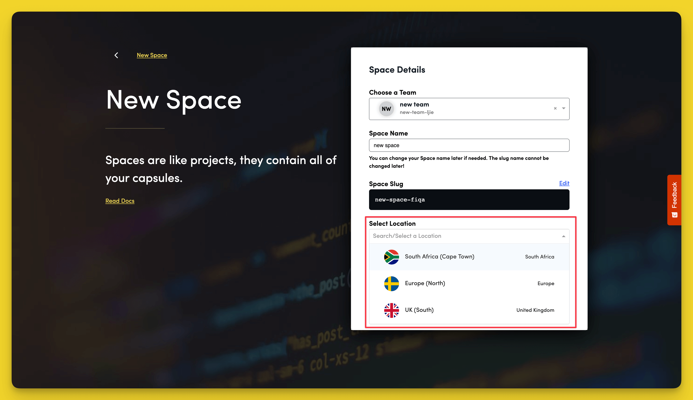

# What Regions Does Code Capsules Support?

 When creating a Space you will be prompted to choose the location you would like to deploy the Capsules created in that Soace. 
 
 We have a few physical cloud data centers for you to choose from. We recommend one closest to your target users.

 - South Africa (Cape Town)
 - Europe (North)
 - United Kingdom (South)

