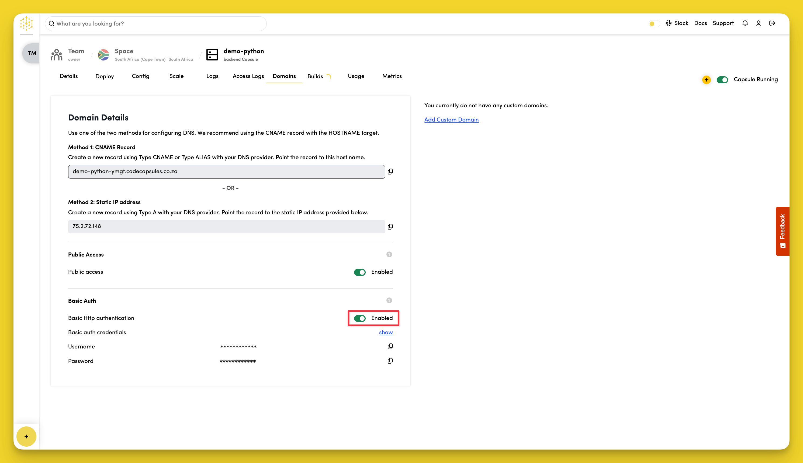

# HTTP Basic Authentication

Secure your Capsule with HTTP basic authentication to protect public-facing URLs.

Navigate to the "Domains" tab and scroll down to the "Basic Auth" section. Toggle "Basic Http authentication" to "Enabled" to secure your Capsule with a username and password.

## View Authentication Credentials

Once enabled, your username and password credentials will be displayed in the "Basic auth credentials" section. Click "show" to view the credentials needed to access your protected Capsule.

Note that basic authentication will only protect the public-facing URLs of your Capsule.