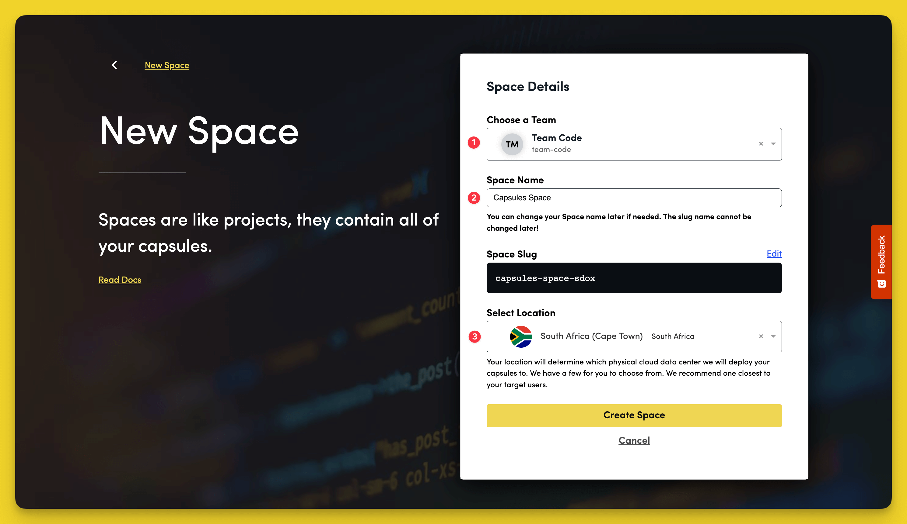
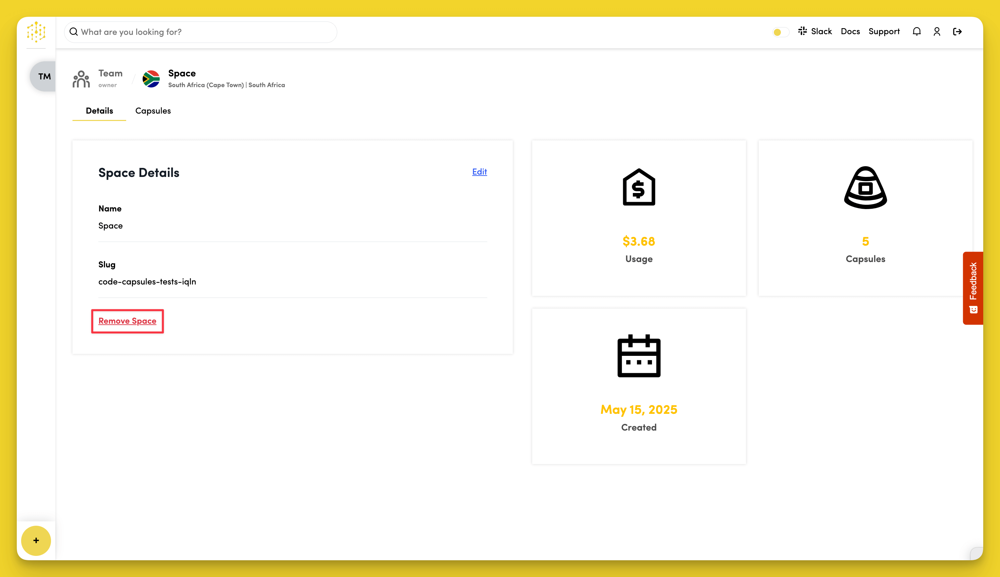

# How Do I Add/Remove a Space?

## Creating Spaces

To create a new Space, click the yellow `+` icon on the bottom left of the screen, and select "New Space".

Follow the prompts, choosing your region and giving your Space a name, then click "Create Space".

## Removing Spaces

To remove a Space, go to the "Details" tab in your Space dashboard and select "Remove Space". You must [remove all Capsules](../capsules/how-do-i-add-remove-stop-capsules.md) from the Space before you can remove the Space itself.

