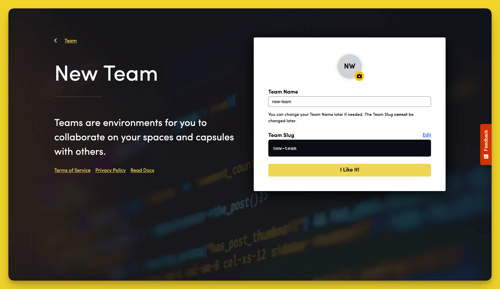

# Add and Remove Teams

## Add a Team

You can create as many teams as you need on Code Capsules. 

To add a new Team, click the yellow **+** button in the bottom-left corner of the dashboard and select **New Team**.

Give your Team a name and click **I Like It** to confirm.

## Remove a Team

To remove a Team, go to the **Details** tab in the Team dashboard and select **Remove Team**. 


You'll need to [remove all Spaces](../spaces/how-do-i-add-remove-a-space.md) from the Team before it can be deleted.


