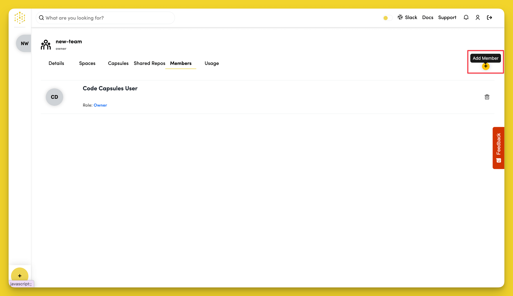

## Inviting Team Members

The final step in creating a Team is to invite members to it. Enter your prospective team members' email addresses in the text field and click "Invite Team Members" to send your invitation.

Your Team is now ready to begin collaborating.