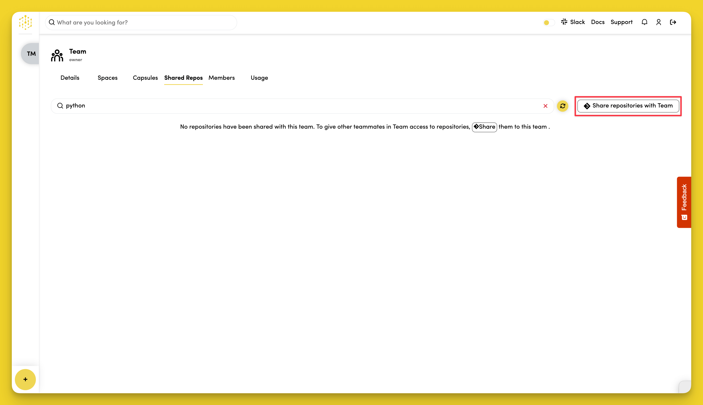

# Share a Repo With a Team

If you've already [linked your Code Capsules account to a version control provider](../account/connect-version-control.md), you can share access to your repos with your Teams. 

Click **Share repositories with Team**, toggle on the repos to share with your Team, then click **Share Repos**.

