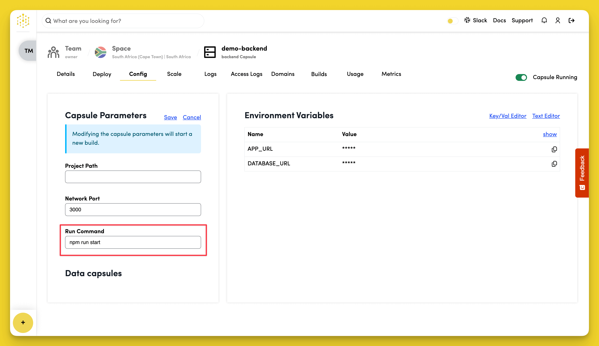

# Add a Procfile to a Backend Application

Procfiles communicate to the Backend Capsule what processes it needs to run and in what order to execute them for your application to be successfully deployed. On Code Capsules, Procfiles aren't a strict requirement, but can be provided if you want to.

The alternative to using a Procfile is using the Code Capsules UI to specify which commands to run during the build phase of your application. Below is a screenshot showing a command that may be entered as input in the UI for a `Node.js` application.

 

## Procfile Naming and Location

A Procfile is a simple text file. It should be named `Procfile` exactly and should not have any extensions, like `.txt` or `.py`. Note that naming the file `procfile` will not work either, as it is case sensitive.

Locate your Procfile in the root folder of your project. It won't work in any other location.

## Procfile Processes

The `Procfile` outlines the type of processes a Backend Capsule needs to run before deploying a backend application. Common processes include, but are not limited to `web`, `worker`, and `clock` processes. When declaring a process type, you should also write the command to run for that particular process.

A process type command allows you to specify the port you'd like the process to run on, as well as other options that are process-specific.

## Procfile Format

The Procfile's format is a key-value listing of process types and their commands on each line, as shown below:

```
<process type>: <command>
```

## Example Procfile for Python's Flask

Code Capsules only requires a Procfile for Python applications. Here is an example of what a Procfile for a Flask application might look:

```
web: python3 -m flask run --host=0.0.0.0 --port=$PORT
```

## Procfiles for Other Languages

Express and Java applications don't need a Procfile to be deployed. The Backend Capsule can detect these applications and run the processes relevant to the application being deployed.
