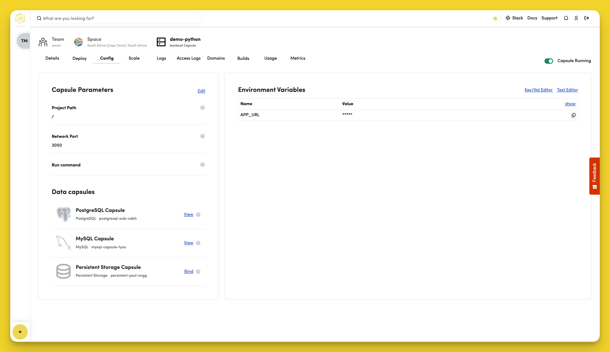

# Configure

To configure your Backend Capsule, navigate to the "Config" tab.

## Set the Project Path

Click "Edit" in the "Capsule Parameters" section to set where your code lives. The default is `/` which works for most projects.

## Set the Network Port

Click "Edit" in the "Capsule Parameters" section to set the port your app runs on. The default is `3000`. Your application should listen on this port.

## Set the Run Command

Click "Edit" in the "Capsule Parameters" section to specify how to start your app. Leave empty to use the default command for your capsule type, or specify your own:
- Python: `python app.py`
- Node.js: `npm start`
- Ruby: `ruby app.rb`

## Environment Variables

Backend Capsules automatically get these environment variables:
- `APP_URL` - Your capsule's public URL

To view variable values, click "show" in the "Environment Variables" section.

To add custom variables:

1. Click "Key/Val Editor" or "Text Editor" in the "Environment Variables" section
2. Edit the variable "Name" and "Value"
3. Click "Save"

## Data Capsules

Click the "View" button alongside your Database Capsules in the "Data capsules" section to see connection details.

### Connect Data and Persistent Storage Capsules to Your Backend Capsule

Connect Database or Storage Capsules to your Backend Capsule:
- **Database Capsules (MySQL, PostgreSQL, etc.)** - Click "View" to view the environment variables from the Data Capsule. Click the `+` next to the `Connection string`  variable to create a `DATABASE_URL` environmental variable in your Backend Capsule, which gives access to the services and features of your Data Capsule.
- **Persistent Storage Capsule** - Click "Bind" to bind your Persistent Storage and Backend Capsules. During the bind process, Code Capsules creates a `PERSISTENT_STORAGE_DIR` environment variable to let your Backend Capsule know where your Data Capsule resides in order to access its features.

