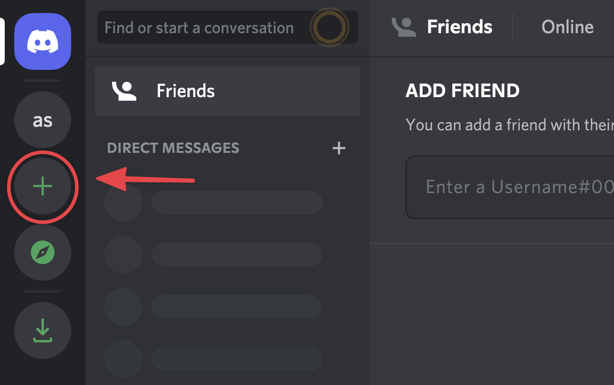
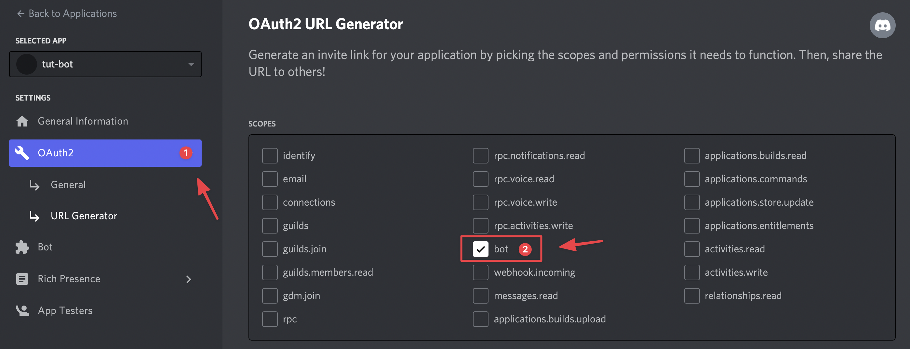
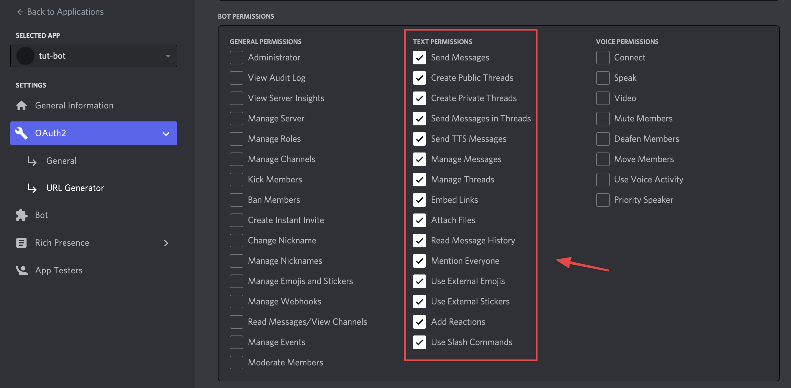

# How to Deploy a Python Discord Bot to Production on Code Capsules in 5 Minutes

Deploy a Python Discord Bot and learn how to host backend code on Code Capsules.

## Set up

Code Capsules connects to GitHub repositories to deploy applications. To follow this guide, you'll need a [Code Capsules](https://codecapsules.io/) account and a [GitHub](https://github.com/) account.

To demonstrate how to deploy a Python Discord Bot with Code Capsules, we've provided an example bot which you can find on the [Code Capsules GitHub repository](https://github.com/codecapsules-io/python-discord-echobot).

Sign in to GitHub, and fork the example bot repository by clicking "Fork" at the top-right of your screen and selecting your GitHub account as the destination.

## Register the Bot

You'll need a Discord user account before you can create a Discord bot. Head over to Discord and create an account if you don't already have one.

When you've signed in to Discord, follow the steps below:

1. Click on the "+" icon in the left toolbar to create a server to contain your channels.

2. Navigate to the [Application Page](https://discord.com/developers/applications).
3. Click on the "New Application" button.
4. Give the application a name and click "Create".
5. Go to the "Bot" tab and click "Add Bot". Confirm your decision by clicking, "Yes, do it!"

6. Click the "Copy" button under the "TOKEN" section to copy your bot's token. 

7. Go to the "OAuth2/URL Generator" tab and select the "bot" option under the "Scopes" section. 

8. Select all the text permission options under the "Bot Permissions" section.

9. Click the "Copy" button under the, "Generated URL" section

10. Paste the url you copied in the previous step in another browser tab and add the bot to the server you created in the first step. Click "Continue" to confirm your changes. 

After actioning these steps, your bot will now have access to all the channels in the server you added it to.

## Create a Space for your App

Log in to your Code Capsules account and navigate to the "Spaces" tab. Once there, click the yellow `+` icon on the top right of the screen to add a new Space. 

Follow the prompts, choosing your region and giving your Space a name, then click "Create Space".

Example instructions to go with numbered annotations
1. Choose a team — you can use a default "personal" team if you're the only person working on this project, or a named team if you're collaborating with others
2. This should remind you of the project, for example "customer-api" or "notetaking-app"
3. Choose a country close to where most of your users will be
4. If you're already using a specific cloud, you can choose that here, otherwise pick any one.

## Create the Capsule

A [Capsule](https://codecapsules.io/docs/FAQ/what-is-a-capsule/) provides the server for hosting an application on Code Capsules.

To create a new Capsule for your space follow the instructions below:

1. Choose "Backend Capsule", your Team and Space.
2. Choose your payment plan.
3. Click the GitHub button and give access to the repository you forked at the start of the tutorial.
4. Choose the GitHub repository you forked.
5. Press "Next".
6. Leave "Run Command" blank.
7. Click "Create Capsule".

Code Capsules will automatically build your application when you've finished creating the Capsule. 

Once your application is live, you can view the build log by selecting the "Deploy" tab and clicking the "View build log" link in the "Builds" section.

## Add a `TOKEN` Environment Variable

Once the build is complete, you have to add a `TOKEN` environment variable on the "Config" tab under the "Environment Variables" section. Assign it the value of the token you copied in step 6 of the [Register the Bot](#register-the-bot) section above. 

Confirm your changes by clicking on "Save", then restart your Capsule by toggling the radio button in the top right off and on again.

## Chat with the Bot

The bot will be able to respond to messages after Code Capsules finishes building it. When this is done, you cand send messages to the bot as a direct message and the bot will echo them.

If you'd like to deploy another application in a different language or framework, take a look at our other [deployment guides](/docs/deployment/).