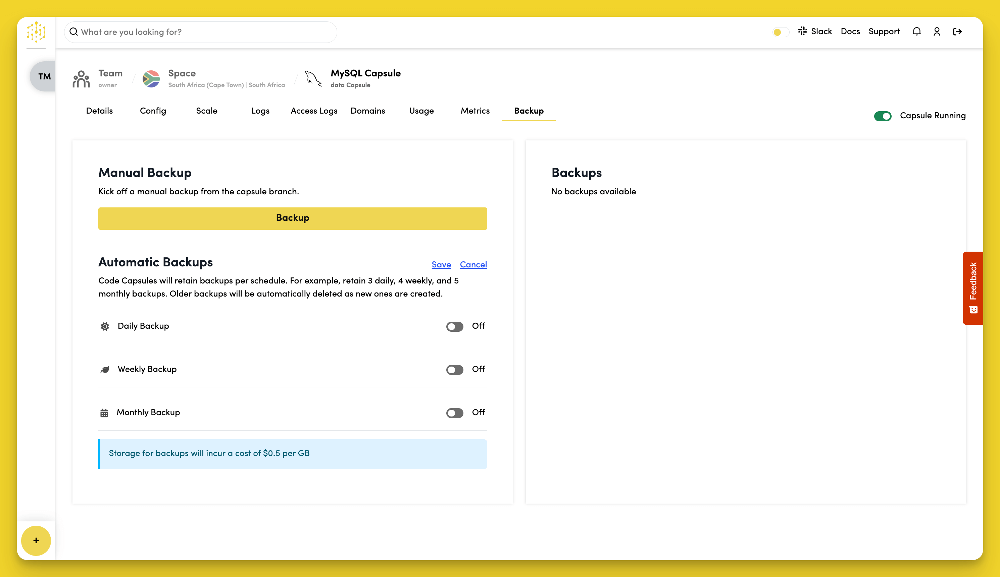

# Backups

Protect your data by creating manual backups and setting up automatic backup schedules for your Data Capsules.

## Manual Backup

Trigger a manual backup of your Capsule by clicking the "Backup" button in the "Manual Backup" section.

## Automatic Backups

Set up scheduled backups to run automatically:

1. Toggle "Daily Backup" to create backups every day
2. Toggle "Weekly Backup" to create backups every week  
3. Toggle "Monthly Backup" to create backups every month

Code Capsules will retain backups per schedule and automatically delete older backups as new ones are created.

## View Your Backups

All completed backups appear in the "Backups" section. From here you can restore or manage your backup files.

Storage for backups incurs a cost of $0.5 per GB.
