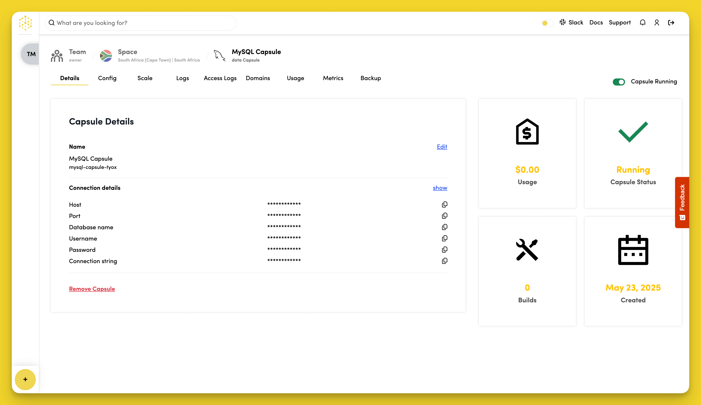
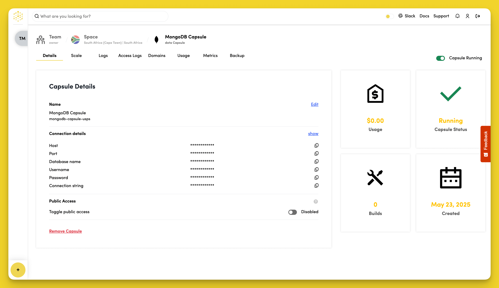
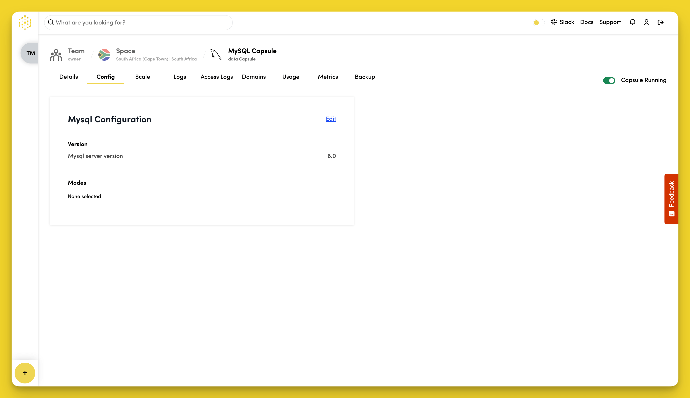

# Configure

To configure your Database Capsules, navigate to the "Details" tab in your Capsule dashboard.

## View Connection Details

All Database Capsules provide connection details in the "Details" tab.

Click "show" in the "Connection Details" section to view your database credentials:

- Host
- Port
- Database name
- Username
- Password
- Connection string

## Edit Capsule Name

Click "Edit" next to the Capsule name in the "Capsule Details" tab to change the name.

## Enable Public Access

**Available for: MongoDB**

In the "Capsule Details" section you can toggle "Public Access" to allow public access to this database from outside your Space. To connect, use the public connection string that is generated when this setting is toggled on.

## Configure MySQL Settings

**Available for: MySQL only**

MySQL Data Capsules have additional configuration options in the "Config" tab.

### Set SQL Modes

Click "Edit" in the "MySQL Configuration" section to select SQL modes for your MySQL server.

SQL modes affect how MySQL handles queries and data validation. Common modes include:
- `STRICT_TRANS_TABLES` - Enable strict mode for transactional tables
- `NO_ZERO_DATE` - Reject invalid date values
- `ONLY_FULL_GROUP_BY` - Require GROUP BY to list all selected columns
