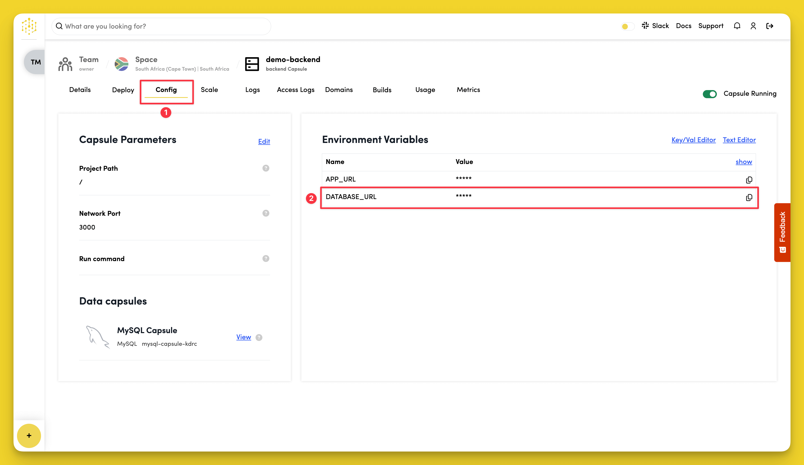
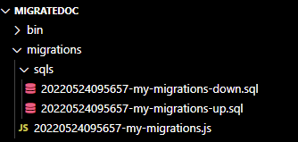

# Migrations

This guide walks you through migrating a database using an Express app and a MySQL Capsule.

You might find our [guide to setting up a MySQL Data Capsule](https://app.gitbook.com/s/xjp0G5hHSJs8nyv5Z5g7/database/mysql) and our [creating an Express application with Code Capsules tutorial](https://app.gitbook.com/s/xjp0G5hHSJs8nyv5Z5g7/backend/node.js/express.js) helpful.

## Step 1: Clone From Your GitHub Repository

To install `db-migrate`, first clone your GitHub repository with the following command (make sure to replace the username and repository name with your own):

`git clone https://github.com/git_username/repository_name.git`

## Step 2: Install `db-migrate`

To use migration commands, install both `db-migrate` and `db-migrate-mysql` with the following commands:

`npm install -g db-migratenpm i db-migrate-mysql`

## Step 3: Connect to the Database With `database.json`

The `db-migrate` package connects to a database through a `database.json` file. 

Create a file called `database.json` in your root directory and populate it with your database information. The example below shows how to connect to both a local database called `"dev"` and a MySQL Data Capsule called `"prod"` (be sure to replace the database information with your own):

```{
  "dev": {
    "driver": "mysql",
    "user": "root",
    "database": "database_name",
    "password": "my_password"
  },
  "prod": "Insert Your Database URL here",
  "sql-file": true
}
```

Here we also add`"sql-file": true` to ensure that database migrations run using SQL files, which we'll create in the next step.

Find the database URL for a MySQL Data Capsule in the **Config** tab of a Backend Capsule:



You can also access the database URL using an environment variable as follows:

`"prod": {"ENV":"DATABASE_URL"},`

## Step 4: Create and Populate SQL Files

Run the following command to create a folder to store migrations:

`db-migrate create insert_unique_name --sql-file`

The folder should contain three files:



MySQL queries are stored in the two generated SQL files: One named with an `up` suffix and the other with a `down` suffix. 

#### Down-Migration Query

Insert the following SQL query into the `down` file to remove a row from the database:

```
ALTER TABLE table_name 
DROP COLUMN drop_column_name; 
```

#### Up-Migration Query

Insert the following SQL query into the `up` file to insert a row into the database:

```
ALTER TABLE table_name
ADD new_row_name datatype;
```

Add your own MySQL queries to these SQL files to define custom database migrations.

## Step 5: Update Scripts

In the root directory of the project, update the `"scripts"` section in the `package.json` file as follows:

```
"scripts": {
    "start": "node ./bin/www",
    "migratedev": "node node_modules/db-migrate/bin/db-migrate up -e dev",
    "migrate-prod-up": "node node_modules/db-migrate/bin/db-migrate up -e prod",
    "migrate-prod-down": "node node_modules/db-migrate/bin/db-migrate down -e prod"
  }
```

Modify these scripts to suit your developer and production environments.

The migration scripts shown here are designed to be used on Code Capsules or in a developer environment.

## Step 6: Edit the Run Command

To run these migrations in a production environment, update the Capsule's **Run Command** to execute the migration scripts.

Edit the **Run Command** in the **Config** tab of the Backend Capsule.


## Step 7: Push the Changes

Finally, commit and push your changes to your GitHub repository to update the codebase and trigger the migrations. 

View migration activity in the Backend Capsule's **Logs** tab. The output will look similar to this:

```
> node node_modules/db-migrate/bin/db-migrate up -e prod
> github_repository_name@0.0.0 migrate-prod-up

);
FirstName varchar(255)
LastName varchar(255),
PersonID int,
received data: CREATE TABLE user (
[INFO] Processed migration 20220523135622-migration_name
[INFO] Done
```
