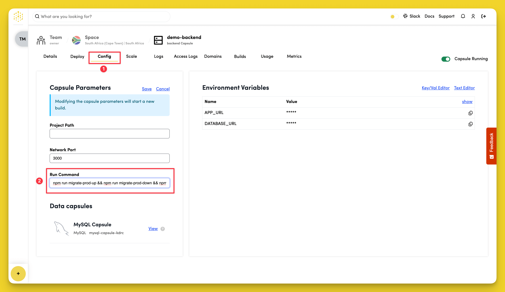

# Migrating a Database with Code Capsules

This guide will walk you through performing database migrations using an Express app and a MySQL Data Capsule.

You might find our [guide to setting up a MySQL Data Capsule](https://codecapsules.io/docs/reference/set-up-mysql-data-capsule/) and our [creating an Express application with Code Capsules](https://codecapsules.io/docs/tutorials/game-catalogue-with-nodejs-and-mysql/) tutorial helpful.

## Step 1: Clone from your GitHub Repository

To install db-migrate to your code, first clone your GitHub repository with the following command (make sure to replace the username and repository name with your own):

`git clone https://github.com/git_username/repository_name.git`

## Step 2: Install db-migrate

To make use of migration commands, install `db-migrate` as well as the `db-migrate-mysql` packages with the following commands:

`npm install -g db-migratenpm i db-migrate-mysql`

## Step 3: Connect to the Database with `database.json`

The db-migrate package connects to a database through `database.json` file. Create a file called `database.json` in your root directory and populate it with your database information. Below we have an example of a connection to both a local database called `"dev"`, and a MySQL Data Capsule called `"prod"` (be sure to replace the database information with your own):

```{
  "dev": {
    "driver": "mysql",
    "user": "root",
    "database": "database_name",
    "password": "my_password"
  },
  "prod": "Insert Your Database URL here",
  "sql-file": true
}
```

Here we also add the`"sql-file": true` information to ensure our database migrations operate through SQL files that will be created in the next step.

The database URL for a MySQL Data Capsule can be found in the "Config" section of your Backend Capsule:


You can also access the database URL through an environment variable like so:

`"prod": {"ENV":"DATABASE_URL"},`

## Step 4: Create and Populate SQL Files

Run the command above to create a folder to store migrations:

`db-migrate create insert_unique_name --sql-file`

The folder should contain three files:


The two SQL files are named with an `up` and `down` suffix to hold your MySQL queries. The migrations that are performed look for MySQL queries in these files.

#### Down-migration query

Insert the following SQL query into the SQL file with the `down` suffix, to drop a row from the database:

```
ALTER TABLE table_name 
DROP COLUMN drop_column_name; 
```

#### Up-migration query

Insert the following SQL query into the SQL file with the `up` suffix, to insert a row into the database:

```
ALTER TABLE table_name
ADD new_row_name datatype;
```

Insert your own MySQL queries into these SQL files to create your unique database migrations.

## Step 5: Update Scripts

Next update the `"scripts"` section in the `package.json` file in the root directory of the project to look something like this:

```
"scripts": {
    "start": "node ./bin/www",
    "migratedev": "node node_modules/db-migrate/bin/db-migrate up -e dev",
    "migrate-prod-up": "node node_modules/db-migrate/bin/db-migrate up -e prod",
    "migrate-prod-down": "node node_modules/db-migrate/bin/db-migrate down -e prod"
  }
```

Adjust these scripts to match your use of your developer and production environments.

Here, the scripts used to run up and down migrations are created to be run on Code Capsules or within a developer environment.

## Step 6: Change Run Commands

When you want to perform these migrations in the production environment, add the scripts created for your migrations to the "Run Command" section found in your Backend Capsule’s "Config" section.



## Step 7: Push Changes

Finally, commit and push your changes to your GitHub repository to update your project’s code base and perform your migrations. You should see your migrations in the "Logs" section of your Backend Capsule. It will have a similar structure to this output:

```
> node node_modules/db-migrate/bin/db-migrate up -e prod
> github_repository_name@0.0.0 migrate-prod-up

);
FirstName varchar(255)
LastName varchar(255),
PersonID int,
received data: CREATE TABLE user (
[INFO] Processed migration 20220523135622-migration_name
[INFO] Done
```
