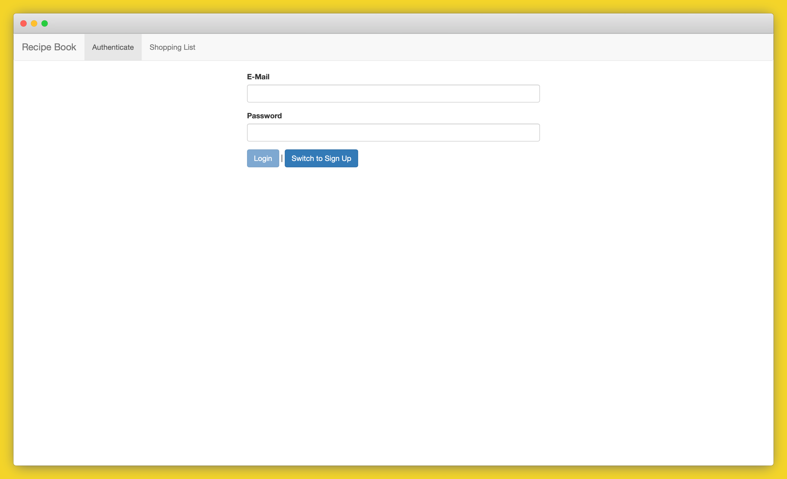
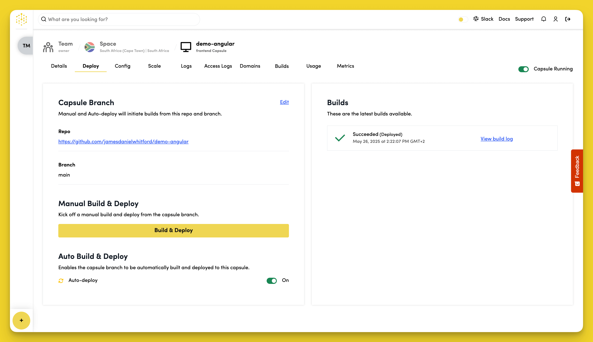

# Angular

Deploy an Angular application and learn how to host frontend code on Code Capsules. At the end of the guide, you would have deployed the application in the screenshot below and can adapt it to meet your unique needs.

<figure><figcaption></figcaption></figure>

### Set Up

Code Capsules connects to GitHub repositories to deploy applications. To follow this guide, you’ll need a [Code Capsules](https://codecapsules.io/) account and a [GitHub](https://github.com/) account.

To demonstrate how to deploy an Angular application with Code Capsules, we’ve provided an example application, which you can find on the [Code Capsules GitHub repository](https://github.com/codecapsules-io/demo-angular).

Sign in to GitHub, and fork the example application by clicking "Fork" at the top-right of your screen and selecting your GitHub account as the destination.

### Create an Account with Code Capsules

If you don’t already have an account, navigate to the [Code Capsules](https://codecapsules.io/) site and click the "Sign Up" button in the top right corner of the screen. Enter your details to create an account, or log in to an existing one.

If you’ve just signed up for an account, you’ll be directed to a welcome page on your first login. Click on the "Go To Personal Team" button.

Alternatively, if you’re signing in again, click on the "Spaces" tab.

Code Capsules gives every account a Personal Team by default. A Team is an environment for you to manage your Spaces and Capsules. For a better understanding of Teams, Spaces, and Capsules, take a look at [our explanation](https://app.gitbook.com/s/gIlxo9gU7Lotj1cdGRh6/what-is-code-capsules).

### Create a Space for your App

Log in to your Code Capsules account and navigate to the "Spaces" tab. Once there, click the yellow `+` icon on the top right of the screen to add a new Space.

Follow the prompts, choosing your region and giving your Space a name, then click "Create Space".

<figure><figcaption></figcaption></figure>

Example instructions to go with numbered annotations

1. Choose a team — you can use a default “personal” team if you’re the only person working on this project, or a named team if you’re collaborating with others
2. This should remind you of the project, for example, “customer-api” or “notetaking-app”
3. Choose a country close to where most of your users will be
4. If you’re already using a specific cloud, you can choose that here; otherwise, pick any one.

### Create the Capsule

A [Capsule](https://app.gitbook.com/s/gIlxo9gU7Lotj1cdGRh6/capsules/what-is-a-capsule) provides the server for hosting an application on Code Capsules.

Navigate to the Space containing your recently created Data Capsule and click the yellow `+` icon on the bottom left of the screen. Follow the instructions below to create a Frontend Capsule:

1. Choose "Frontend Capsule", your Team and Space.
2. Choose your payment plan.
3. Click the GitHub button and give access to the repository you forked at the start of the tutorial.
4. Choose the GitHub repository you forked.
5. Press "Next".
6. Type `npm run build` in "Build Command" and `dist/ng4-complete-guide` in "Static Content Folder Path".
7. Click "Create Capsule".

Code Capsules will automatically build your application when you’ve finished creating the Capsule. While the build is in progress, you can view the log by clicking "View Build Progress" next to the "Building Capsule" message.

Once your application is live, you can view the build log by selecting the "Deploy" tab and clicking the "View build log" link in the "Builds" section.

<figure><figcaption></figcaption></figure>

Once the build is complete, click the "URL" link in the "Config" tab, and you should see your deployed application.

If you’d like to deploy another application in a different language or framework, take a look at our other deployment guides.

<figure><figcaption></figcaption></figure>

<table data-card-size="large" data-view="cards"><thead><tr><th></th><th></th><th data-hidden data-card-cover data-type="files"></th></tr></thead><tbody><tr><td>Video Guides</td><td>If you prefer watching videos to reading text, find videos…</td><td><a href="../../.gitbook/assets/Video Guides Angular.png">Video Guides Angular.png</a></td></tr></tbody></table>

