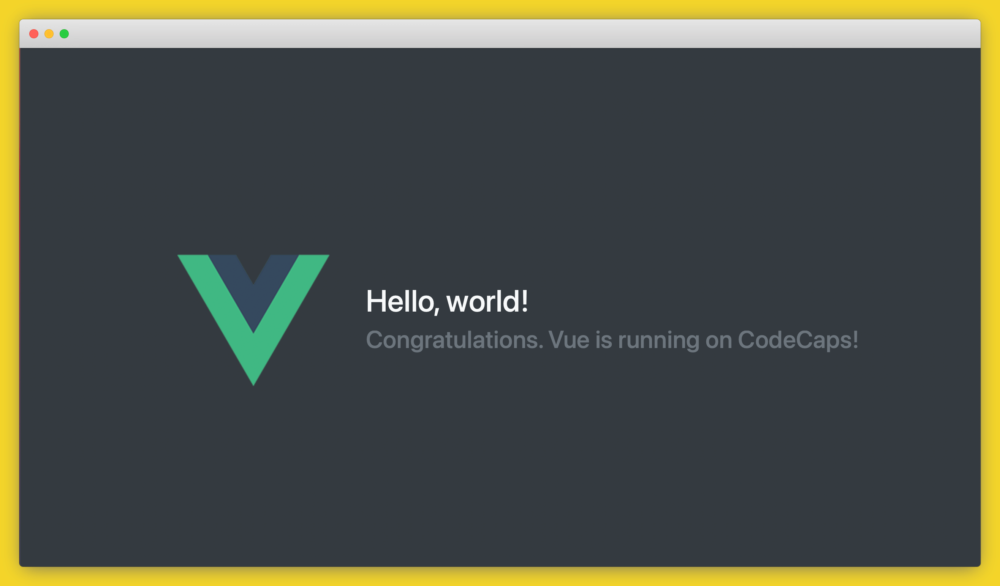

# Vue

Deploy a Vue application and learn how to host frontend code on Code Capsules.

## Set up

Code Capsules connects to GitHub repositories to deploy applications. To follow this guide, you'll need a [Code Capsules](https://codecapsules.io/) account and a [GitHub](https://github.com/) account.

To demonstrate how to deploy a Vue application with Code Capsules, we've provided an example application which you can find on the [Code Capsules GitHub repository](https://github.com/codecapsules-io/demo-vue).

Sign in to GitHub, and fork the example application by clicking "Fork" at the top-right of your screen and selecting your GitHub account as the destination.

## Create an Account with Code Capsules

Log in to your Code Capsules account and navigate to the "Spaces" tab. Once there, click the yellow `+` icon on the top right of the screen to add a new Space.

Follow the prompts, choosing your region and giving your Space a name, then click "Create Space".

Example instructions to go with numbered annotations

1. Choose a team — you can use a default "personal" team if you're the only person working on this project, or a named team if you're collaborating with others
2. This should remind you of the project, for example "customer-api" or "notetaking-app"
3. Choose a country close to where most of your users will be
4. If you're already using a specific cloud, you can choose that here, otherwise pick any one.

## Create the Capsule

A [Capsule](https://codecapsules.io/docs/FAQ/what-is-a-capsule/) provides the server for hosting an application on Code Capsules.

To create a new Capsule for your space follow the instructions below:

1. Choose "Frontend Capsule", your Team and Space.
2. Choose your payment plan.
3. Click the GitHub button and give access to the repository you forked at the start of the tutorial.
4. Choose the GitHub repository you forked.
5. Press "Next".
6. Type `npm run build` in "Build Command" and `dist` in "Static Content Folder Path".
7. Click "Create Capsule".

Code Capsules will automatically build your application when you've finished creating the Capsule.

Once your application is live, you can view the build log by selecting the "Deploy" tab and clicking the "View build log" link in the "Builds" section.

Once the build is complete, a URL link will appear in the URL section in the "Details" tab. Click the link and you should see your deployed application.

