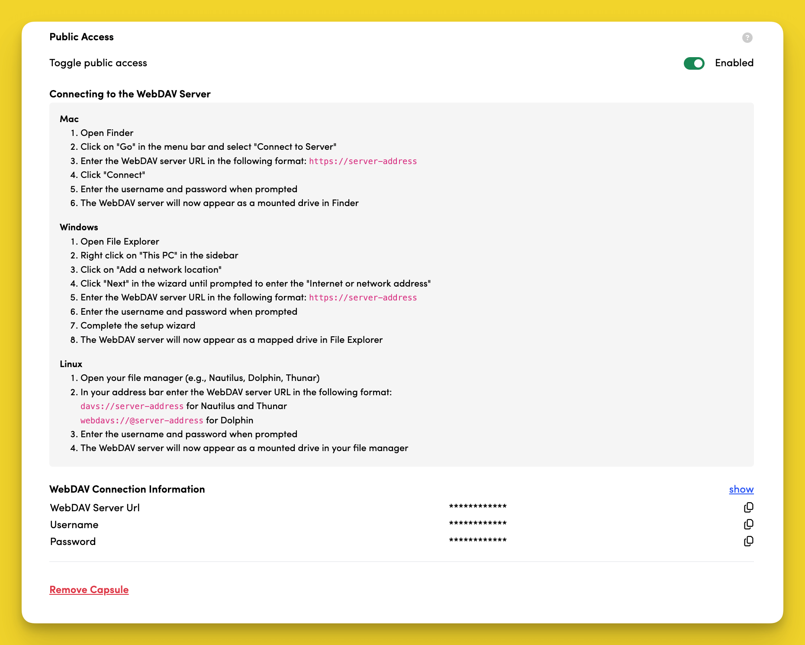

# Configure

To configure your Persistent Storage Capsule, navigate to the "Details" tab.

## Edit Capsule Name

Click "Edit" in the "Capsule Details" section to rename your Persistent Storage Capsule.

## Enable Public Access

Toggle "Public Access" in the "Public Access" section to allow connections from outside your Space.

This is disabled by default for security.

## Connect to WebDAV

When Public Access is enabled, you can connect to your storage using WebDAV.

### View Connection Information

Click "show" in the "WebDAV Connection Information" section to view:
- WebDAV Server URL
- Username
- Password

### Connect from Mac

1. Open Finder
2. Click on "Go" in the menu bar and select "Connect to Server"
3. Enter the WebDAV server URL in the following format: `https://server-address`
4. Click "Connect"
5. Enter the username and password when prompted
6. The WebDAV server will now appear as a mounted drive in Finder

### Connect from Windows

1. Open File Explorer
2. Right click on "This PC" in the sidebar
3. Click on "Add a network location"
4. Click "Next" in the wizard until prompted to enter the "Internet or network address"
5. Enter the WebDAV server URL in the following format: `https://server-address`
6. Enter the username and password when prompted
7. Complete the setup wizard
8. The WebDAV server will now appear as a mapped drive in File Explorer

### Connect from Linux

1. Open your file manager (e.g., Nautilus, Dolphin, Thunar)
2. In your address bar enter the WebDAV server URL in the following format:
   - `davs://server-address` for Nautilus and Thunar
   - `webdavs://@server-address` for Dolphin
3. Enter the username and password when prompted
4. The WebDAV server will now appear as a mounted drive in your file manager
