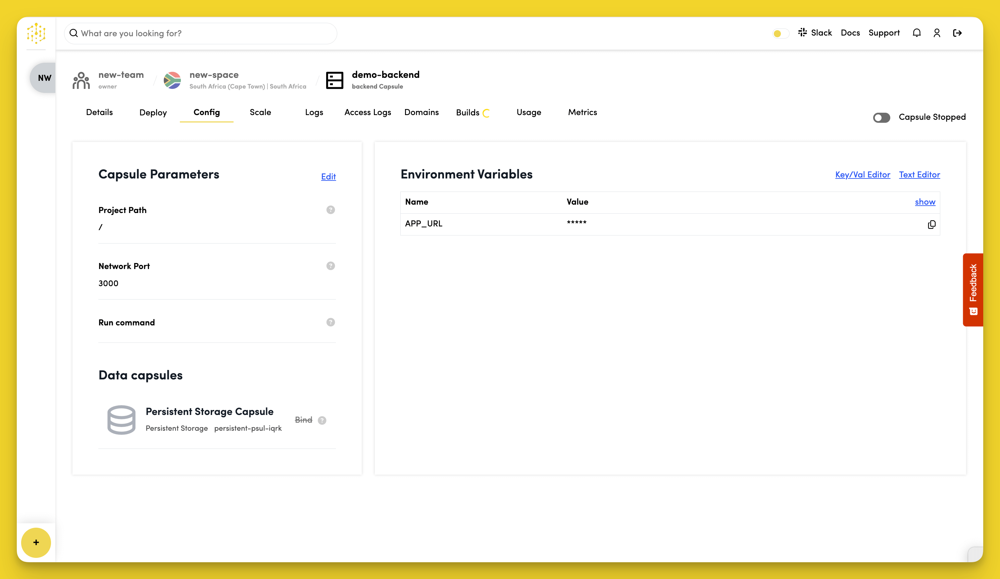
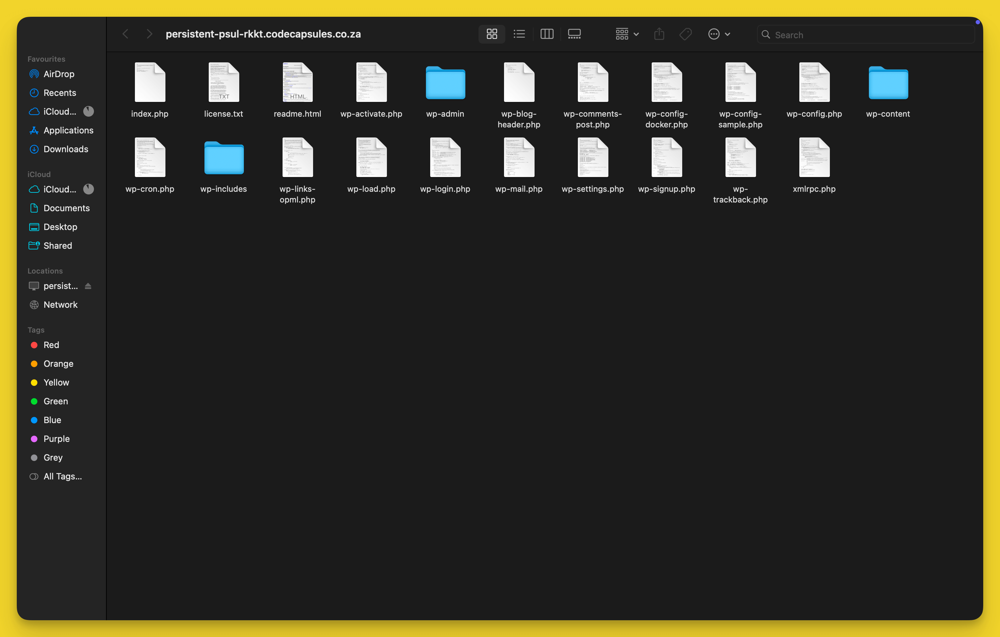

# Set Up Persistent File Data Storage

You need persistent storage to develop your application that solves a real-world problem, but you don't want a full-blown database. In this tutorial, we'll show you how to create a persistent storage Data Capsule that you can use with your backend applications running on Code Capsules.

## What is a Persistent Storage Capsule?

A Persistent Storage Capsule is like a virtual cloud hard drive. The key benefit is that you can attach multiple backend or docker capsules (workloads) to read/write to the same persistent storage capsule, allowing for horizontal and vertical scaling of your backend/docker capsules/workloads.

## Create a File Data Capsule

Log in to your Code Capsules account and navigate to the Space your Data Capsule will be contained in. Click the yellow `+` button on the bottom left of the screen, select "New Capsule", then select "Persistent Storage" option from the dropdown.


Choose your payment option, then click the "Create Capsule" button.

## Binding a Data Capsule to a Backend Capsule

You need to bind the Data Capsule to a Backend Capsule hosted on Code Capsules before you can connect to it and use it.

Navigate to the Backend Capsule and click "Config" to open the Capsule's config tab. Scroll down to the "Bind Data Capsule" section, where your recently created Data Capsule will show.



Click "Bind" to bind your Data and Backend Capsules. During the bind process, Code Capsules creates a `PERSISTENT_STORAGE_DIR` environment variable to let your Backend Capsule know where your Data Capsule resides in order to access its features. Once the two Capsules have been bound, you can scroll to the top of the Configure tab to find the value of this variable.


The next step is to use this environment variable in code in order to read and write to our Data Capsule. Copy the value of the `PERSISTENT_STORAGE_DIR` variable and paste it in your code as the value of the `db_directory` variable. Alternatively, reference it directly in your code using `os.getenv` for Python or `process.env` for Node.js.

### Connecting to a File Data Capsule From a Python Application

If your Backend Capsule is a Python application, use the following code to connect to your Data Capsule:

```python
import os

db_directory = os.getenv('PERSISTENT_STORAGE_DIR')

### Do something with the db_directory variable here
file_to_write = os.path.join(db_directory, "test.txt")

file1 = open(file_to_write, "w")
file1.write("File writing test")
file1.close()

```

### Connecting to a File Data Capsule From a Node.js Application

If your Backend Capsule is a Node.js application, use the following code to connect to your Data Capsule:

```js

db_directory = process.env.PERSISTENT_STORAGE_DIR
const fs = require('fs')

const content = 'Some content!'

// Do something with the db_directory variable here

fs.writeFile(db_directory + '/test.txt', content, err => {
  if (err) {
    console.error(err)
    return
  }
  //file written successfully
})

```
## Access Your Files via WebDAV

By default, you can't browse files and folders in your Persistent Storage Capsule without building your own file browser. To solve this, Code Capsules provides native WebDAV access.

To enable file browsing:

1. Navigate to your Persistent Storage Capsule
2. Go to the "Details" tab
3. Toggle "Public Access" to "Enabled"


This doesn't mean your files are indexed on the internet - it exposes them over WebDAV protocol with authentication credentials.

### Connecting to the WebDAV Server

#### Mac
1. Open Finder
2. Click on "Go" in the menu bar and select "Connect to Server"
3. Enter the WebDAV server URL in the following format: `https://server-address`
4. Click "Connect"
5. Enter the username and password when prompted
6. The WebDAV server will now appear as a mounted drive in Finder

Here you can see the files inside a Wordpress Capsule accessed in the Mac Finder locally.



#### Windows
1. Open File Explorer
2. Right click on "This PC" in the sidebar
3. Click on "Add a network location"
4. Click "Next" in the wizard until prompted to enter the "Internet or network address"
5. Enter the WebDAV server URL in the following format: `https://server-address`
6. Enter the username and password when prompted
7. Complete the setup wizard
8. The WebDAV server will now appear as a mapped drive in File Explorer

#### Linux
1. Open your file manager (e.g., Nautilus, Dolphin, Thunar)
2. In your address bar enter the WebDAV server URL in the following format:
   - `davs://server-address` for Nautilus and Thunar
   - `webdavs://@server-address` for Dolphin
3. Enter the username and password when prompted
4. The WebDAV server will now appear as a drive in your file manager