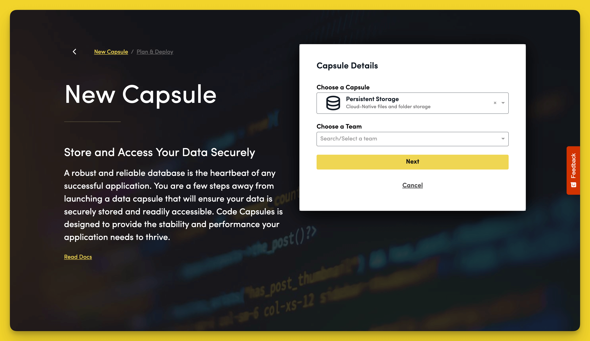
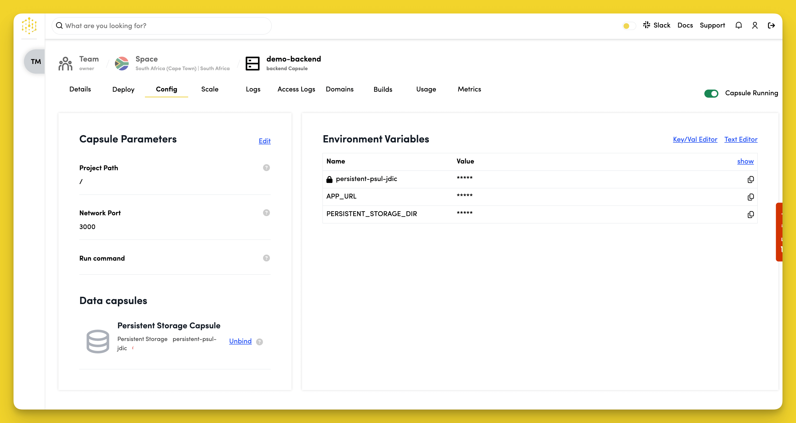
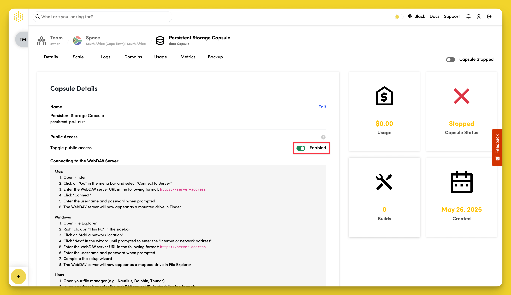

# Deploy

You need persistent storage for your application, but you don't want a full-blown database. 

This guide will show you how to create a persistent storage Data Capsule that you can use with backend applications running on Code Capsules.

## What is a Persistent Storage Capsule?

A Persistent Storage Capsule works like a virtual hard drive in the cloud. The key benefit is that you can attach multiple Backend or Docker Capsules to the same Persistent Storage Capsule, enabling them to share data and scale horizontally or vertically.

## How To Set Up Persistent File Storage

To set up persistent file storage, you'll first create a Persistent Storage Capsule, then bind it to a Backend Capsule.

### Create a File Storage Capsule

Log in to your Code Capsules account and navigate to the Space where you want to create a Data Capsule. 

Click the yellow **+** button on the bottom-left corner of the dashboard. Select **New Capsule** and then **Persistent Storage** from the dropdown.



Select your payment method, then click **Create Capsule**.

### Bind the Storage Capsule to a Backend Capsule

You need to bind the Storage Capsule to a Backend Capsule hosted on Code Capsules before you can connect to and use it.

Navigate to the Backend Capsule and open the **Config** tab. Scroll down to the **Bind Data Capsule** section, where your recently created Storage Capsule is listed.


Click **Bind** to bind the Capsules. 

During the bind process, Code Capsules creates a `PERSISTENT_STORAGE_DIR` environment variable that your Backend Capsule will use to access the Storage Capsule. 

When the two Capsules are bound, scroll to the top of the **Config** tab to view the value of the variable.



Now you can use this environment variable in your code to read and write to the Storage Capsule. Copy the value of the `PERSISTENT_STORAGE_DIR` variable and assign it to the `db_directory` variable. Alternatively, reference it directly using `os.getenv` in Python or `process.env` in Node.js.

#### Connect to a Storage Capsule From a Python Application

If you're using Python in your Backend Capsule, use the following code to connect to the Storage Capsule:

```python
import os

db_directory = os.getenv('PERSISTENT_STORAGE_DIR')

### Do something with the db_directory variable here
file_to_write = os.path.join(db_directory, "test.txt")

file1 = open(file_to_write, "w")
file1.write("File writing test")
file1.close()

```

#### Connect to a File Data Capsule From a Node.js Application

If you're using Node.js in your Backend Capsule, use the following code to connect to the Storage Capsule:

```js

db_directory = process.env.PERSISTENT_STORAGE_DIR
const fs = require('fs')

const content = 'Some content!'

// Do something with the db_directory variable here

fs.writeFile(db_directory + '/test.txt', content, err => {
  if (err) {
    console.error(err)
    return
  }
  //file written successfully
})

```

## Access Files Using WebDAV

By default, you can't browse files and folders in your Persistent Storage Capsule without building your own file browser. To solve this, Code Capsules provides native WebDAV access.

To enable file browsing:

1. Navigate to your Persistent Storage Capsule
2. Go to the **Details** tab
3. Toggle **Public Access** to **Enabled**



Enabling this setting doesn't make your files publicly accessible on the internet. They are served over the WebDAV protocol and require authentication credentials to access.

### Connect to the WebDAV Server

#### macOS

1. Open **Finder**
2. Click on **Go** in the menu bar and select **Connect to Server**
3. Enter the WebDAV server URL in the following format: `https://server-address`
4. Click **Connect**
5. Enter the username and password when prompted

The WebDAV server will now appear as a mounted drive in **Finder**.

Here you can see the files inside a WordPress Capsule accessed locally through **Finder** in macOS.


#### Windows

1. Open **File Explorer**
2. Right click on **This PC** in the sidebar
3. Click **Add a network location**
4. Click **Next** in the wizard until prompted to enter the **Internet or network address**
5. Enter the WebDAV server URL in the following format: `https://server-address`
6. Enter the username and password when prompted
7. Complete the setup wizard

The WebDAV server will now appear as a mapped drive in **File Explorer**.

#### Linux

1. Open your file manager (for example, Nautilus, Dolphin, or Thunar)
2. In your address bar, enter the WebDAV server URL in the following format:
   - `davs://server-address` for Nautilus and Thunar
   - `webdavs://@server-address` for Dolphin
3. Enter the username and password when prompted

The WebDAV server will now appear as a drive in your file manager.
