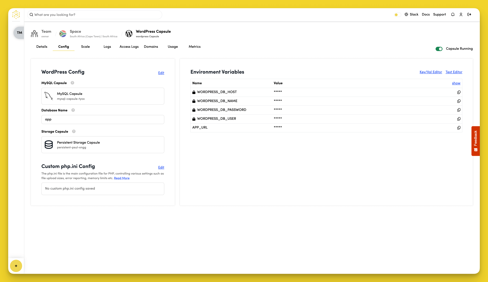

# Configure

To configure your Wordpress Capsule, navigate to the "Config" tab.

## Choose a MySQL Capsule

Your WordPress Capsule needs to connect to a MySQL Data Capsule. Click "Edit" in the "Wordpress Config" section to select a MySQL Capsules from your Space.

## Edit the Database Name

Click "Edit" in the "Wordpress Config" section to edit the name of your WordPress database. The default is `app`.

## Choose a Storage Capsule

Your WordPress Capsule needs to connect to a Peristent Storage Capsule. Click "Edit" in the "Wordpress Config" section to select a Peristent Storage Capsule from your Space.

## Environment Variables

WordPress Capsules automatically get these environment variables:
- `WORDPRESS_DB_HOST` - Database server location
- `WORDPRESS_DB_NAME` - Database name
- `WORDPRESS_DB_USER` - Database username
- `WORDPRESS_DB_PASSWORD` - Database password
- `APP_URL` - Your site's public URL

To view variable values, click "show" in the "Environment Variables" section.

To add custom variables:

1. Click "Key/Val Editor" or "Text Editor" in the "Environment Variables" section
2. Edit the variable "Name" and "Value"
3. Click "Save"

## Custom php.ini Config

Add custom PHP settings if needed, like upload sizes or memory limits.

Leave the field empty to use default settings.
