# How to Simply Host a Production WordPress Blog

AWS's WordPress reference architecture became a meme in DevOps circles. The 2018 [whitepaper](https://aws.amazon.com/blogs/architecture/wordpress-best-practices-on-aws/) recommends 11 services costing $500-1,500 monthly and assumes you have dedicated DevOps staff. The alternative is a single Lightsail instance where you handle OS updates, security hardening, and MySQL tuning yourself.

Production WordPress needs infrastructure that falls between these extremes: reliable enough to handle traffic spikes and hardware failures, yet simple enough to manage without a DevOps team.

This guide shows how to run production WordPress with:

- Separated application, database, and storage layers
- Staging and production environments with one-click migration
- Automatic scaling for traffic spikes
- Infrastructure-level backups

You'll understand the operational challenges WordPress creates, how different hosting approaches address them, and how to deploy a staging-to-production workflow.

## What You Need to Know 

Hosting WordPress in production is confusing because WordPress doesn't fit standard deployment workflows. You can't version-control content, staging-to-production migration isn't built-in, and backups require synchronizing files and databases separately. Here's what you need to know to host a production WordPress site simply:

- **Separate your WordPress layers from the start.** WordPress, MySQL, and file storage should run independently. When one layer fails or requires scaling, the others continue to operate.
- **Plan for staging-to-production workflows.** WordPress has no built-in mechanism for migrating between environments. Set up either a plugin-based migration ($99-$299/year with manual configuration) or use hosting platforms like Code Capsules, which offer one-click migration built in. Without this, you'll manually recreate approved content or risk breaking production with direct edits.
- **Match infrastructure to your team's capacity.** A self-hosted VPS (starting from $10 per month) requires you to handle security patches, backups, and scaling. Managed WordPress removes operational work but limits flexibility and costs more (an average of $50 per month for basic plans). Always choose based on whether you have DevOps resources.

## The WordPress Production Problem

In a development team, the workflow for releasing changes usually looks like this:

Your developers write code locally, commit to GitHub, run automated tests, deploy changes to staging for review, stakeholders approve, and only then does anything touch production. Every change is tracked, every deployment is reversible, and nothing reaches your live site without multiple checkpoints.

WordPress doesn't work this way.

WordPress splits data between files and the database, breaking Git workflows:

- You can commit theme changes to Git, but blog posts aren't in your repository.
- You can deploy code via CI/CD, but database changes occur directly in production via the WordPress admin.
- You can run tests on your code, but there's no automated testing for "someone installed a plugin that conflicts with your theme."
- You can roll back a bad deployment, but only file-system changes are rolled back; database modifications remain, so you can't recover from bad content changes.

The real consequences look like this: 

- Marketing installs a plugin on production. It conflicts with your theme. Site breaks during business hours.
- A content creator deletes a popular post. No Git history exists for database content.
- You want to test WordPress core updates on staging, but staging content is days behind production.

Your infrastructure may have version control and staging environments, but WordPress makes both nearly impossible without building custom tooling to synchronize databases and file systems between environments. WordPress migration, backups, and staging workflows each require specific approaches to work reliably in production.

## How WordPress Migration Actually Works

WordPress migration is more complex than deploying typical web applications because WordPress stores data in two separate locations:

- Your application code, themes, plugins, and configuration files live in the file system.

- Your content, blog posts, comments, user accounts, and plugin settings live in the MySQL database.

- Uploaded media like images, videos, and PDFs live in the file system, but the database stores the URLs pointing to these files.

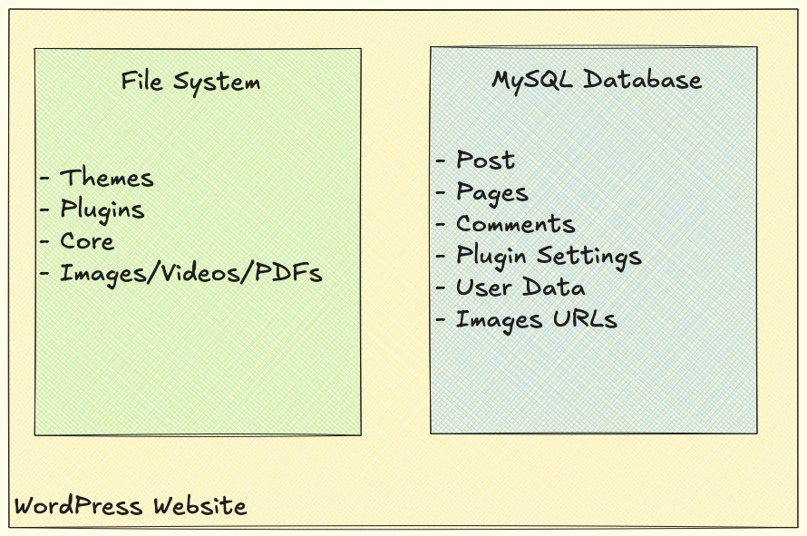

This split storage creates migration complexity. A successful migration requires three coordinated steps:

- **Copy the database.** Export the MySQL database from staging and import it to production. This transfers all your content (posts, pages, comments), plugin configurations, user accounts, and custom fields.

- **Copy the file system.** Transfer all files from staging to production: uploaded media, installed plugins, active themes, and WordPress core files.

- **Update URLs in the database.** Search through every database table and replace staging URLs with production URLs. This affects blog post content, plugin settings, theme options, widget configurations, and metadata.

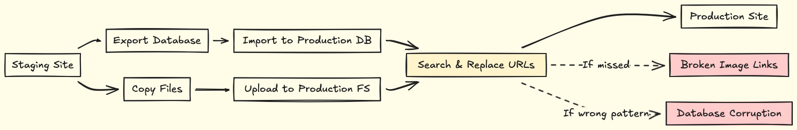

WordPress has no built-in migration tool, so you have two options: use a plugin or build custom scripts.

### WordPress Migration: Using a plugin

Most WordPress users handle staging-to-production migrations with plugins such as [WP Synchro](https://wordpress.org/plugins/wpsynchro/), [UpdraftPlus](https://teamupdraft.com/updraftplus/), or [All-in-One WP Migration](https://wordpress.org/plugins/all-in-one-wp-migration/). These plugins automate the three-step process: database export/import, file transfer, and URL replacement.

WP Synchro offers the most straightforward setup. The free version handles basic migrations but limits the database size to 10MB. Production sites require the premium version at $99-$299 per year for extensive database support, selective sync, and conflict resolution. The setup process looks like this: 

- Install the plugin on both the staging and production environments. The premium version requires you to download the zip file manually.

  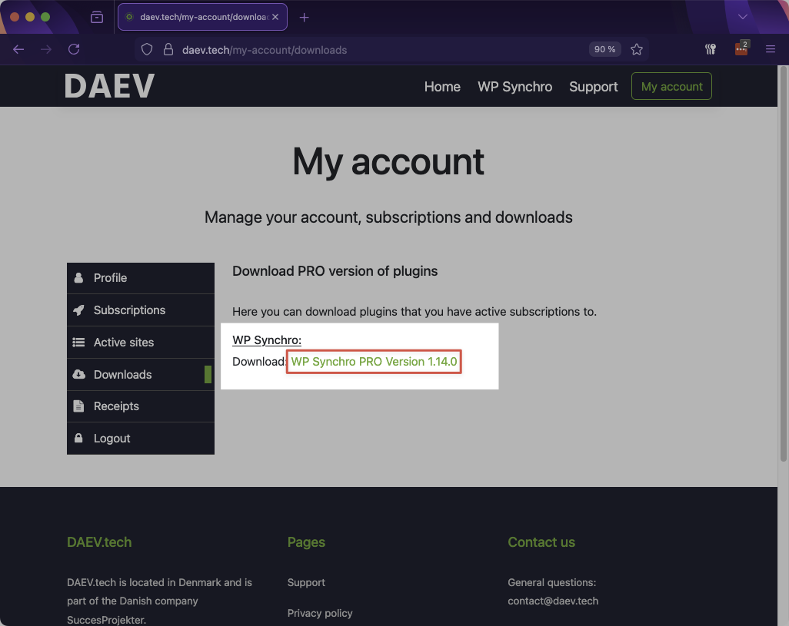

- You'll need your license key:

  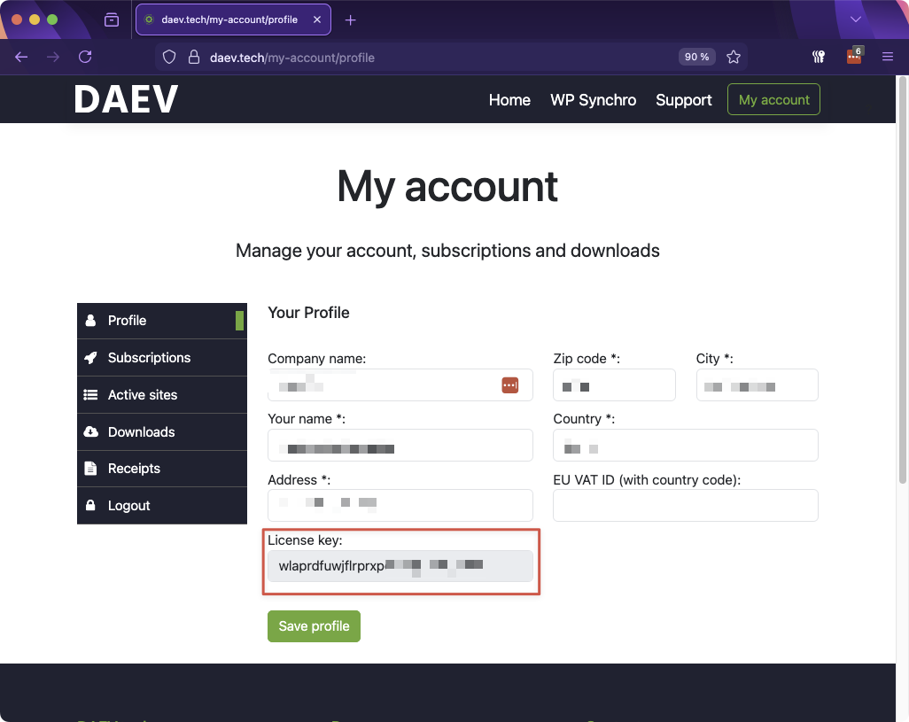

- Upload the downloaded zip file on the Add Plugins page.

  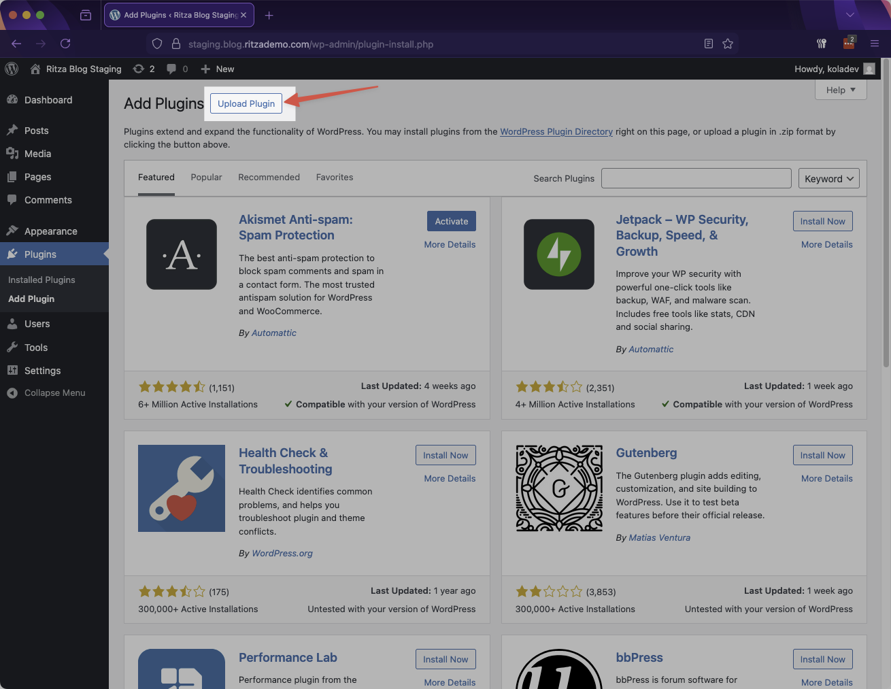

- After installation, add your license key in WP Synchro → Licensing.

  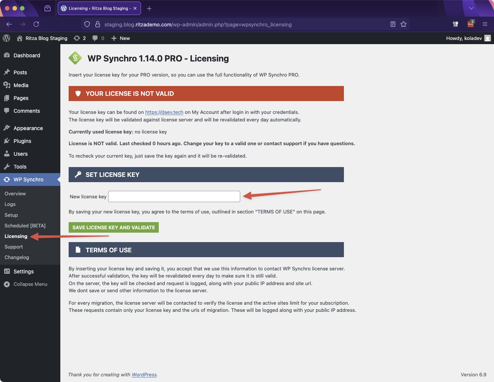

- Configure your setup in WP Synchro → Setup by enabling pushes for the production environment, then save the access key. The staging environment uses this access key to authenticate when pushing changes to production.

  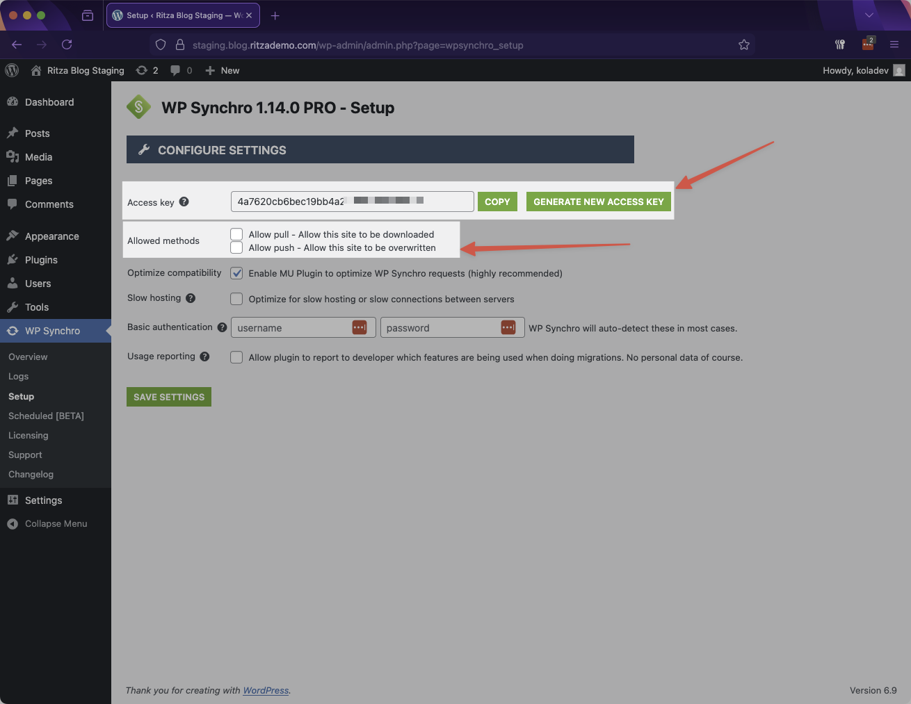

- On the WP Synchro → Overview page, click Add Migration. Enter a name for the migration, select Push this site to remote site as the migration type, then enter your production site's full URL and paste the access key.

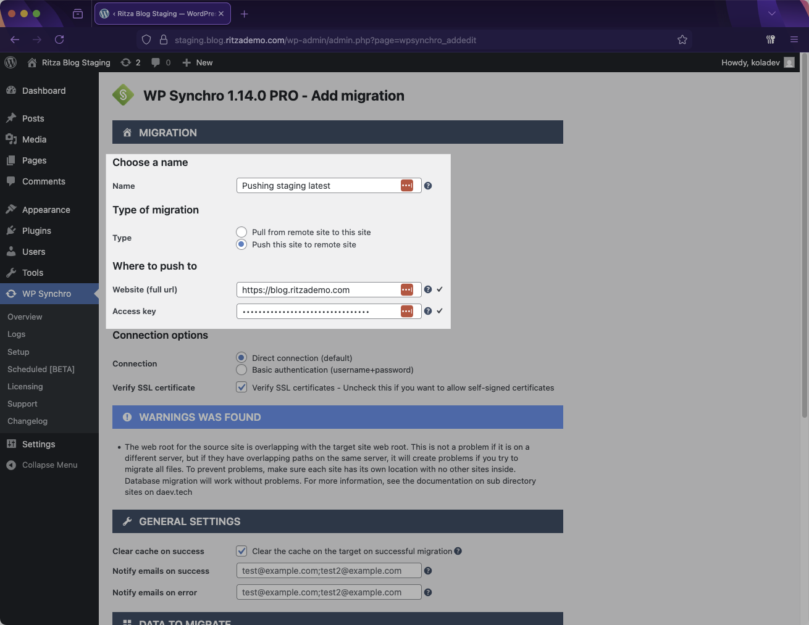

- You have four migration options: entire site, database only, files only, or custom. Custom migration lets you select specific tables, files, posts, or comments to migrate.

  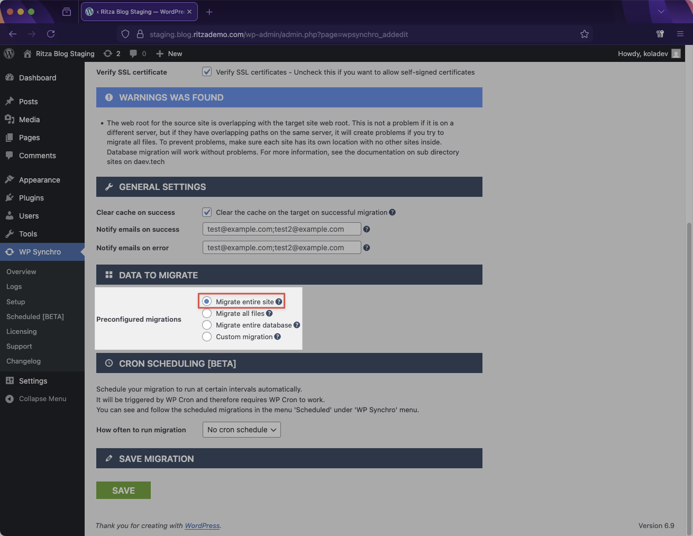

- Save and execute the migration.

If content changed on production since your last sync, the plugin shows conflicts. You manually choose whether to keep production changes or overwrite with staging content. Unlike Git, there's no automatic conflict resolution—you choose which complete version to keep.

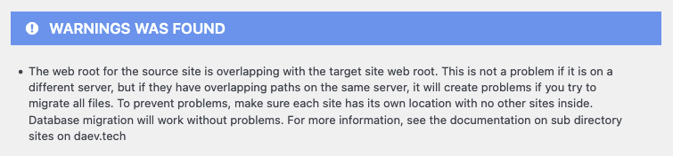

WP Synchro provides a reliable migration workflow for WordPress sites. However, plugin-based migration creates several operational challenges:

- The free version limits the database size to 10MB. Production sites need premium licenses at $99-$299 per year.
- Configuration takes 20 minutes with database credentials, FTP access, and sync rules that need adjustment whenever your WordPress structure changes.
- If someone edited production content while you worked on staging, the plugin can't merge changes. You either overwrite production or cancel the migration.
- Anyone with access can view the API keys and use them to push unauthorized changes to your production site.

## Using Wordpress on Code Capsules

Code Capsules provides detailed deployment documentation for WordPress. This section covers the setup of the staging-to-production workflow.

- **WordPress deployment:** Follow the [WordPress deployment guide](../products/wordpress-capsule/deploy.md) to create your WordPress capsule with attached database and storage.
- **Creating staging and production environments:** Deploy two identical WordPress setups, for example, one called "Staging WordPress" and one called "Production WordPress". Each needs its own database and storage capsules. This separation ensures staging changes don't affect production until you explicitly migrate them.
- **Configuring custom domains:** Navigate to the [Domains](../products/wordpress-capsule/domain.md) tab in each capsule, then add your custom domains. Use subdomains like `staging.yourblog.com` for staging and `yourblog.com` for production. Configure DNS records for your domain with your domain provider using the instructions provided by Code Capsules.
- **Setting up the migration workflow:** Once both environments are deployed, migrate content from staging to production using the [Migrate](../products/wordpress-capsule/migrate.md) tab in your production capsule. Select staging as the source and start the migration. Code Capsules handles database synchronization, file transfer, and URL updates automatically.
- **Backup verification:** Database and storage capsules back up automatically daily. Check the Backups tab in each capsule to verify retention settings and test restoration to a new capsule to confirm backup integrity.

For ongoing operations, refer to the [WordPress capsule documentation](../products/wordpress-capsule/) for monitoring, logs, and alerting configuration.

### Migrating Content from Staging to Production

In your production WordPress capsule, navigate to the **Migrate** tab. Select your staging wordpress capsule as the source capsule.

Click **Start Migration**. Code Capsules copies your database content, uploaded media files, installed plugins, and theme configurations from staging to production.

Once complete, your production environment will have identical content to the staging environment.

With this set up writers create posts on staging, editors review the content, then you migrate approved changes to production with one click.

## Backup in WordPress

Production WordPress requires comprehensive backups capturing your entire site state. A complete backup includes three components:

- **The database.** Your MySQL database contains all posts, pages, comments, user accounts, and plugin settings, your site's dynamic content.
- **The file system.** Your files include themes, plugins, WordPress core, and the uploads directory with all images and media, your site's structure, and assets.
- **Off-site storage.** Backups stored on the same server as your live site provide no protection against hardware failures or hosting issues. Production backups require external storage.

The critical requirement is synchronization. Your database references files by path and URL. If you back up your database at 2 pm and files at 3 pm, a blog post created at 2:30 pm can reference an image that doesn't exist in your file backup. Production backups must capture the database and files simultaneously.

### How Code Capsules Handles Backups

Code Capsules implements infrastructure-level backups. Your database and storage capsule maintain automatic daily snapshots with 30-day retention. These backups run outside WordPress, avoiding performance impact and resource limits.

Database and storage backups capture the same point in time, ensuring a synchronized state. Restoration works regardless of database size, avoiding the 500MB cPanel limitation that breaks manual restoration for production sites.

With migration and backup requirements established, the next question is cost. Different hosting approaches address these requirements with varying levels of automation, complexity, and price.

## WordPress Hosting Cost Breakdown

Production WordPress hosting costs vary widely based on the approach. Understanding what you're paying for helps evaluate whether the infrastructure matches your requirements.

### Single-Server WordPress Hosting

Single-server WordPress runs everything on one machine: web server, PHP, MySQL, and file storage. DigitalOcean droplets and AWS Lightsail offer this for $5-20/month.

With a single-server WordPress website, scaling requires handling several operational challenges:

- **Traffic spikes.** When your marketing team sends a newsletter, 1000 concurrent visitors means 1000 PHP processes competing for CPU, while database connections exhaust MySQL's connection pool. Separating the application server from the database server allows each to scale independently based on resource demands.

- **Hardware failures and maintenance.** When the server reboots for system updates or a plugin update crashes PHP, your entire site goes offline. This requires redundancy across multiple servers or accepting downtime during failures.

- **Storage scaling.** As your media library grows, you need to expand disk space. On a single server, this means upgrading to a larger instance and migrating all data. Separated storage scales file storage independently without touching your application or database.

However, a single server/self-host approach gives complete control. You choose your tech stack, install any software, and customize everything. The cost is your time: server administration, security patching, backup verification, and troubleshooting when things break.

Self-hosted VPS requires technical expertise. You need to understand Linux server administration, MySQL database tuning, PHP configuration, web server optimization, and security hardening. For teams with DevOps resources, this works. For teams focused on content and marketing, the maintenance overhead outweighs the cost savings.

### Managed WordPress Hosting

Managed WordPress providers like Kinsta and WP Engine handle server configuration, updates, security, and backups for you.

- **Kinsta** starts at $35/month for a single site with 25,000 monthly visits, 10GB storage, and automatic backups. This includes CloudFlare CDN, malware scanning, and staging environments. The plan scales to $675/month for 250,000 visits and 100GB storage.

- **WP Engine** starts at $20/month for personal sites with 25,000 monthly visits and 10GB storage. Business plans supporting 100,000 visits and staging environments begin at $50/month. Enterprise plans reach $500+/month.

These services provide convenience: you get WordPress optimized for performance without managing servers yourself. The tradeoff is limited control. You can't install custom server software, extensively modify PHP configurations, or integrate WordPress into your existing infrastructure automation.

### AWS Enterprise Architecture

AWS's reference architecture for production WordPress runs 11 services: CloudFront CDN, Application Load Balancer, Auto Scaling EC2 instances, EFS, Aurora, ElastiCache, S3, NAT Gateways, and VPC networking. Monthly costs range from $500-1,500 depending on traffic.

This architecture provides enterprise-grade reliability and scale. You get distributed infrastructure, automatic failover, and performance optimization. The tradeoff is complexity – you need dedicated DevOps staff to monitor, maintain, and debug across all these services. Troubleshooting failures requires expertise in multiple AWS services simultaneously.

AWS also provides no built-in WordPress staging-to-production migration. You need expensive sync plugins ($200+/year) or custom deployment scripts.

### Code Capsules

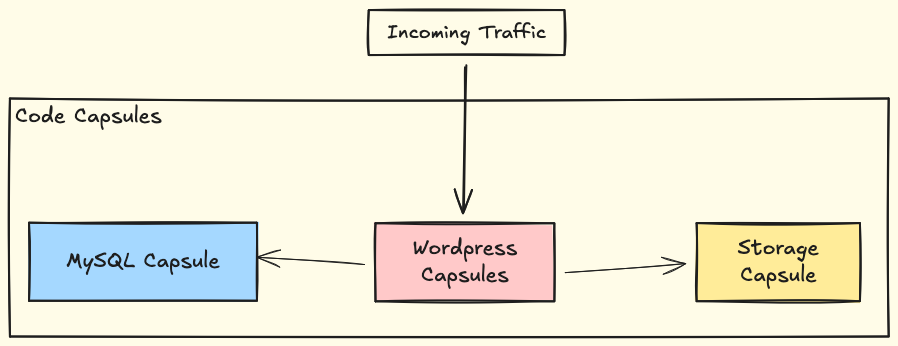

Code Capsules WordPress hosting starts with separate application, database, and storage capsules. Pricing scales based on actual resource usage.

A typical small production setup costs approximately $15-25/month, including:

- WordPress application capsule handling web traffic.
- MySQL database capsule with automatic daily backups.
- Storage capsule for media files with backup retention.

Staging environments add the same components, roughly doubling the cost for a complete staging-to-production setup at $30-50/month total.

This includes infrastructure-level backups, one-click staging-to-production migration, auto-scaling for traffic spikes, and separated application/database/storage layers: no plugin licensing costs, no DevOps staff requirements, no complex AWS service configuration.

Choosing a hosting option depends on whether you have DevOps resources and need complete control; a self-hosted VPS or AWS provides maximum flexibility. If you're a small team focused on content rather than infrastructure, managed solutions eliminate maintenance overhead. Code Capsules sits between these extremes: managed infrastructure with staging/production workflows, without the premium pricing of fully managed WordPress hosts or the complexity of AWS enterprise architecture.

| Feature                             | Managed WordPress (Kinsta/WP Engine) | Self-Hosted VPS                        | AWS Enterprise                                | Code Capsules                                |
|-------------------------------------|--------------------------------------|----------------------------------------|-----------------------------------------------|----------------------------------------------|
| **Monthly Cost**                    | $35-100                              | $10-40                                 | $500-1,500                                    | Starting $30                                 |
| **Setup Time**                      | Minutes                              | Hours                                  | Days                                          | Minutes                                      |
| **DevOps Required**                 | No                                   | Yes                                    | Yes                                           | No                                           |
| **Staging Environment**             | Included                             | Manual setup                           | Manual setup                                  | Included                                     |
| **Staging-to-Production Migration** | Manual or plugins ($200+/year)       | Custom scripts                         | Custom scripts                                | One-click built-in                           |
| **Auto-scaling**                    | Limited                              | Manual                                 | Full control                                  | Automatic                                    |
| **Infrastructure Control**          | Limited                              | Complete                               | Complete                                      | Moderate                                     |
| **Backup Management**               | Automatic                            | Manual setup                           | Manual setup                                  | Automatic infrastructure-level               |
| **Database Size Limits**            | Plan-dependent                       | Server capacity                        | Unlimited                                     | Capsule plan                                 |
| **Performance Optimization**        | Managed by provider                  | Your responsibility                    | Your configuration                            | Platform-managed                             |
| **Security Updates**                | Managed by provider                  | Your responsibility                    | Your responsibility                           | Platform-managed                             |
| **Custom Server Software**          | No                                   | Yes                                    | Yes                                           | Limited                                      |
| **Best For**                        | Non-technical teams, simple sites    | Teams with DevOps, custom requirements | Enterprise with dedicated infrastructure team | Technical teams needing workflow integration |

## Conclusion

WordPress hosting doesn't require choosing between single-server fragility and AWS enterprise complexity. Code Capsules provides separated application, database, and storage layers with built-in staging-to-production migration.

With Code Capsules, your WordPress infrastructure now handles traffic spikes through auto-scaling, survives hardware failures through component separation, and deploys content changes through one-click migration. You can focus on creating content instead of maintaining servers.

For production operations, Code Capsules provides:

- [Monitoring](https://docs.codecapsules.io/products/wordpress-capsule/monitor) for tracking performance metrics.
- [Logs](https://docs.codecapsules.io/products/wordpress-capsule/logs) for debugging issues.
- [Scaling rules](https://docs.codecapsules.io/products/wordpress-capsule/scale) for automatic capacity adjustments.
- [Alerting](https://docs.codecapsules.io/products/wordpress-capsule/alerting) for proactive issue detection.
